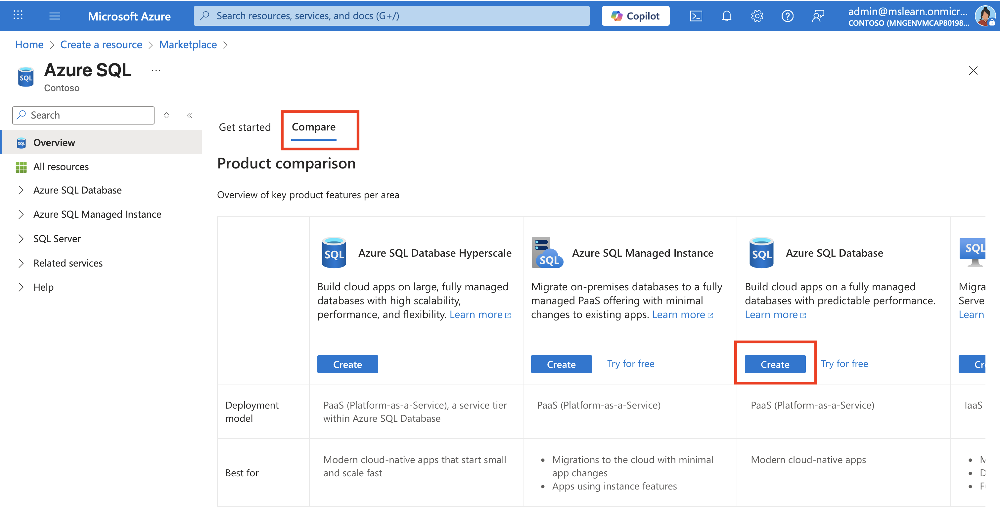
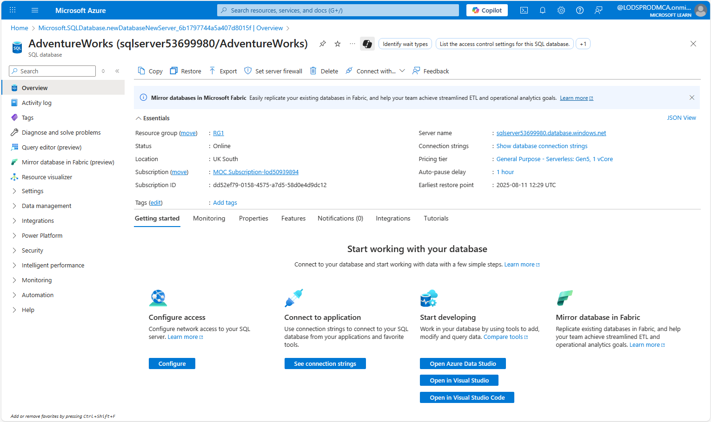
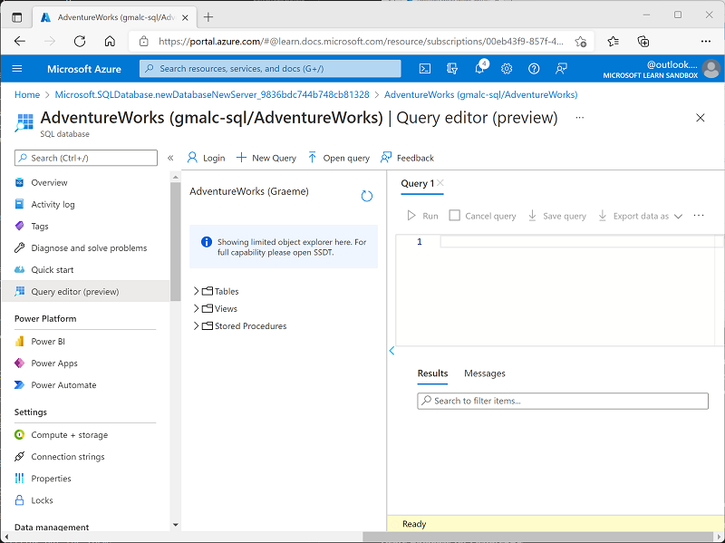
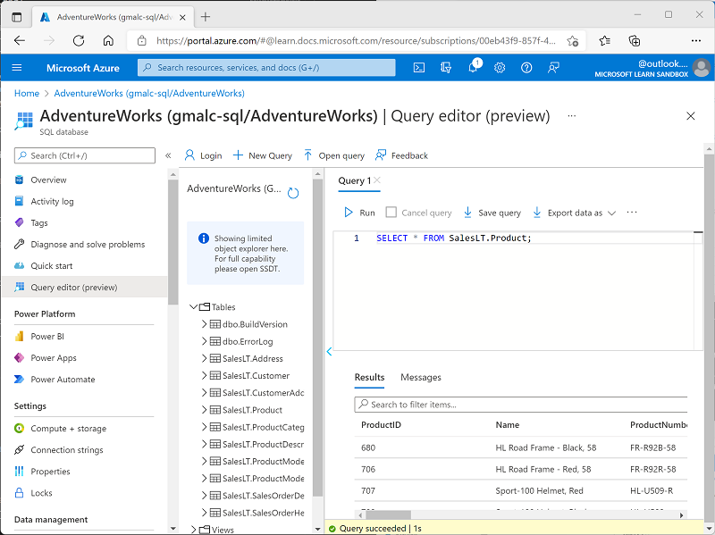

---
lab:
    title: 'Explore Azure SQL Database'
    module: 'Explore relational data in Azure'
---

# Explore Azure SQL Database

In this exercise you'll provision an Azure SQL Database resource in your Azure subscription, and then use SQL to query the tables in a relational database.

This lab will take approximately **15** minutes to complete.

## Before you start

You'll need an [Azure subscription](https://azure.microsoft.com/free) in which you have administrative-level access.

## Provision an Azure SQL Database resource

1. In the [Azure portal](https://portal.azure.com?azure-portal=true), select **&#65291; Create a resource** from the upper left-hand corner and search for *Azure SQL*. Then in the resulting **Azure SQL** page, select **Create**.

1. Review the Azure SQL options that are available, and then in the **SQL databases** tile, ensure **Single database** is selected and select **Create**.

    

1. Enter the following values on the **Create SQL Database** page, and leave all other properties with their default setting:
    - **Subscription**: Select your Azure subscription.
    - **Resource group**: Create a new resource group with a name of your choice.
    - **Database name**: *AdventureWorks*
    - **Server**:  Select **Create new** and create a new server with a unique name in any available location. Use **SQL authentication** and specify your name as the server admin login and a suitably complex password (remember the password - you'll need it later!)
    - **Want to use SQL elastic pool?**: *No*
    - **Compute + storage**: Leave unchanged
    - **Backup storage redundancy**: *Locally-redundant backup storage*

1. On the **Create SQL Database** page, select **Next :Networking >**, and on the **Networking** page, in the **Network connectivity** section, select **Public endpoint**. Then select **Yes** for both options in the **Firewall rules** section to allow access to your database server from Azure services and your current client IP address.

1. Select **Next: Security >** and set the **Enable Microsoft Defender for SQL** option to **Not now**.

1. Select **Next: Additional Settings >** and on the **Additional settings** tab, set the **Use existing data** option to **Sample** (this will create a sample database that you can explore later).

1. Select **Review + Create**, and then select **Create** to create your Azure SQL database.

1. Wait for deployment to complete. Then go to the resource that was deployed, which should look like this:

    

1. In the pane on the left side of the page, select **Query editor (preview)**, and then sign in using the administrator login and password you specified for your server.
    
    *If an error message stating that the client IP address isn't allowed is displayed, select the **Allowlist IP ...** link at the end of the message to allow access and try to sign in again (you previously added you own computer's client IP address to the firewall rules, but the query editor may connect from a different address depending on your network configuration.)*
    
    The query editor looks like this:
    
    

1. Expand the **Tables** folder to see the tables in the database.

1. In the **Query 1** pane, enter the following SQL code:

    ```sql
    SELECT * FROM SalesLT.Product;
    ```

1. Select **&#9655; Run** above the query to run it and view the results, which should include all columns for all rows in the **SalesLT.Product** table as shown here:

    

1. Replace the SELECT statement with the following code, and then select **&#9655; Run** to run the new query and review the results (which includes only the **ProductID**, **Name**, **ListPrice**, **ProductCategoryID** columns):

    ```sql
    SELECT ProductID, Name, ListPrice, ProductCategoryID
    FROM SalesLT.Product;
    ```

1. Now try the following query, which uses a JOIN to get the category name from the **SalesLT.ProductCategory** table:

    ```sql
    SELECT p.ProductID, p.Name AS ProductName,
            c.Name AS Category, p.ListPrice
    FROM SalesLT.Product AS p
    JOIN [SalesLT].[ProductCategory] AS c
        ON p.ProductCategoryID = c.ProductCategoryID;
    ```

1. Close the query editor pane, discarding your edits.

> **Tip**: If you've finished exploring Azure SQL Database, you can delete the resource group that you created in this exercise.
