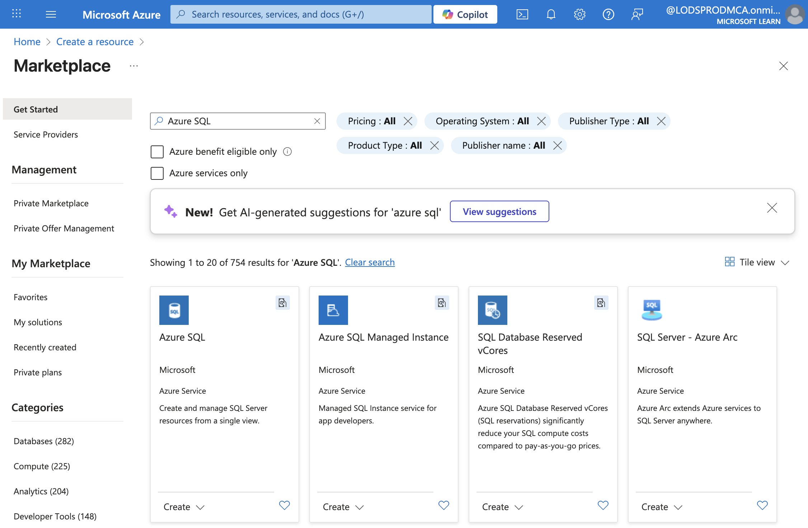
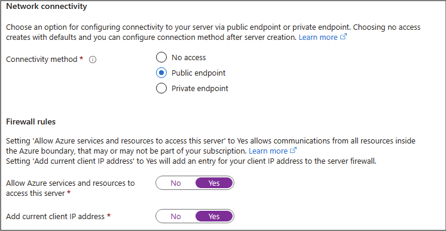

---
lab:
    title: 'Explore Azure SQL Database'
    module: 'Explore relational data in Azure'
---

# Explore Azure SQL Database

In this lab, you'll learn how to provision an Azure SQL Database and interact with it using SQL queries. You'll use the Microsoft AdventureWorks sample database, which provides pre-populated tables and data, so you can focus on exploring and querying relational data without needing to create your own schema or insert sample records. This approach keeps things straightforward and lets you concentrate on understanding core database concepts and SQL syntax.

This lab will take approximately **15** minutes to complete.

## Before you start

You'll need an [Azure subscription](https://azure.microsoft.com/free) in which you have administrative-level access.

## Provision an Azure SQL Database resource

1. In the [Azure portal](https://portal.azure.com?azure-portal=true), select **&#65291; Create a resource** from the upper left-hand corner and search for `Azure SQL`. Then in the resulting **Azure SQL** page, select **Create**.

    

1. Review the Azure SQL options that are available, and then in the **SQL databases** tile, ensure **Single database** is selected and select **Create**.

    

    > _**Tip**: Single database is the simplest and fastest to set up for this lab. The other options add settings you don't need yet._

1. Enter the following values on the **Create SQL Database** page, and leave all other properties with their default setting:
    - **Subscription**: Select your Azure subscription.
    - **Resource group**: Create a new resource group with a name of your choice.
    - **Database name**: `AdventureWorks`
    - **Server**:  Select **Create new** and create a new server with a unique name in any available location. Use **SQL authentication** and specify your name as the server admin login and a suitably complex password (remember the password - you'll need it later!)
    - **Want to use SQL elastic pool?**: *No*
    - **Workload environment**: Development
    - **Compute + storage**: Leave unchanged
    - **Backup storage redundancy**: *Locally-redundant backup storage*

    > _**Tip**: SQL authentication is quick to setup for the last (no extra Microsoft Entra ID steps). Development defaults are cheaper and fast. Local backup is the low‑cost choice and fine for a temporary practice database._

1. On the **Create SQL Database** page, select **Next :Networking >**, and on the **Networking** page, in the **Network connectivity** section, select **Public endpoint**. Then select **Yes** for both options in the **Firewall rules** section to allow access to your database server from Azure services and your current client IP address.

    

    > _**Tip**: Public endpoint + allowing your IP lets you connect right away. Good for a short lab. In real projects you normally lock access down more._

1. Select **Next: Security >** and set the **Enable Microsoft Defender for SQL** option to **Not now**.

    > _**Tip**: Defender is a paid security add‑on. We skip it here to keep things simple and avoid cost in a short exercise._

1. Select **Next: Additional Settings >** and on the **Additional settings** tab, set the **Use existing data** option to **Sample** (this will create a sample database that you can explore later).

    > _**Tip**: Sample data gives you ready‑made tables and rows so you can start querying straight away._

1. Select **Review + Create**, and then select **Create** to create your Azure SQL database.

1. Wait for deployment to complete. Then go to the resource that was deployed, which should look like this:

    

1. In the pane on the left side of the page, select **Query editor (preview)**, and then sign in using the administrator login and password you specified for your server.
    
    >**Note**: If an error message stating that the client IP address isn't allowed is displayed, select the **Allowlist IP ...** link at the end of the message to allow access and try to sign in again (you previously added your own computer's client IP address to the firewall rules, but the query editor may connect from a different address depending on your network configuration.)
    
    The query editor looks like this:
    
    

1. Expand the **Tables** folder to see the tables in the database.

1. In the **Query 1** pane, enter the following SQL code:

    ```sql
   SELECT * FROM SalesLT.Product;
    ```

    > _**Tip**: SELECT * quickly shows every column and some values. (In real apps you usually avoid it and pick only the columns you need.)_

1. Select **&#9655; Run** above the query to run it and view the results, which should include all columns for all rows in the **SalesLT.Product** table as shown here:

    

1. Replace the SELECT statement with the following code, and then select **&#9655; Run** to run the new query and review the results (which includes only the **ProductID**, **Name**, **ListPrice**, **ProductCategoryID** columns):

    ```sql
   SELECT ProductID, Name, ListPrice, ProductCategoryID
   FROM SalesLT.Product;
    ```

    > _**Tip**: Listing only the columns you need keeps results smaller and can run faster._

1. Now try the following query, which uses a JOIN to get the category name from the **SalesLT.ProductCategory** table:

    ```sql
    SELECT 
        p.ProductID, 
        p.Name AS ProductName,
        c.Name AS Category, 
        p.ListPrice
    FROM SalesLT.Product AS p
    INNER JOIN SalesLT.ProductCategory AS c 
        ON p.ProductCategoryID = c.ProductCategoryID;
    ```

    > _**Tip**: The JOIN shows how to pull related data (the category name) from another table using a matching ID._

1. Close the query editor pane, discarding your edits.

> _**Tip**: If you've finished exploring Azure SQL Database, you can delete the resource group that you created in this exercise. Deleting the resource group removes all the resources in one step. It also minimizes cost._
