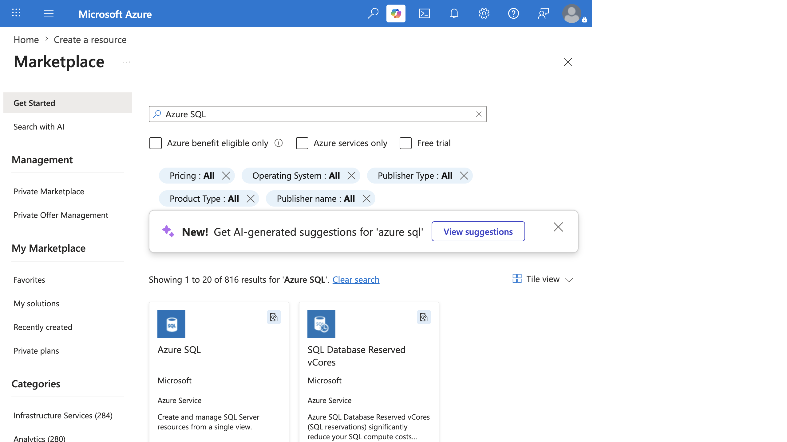
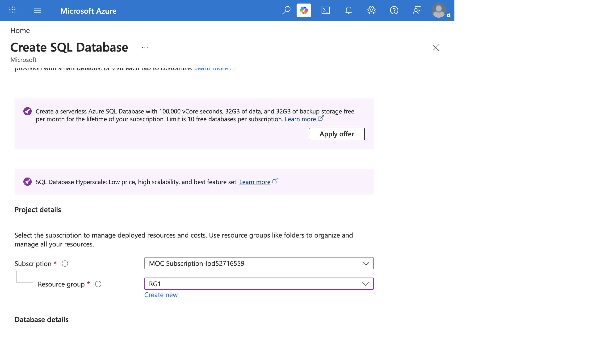
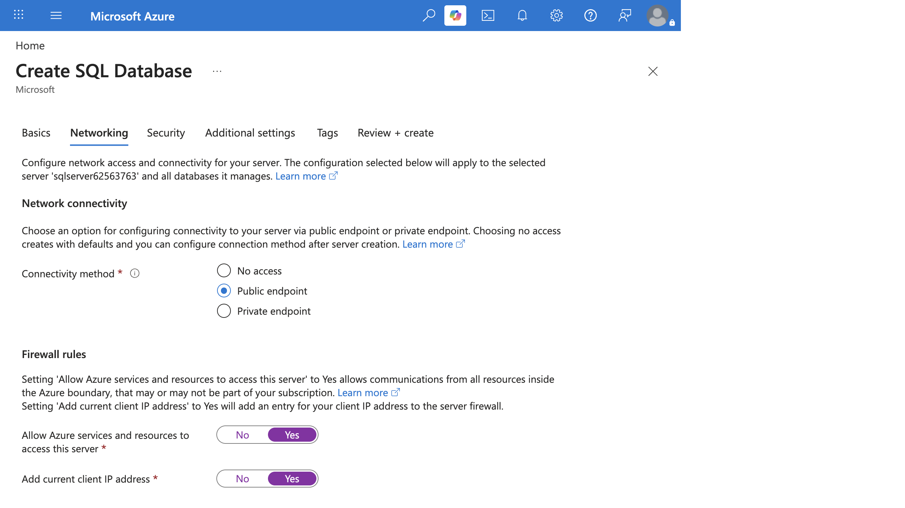
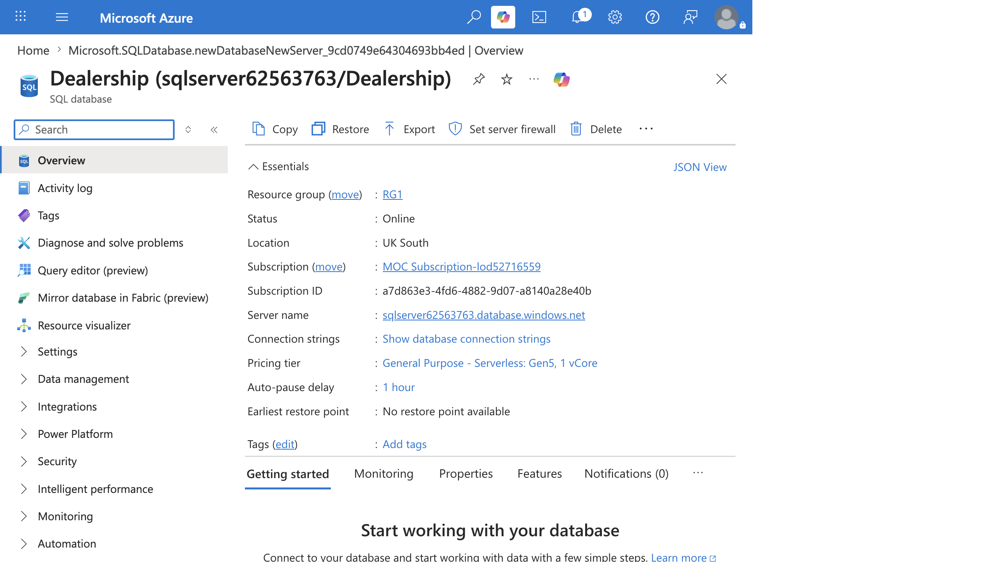
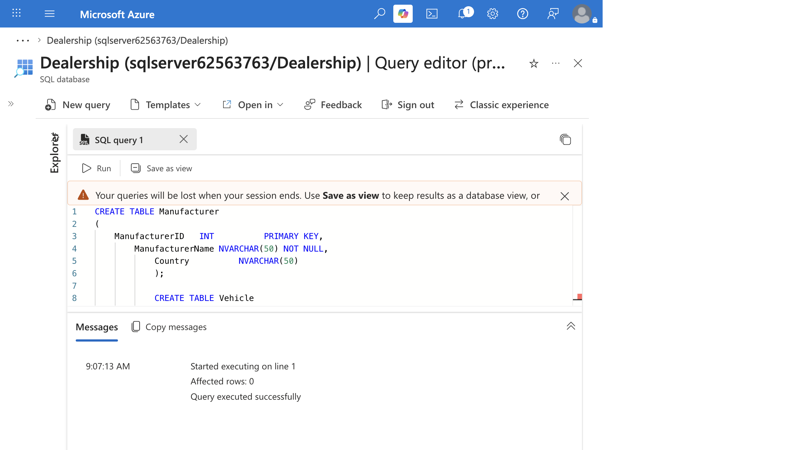

---
lab:
  title: Explore Azure SQL Database
  module: Explore relational data in Azure
  description: In this lab, you'll provision an Azure SQL Database from scratch and interact with it using SQL queries. You'll build a small automotive dealership database, add some sample vehicles and manufacturers, and then run queries to explore the data. The lab is written for absolute beginners with no prior Azure or database experience, so every step is explained in plain language.
  duration: 20 minutes
  level: 100
  islab: true
  primarytopics:
    - Azure SQL Database
    - Azure
    - Azure Portal
---

# Explore Azure SQL Database

In this lab, you'll create your very first cloud database using **Azure SQL Database**. A database is simply an organized place to store information so you can find and use it later. In this case, you'll store information for a fictional car dealership: the **manufacturers** that build cars, and the **vehicles** the dealership sells.

You'll create the database, add a small amount of sample data, and then use **SQL** (Structured Query Language) to ask the database questions like "Which cars cost less than $30,000?" Don't worry if you've never written SQL or used Azure before, every step is explained as you go.

This lab will take approximately **20** minutes to complete.

## Before you start

You'll need an [Azure subscription](https://azure.microsoft.com/free) in which you have administrative-level access. If you don't have one, you can sign up for a free account using the link above.

> _**What is Azure?** Azure is Microsoft's cloud platform. Instead of buying and running your own server computer, you rent computing resources (like a database) from Microsoft and use them over the internet. The **Azure portal** is the website you use to create and manage those resources._

## Provision an Azure SQL Database resource

"Provisioning" just means creating and setting up a new resource. In this section, you'll create your database server and an empty database to put your data in.

1. Sign in to the [Azure portal](https://portal.azure.com?azure-portal=true) using your Azure account.

1. At the top left of the page, select **&#65291; Create a resource**, and in the search box type `Azure SQL`. In the search results, select **Azure SQL**, and then on the **Azure SQL** page, select **Create**.

    

1. Select **Compare options**.

1. Review the Azure SQL options that are available, and then in the **SQL databases** tile, ensure **Single database** is selected and select **Create**.

    

    > _**Tip:** A "single database" is the simplest option to set up and is perfect for learning. The other options add features you don't need yet._

1. Enter the following values on the **Create SQL Database** page, and leave all other properties with their default setting:

    - **Subscription**: Select your Azure subscription.
    - **Resource group**: Select **Create new** and enter a name of your choice, such as `dp900-lab-rg`.

        > _**What is a resource group?** It's just a folder that holds related Azure resources together. When you're finished, you can delete the folder to remove everything in one click._

    - **Database name**: `Dealership`
    - **Server**: Select **Create new**. A server is the computer (in the cloud) that runs your database. Fill in the form that appears:
        - **Server name**: Enter a globally unique name, such as `dealership-server-<your-initials-and-numbers>` (the name must not already be in use by anyone else).
        - **Location**: Choose any available location near you.
        - **Authentication method**: Select **Use SQL authentication**.
        - **Server admin login**: Enter a username of your choice, such as `sqladmin`.
        - **Password** / **Confirm password**: Enter a strong password and **write it down**, you'll need it again later in this lab.

        Select **OK** to close the server form.
    - **Want to use SQL elastic pool?**: *No*
    - **Workload environment**: *Development*
    - **Compute + storage**: Leave unchanged.
    - **Backup storage redundancy**: *Locally-redundant backup storage*

    > _**Tip:** SQL authentication (a username and password) is the quickest way to sign in for this lab. The **Development** and **Locally-redundant** options keep costs as low as possible for a short practice database._

1. Select **Next: Networking >**. On the **Networking** page, in the **Network connectivity** section, select **Public endpoint**. Then, in the **Firewall rules** section, select **Yes** for both options to allow access from Azure services and from your own computer's current IP address.

    

    > _**Tip:** A firewall blocks unwanted connections. These settings open just enough access so that *you* can connect to the database during the lab. In a real project, you'd lock this down much more tightly._

1. Select **Next: Security >** and set the **Enable Microsoft Defender for SQL** option to **Not now**.

    > _**Tip:** Defender is a paid security add-on. You can safely skip it for this short, no-cost-sensitive exercise._

1. Select **Next: Additional settings >**. On the **Additional settings** tab, make sure the **Use existing data** option is set to **None**.

    > _**Important:** Leaving this as **None** gives you a completely empty database. That's what you want, because you'll create your own automotive tables and data in the next section._

1. Select **Review + create**, review the settings, and then select **Create**.

1. Wait a few minutes for the deployment to complete. When it's finished, select **Go to resource**. Your database page should look similar to this:

    

## Create the database tables and add sample data

Your database is created, but it's empty. In a relational database, data is stored in **tables**, which are like spreadsheets made of rows and columns. You'll now create two tables and fill them with a small amount of sample data.

1. In the menu on the left side of the database page, select **Query editor (preview)**. Sign in using the **server admin login** and **password** you created earlier.

    > _**Note:** If you see an error saying your client IP address isn't allowed, select the **Allowlist IP ...** link in the message to grant access, then try signing in again._

    The query editor is where you'll type and run SQL commands. It looks like this:

    

1. In the **Query 1** pane, paste the following SQL code. This creates a **Manufacturer** table (the companies that build vehicles) and a **Vehicle** table (the cars the dealership sells).

    ```sql
    CREATE TABLE Manufacturer
    (
        ManufacturerID   INT          PRIMARY KEY,
        ManufacturerName NVARCHAR(50) NOT NULL,
        Country          NVARCHAR(50)
    );

    CREATE TABLE Vehicle
    (
        VehicleID      INT            PRIMARY KEY,
        ModelName      NVARCHAR(50)   NOT NULL,
        ManufacturerID INT            NOT NULL,
        ModelYear      INT,
        BodyType       NVARCHAR(30),
        ListPrice      DECIMAL(10, 2),
        FOREIGN KEY (ManufacturerID) REFERENCES Manufacturer(ManufacturerID)
    );
    ```

    > _**What does this do?** Each `CREATE TABLE` statement defines a table and its columns. The **PRIMARY KEY** uniquely identifies each row (no two manufacturers can share an ID). The **FOREIGN KEY** links each vehicle to a manufacturer, so the two tables are related, that's what makes this a "relational" database._

1. Select **&#9655; Run** above the query. You should see a message confirming the query succeeded. Your two tables now exist, but they're empty.

1. Replace all the SQL in the **Query 1** pane with the following code, which adds sample manufacturers and vehicles. Then select **&#9655; Run**.

    ```sql
    INSERT INTO Manufacturer (ManufacturerID, ManufacturerName, Country) VALUES
    (1, 'Toyota',        'Japan'),
    (2, 'Ford',          'United States'),
    (3, 'Volkswagen',    'Germany'),
    (4, 'Hyundai',       'South Korea');

    INSERT INTO Vehicle (VehicleID, ModelName, ManufacturerID, ModelYear, BodyType, ListPrice) VALUES
    (101, 'Corolla',     1, 2024, 'Sedan',      24500.00),
    (102, 'RAV4',        1, 2024, 'SUV',        31200.00),
    (103, 'F-150',       2, 2023, 'Pickup',     38900.00),
    (104, 'Mustang',     2, 2024, 'Coupe',      42500.00),
    (105, 'Golf',        3, 2023, 'Hatchback',  27800.00),
    (106, 'Tiguan',      3, 2024, 'SUV',        33400.00),
    (107, 'Elantra',     4, 2024, 'Sedan',      22300.00),
    (108, 'Tucson',      4, 2023, 'SUV',        29600.00);
    ```

    > _**What does this do?** Each `INSERT` statement adds rows of data to a table. You've now added 4 manufacturers and 8 vehicles. Notice that each vehicle's **ManufacturerID** matches an ID in the Manufacturer table._

## Query the data

Now that your database has data in it, you can use SQL **SELECT** statements to retrieve and explore it.

1. Replace all the SQL in the **Query 1** pane with the following code, and select **&#9655; Run**. This returns every column and every row from the **Vehicle** table.

    ```sql
    SELECT * FROM Vehicle;
    ```

    The results should show all 8 vehicles you added.

    > _**Tip:** `SELECT *` means "select all columns". It's handy for a quick look, but in real applications you usually list only the columns you actually need._

1. Replace the query with the following code and select **&#9655; Run**. This returns only specific columns, so the results are easier to read.

    ```sql
    SELECT ModelName, BodyType, ListPrice
    FROM Vehicle;
    ```

1. Now try filtering the data. Replace the query with the following code and select **&#9655; Run**. The **WHERE** clause returns only the vehicles that cost less than $30,000, and **ORDER BY** sorts them from cheapest to most expensive.

    ```sql
    SELECT ModelName, BodyType, ListPrice
    FROM Vehicle
    WHERE ListPrice < 30000
    ORDER BY ListPrice;
    ```

    > _**Tip:** **WHERE** filters which rows you get back, and **ORDER BY** controls the order they appear in. These are two of the most useful tools in SQL._

1. Finally, try a query that combines data from both tables. Replace the query with the following code and select **&#9655; Run**.

    ```sql
    SELECT
        v.ModelName,
        m.ManufacturerName,
        m.Country,
        v.ListPrice
    FROM Vehicle AS v
    INNER JOIN Manufacturer AS m
        ON v.ManufacturerID = m.ManufacturerID
    ORDER BY m.ManufacturerName;
    ```

    > _**What does this do?** A **JOIN** combines rows from two tables based on a matching value, here, the **ManufacturerID** that both tables share. This lets you see each vehicle alongside the name and country of the company that makes it, even though that information lives in a separate table._

1. Take a moment to experiment. Try changing the price in the **WHERE** clause, or sorting by a different column, then run the query again to see how the results change.

1. When you're done, close the query editor pane, discarding your edits if prompted.

## Clean up

When you've finished exploring, you should delete the resources you created so you don't incur any further costs.

1. In the Azure portal, navigate to the **resource group** you created at the start of the lab (for example, `dp900-lab-rg`).

1. Select **Delete resource group**, confirm the deletion by entering the resource group name, and select **Delete**.

    > _**Tip:** Deleting the resource group removes the database, the server, and everything else inside it in a single step. This is the easiest way to make sure nothing is left running and costing money._

In this lab, you provisioned an Azure SQL Database, created your own tables, added automotive sample data, and queried it using SQL. You've now taken your first steps with relational data in the cloud!
