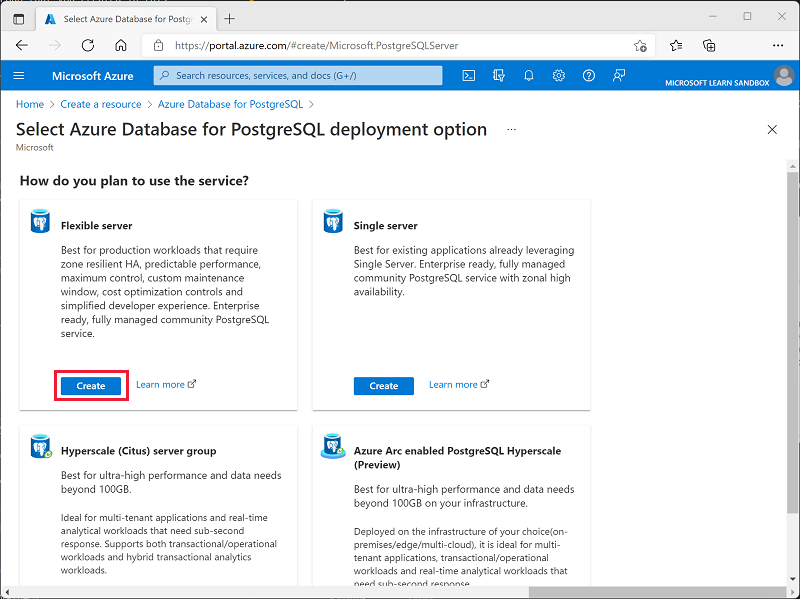
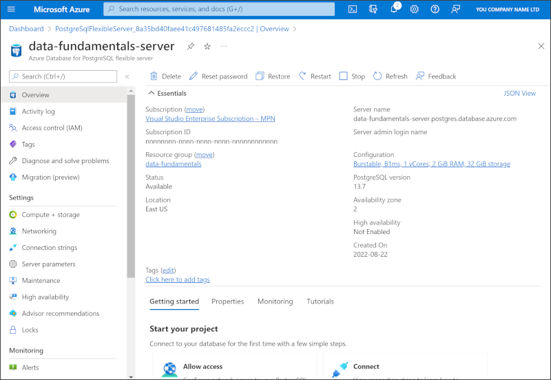

---
lab:
  title: Explore Azure Database for PostgreSQL
  module: Explore relational data in Azure
  description: In this lab, you'll provision an Azure Database for PostgreSQL resource from scratch and explore how it's managed in the Azure portal. The lab is written for absolute beginners with no prior Azure or database experience, so every step is explained in plain language.
  duration: 10 minutes
  level: 100
  islab: true
  primarytopics:
    - Azure Database for PostgreSQL
    - Azure Portal
    - Azure
---

# Explore Azure Database for PostgreSQL

In this lab, you'll create your first cloud database using **Azure Database for PostgreSQL**. **PostgreSQL** (often shortened to "Postgres") is a popular, free, open-source relational database. A *relational* database stores information in tables made up of rows and columns, similar to a spreadsheet.

You'll create ("provision") the database server, then explore the options Azure gives you for managing it. Don't worry if you've never used Azure or a database before, every step is explained as you go.

This lab will take approximately **10** minutes to complete.

## Before you start

You'll need an [Azure subscription](https://azure.microsoft.com/free) in which you have administrative-level access. If you don't have one, you can sign up for a free account using the link above.

> _**What is Azure?** Azure is Microsoft's cloud platform. Instead of buying and running your own server computer, you rent computing resources (like a database) from Microsoft and use them over the internet. The **Azure portal** is the website you use to create and manage those resources._

## Provision an Azure Database for PostgreSQL resource

"Provisioning" just means creating and setting up a new resource. In this section, you'll create your PostgreSQL database server.

1. Sign in to the [Azure portal](https://portal.azure.com?azure-portal=true) using your Azure account.

1. At the top left of the page, select **&#65291; Create a resource**, and in the search box type `Azure Database for PostgreSQL`. In the search results, select **Azure Database for PostgreSQL**, and then on its page, select **Create**.

1. Review the deployment options that are available, and then in the **Azure Database for PostgreSQL** tile, select **Flexible server (Recommended)**, and then select **Create**.

    

    > _**Tip:** "Flexible server" is the recommended option for most new projects. It gives you good control over cost and configuration while keeping setup simple, which is perfect for learning._

1. Enter the following values on the **Create** page, and leave all other properties with their default setting:
    - **Subscription**: Select your Azure subscription.
    - **Resource group**: Select **Create new** and enter a name of your choice, such as `dp900-lab-rg`.

        > _**What is a resource group?** It's just a folder that holds related Azure resources together. When you're finished, you can delete the folder to remove everything in one click._

    - **Server name**: Enter a globally unique name, such as `postgres-server-<your-initials-and-numbers>` (the name must not already be in use by anyone else).
    - **Region**: Choose any available location near you.
    - **PostgreSQL version**: Leave unchanged.
    - **Workload type**: Select **Development**.

        > _**Tip:** The **Development** workload type chooses smaller, lower-cost settings that are ideal for learning and testing rather than running a busy production app._

    - **Compute + storage**: Leave unchanged.
    - **Availability zone**: Leave unchanged.
    - **Enable high availability**: Leave unchanged.
    - **Admin username**: Enter a username of your choice, such as `pgadmin`.
    - **Password** and **Confirm password**: Enter a strong password and **write it down**, you'd need it to sign in to the database later.

        > _**Tip:** The admin username and password are the "keys" to your database. In a real project you'd store them securely, never share them, and use a strong password._

1. Select **Next: Networking >**.

1. Under **Firewall rules**, select **&#65291; Add current client IP address**.

    > _**What does this do?** A firewall blocks unwanted connections to your database. This setting adds an exception so that *your* computer is allowed to connect during the lab. In a real project, you'd open access only to the specific computers and services that genuinely need it._

1. Select **Review + create**, review the settings, and then select **Create** to start creating your Azure Database for PostgreSQL.

1. Wait a few minutes for the deployment to complete. When it's finished, select **Go to resource**. Your database page should look similar to this:

    

1. Take a few moments to explore the menu on the left side of the page. This is where you manage your database, for example, you can review connection settings, adjust the firewall, monitor performance, and control who has access. You don't need to change anything; the goal here is simply to see what Azure provides.

## Clean up

When you've finished exploring, you should delete the resources you created so you don't incur any further costs.

1. In the Azure portal, navigate to the **resource group** you created at the start of the lab (for example, `dp900-lab-rg`).

1. Select **Delete resource group**, confirm the deletion by entering the resource group name, and select **Delete**.

    > _**Tip:** Deleting the resource group removes the database server and everything else inside it in a single step. This is the easiest way to make sure nothing is left running and costing money._

In this lab, you provisioned an Azure Database for PostgreSQL and explored how it's managed in the Azure portal. You've taken your first steps with open-source relational databases in the cloud!
