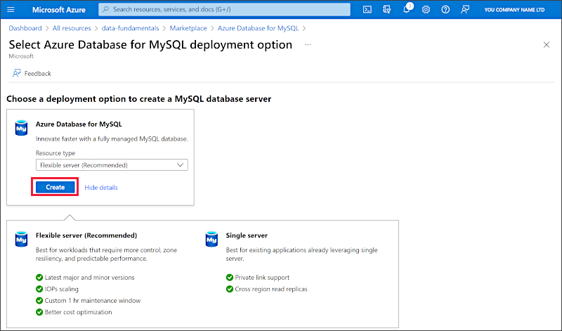
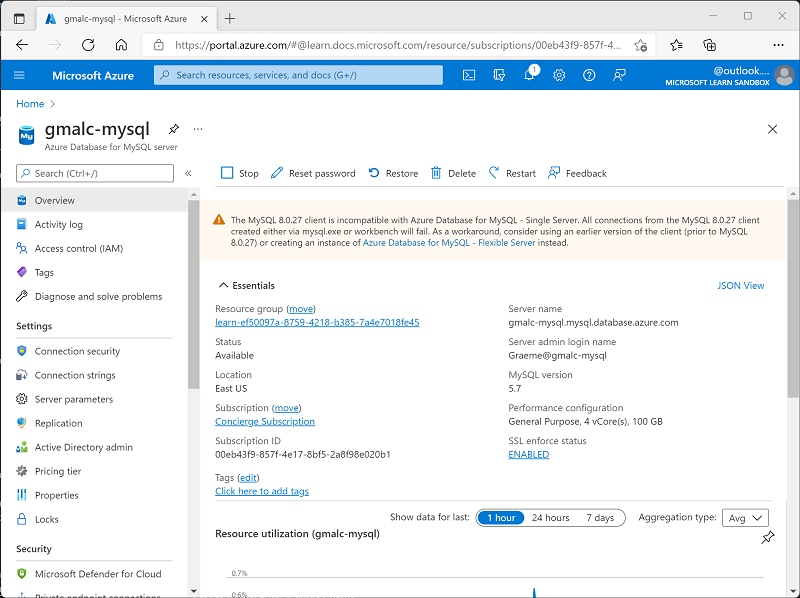

---
lab:
    title: 'Explore Azure Database for MySQL'
    module: 'Explore relational data in Azure'
---

# Explore Azure Database for MySQL

In this exercise you'll provision an Azure Database for MySQL resource in your Azure subscription.

This lab will take approximately **5** minutes to complete.

## Before you start

You'll need an [Azure subscription](https://azure.microsoft.com/free) in which you have administrative-level access.

## Provision an Azure Database for MySQL resource

In this exercise, you'll provision an Azure Database for MySQL resource.

1. In the Azure portal, select **&#65291; Create a resource** from the upper left-hand corner and search for *Azure Database for MySQL*. Then in the resulting **Azure Database for MySQL** page, select **Create**.

1. Review the Azure Database for MySQL options that are available. Then for **Resource type**, select **Flexible Server** and select **Create**.

    

1. Enter the following values on the **Create SQL Database** page:
    - **Subscription**: Select your Azure subscription.
    - **Resource group**: Create a new resource group with a name of your choice.
    - **Server name**: Enter a unique name.
    - **Region**: Any available location near you.
    - **MySQL Version**: Leave unchanged.
    - **Workload type**: For development or hobby projects.
    - **Compute + storage**: Leave unchanged.
    - **Availability zone**: Leave unchanged.
    - **Enable high availability**: Leave unchanged.
    - **Admin username**: Your name
    - **Password** and **Confirm password**: A suitably complex password

1. Select **Next: Networking**.

1. Under **Firewall rules**, select **&#65291; Add current client IP address**.

1. Select **Review + Create**, and then select **Create** to create your Azure MySQL database.

1. Wait for deployment to complete. Then go to the resource that was deployed, which should look like this:

    

1. Review the options for managing your Azure Database for MySQL resource.

> **Tip**:  If you've finished exploring Azure Database for MySQL, you can delete the resource group that you created in this exercise.
