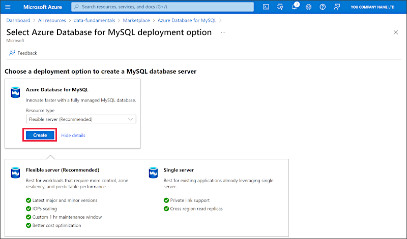
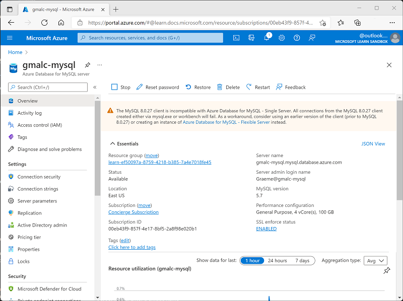

---
lab:
  title: Explore Azure Database for MySQL
  module: Explore relational data in Azure
  description: In this lab, you'll provision an Azure Database for MySQL resource from scratch, then create tables, add sample data, and run SQL queries against it. The lab is written for absolute beginners with no prior Azure or database experience, so every step is explained in plain language.
  duration: 25 minutes
  level: 100
  islab: true
  primarytopics:
    - Azure Database for MySQL
    - Azure Portal
    - Azure
---

# Explore Azure Database for MySQL

In this lab, you'll create your first cloud database using **Azure Database for MySQL**. **MySQL** is one of the world's most popular free, open-source relational databases, widely used to power websites and apps. A *relational* database stores information in tables made up of rows and columns, similar to a spreadsheet.

You'll create ("provision") the database server, then build a small **car dealership** database: a table of **manufacturers** that build cars, and a table of **vehicles** the dealership sells. After adding some sample data, you'll use **SQL** (Structured Query Language) to ask the database questions, and finish by answering a real business question with a summary query. Don't worry if you've never used Azure, a database, or SQL before, every step is explained as you go.

This lab will take approximately **25** minutes to complete.

## Before you start

You'll need an [Azure subscription](https://azure.microsoft.com/free) in which you have administrative-level access. If you don't have one, you can sign up for a free account using the link above.

> _**What is Azure?** Azure is Microsoft's cloud platform. Instead of buying and running your own server computer, you rent computing resources (like a database) from Microsoft and use them over the internet. The **Azure portal** is the website you use to create and manage those resources._

## Provision an Azure Database for MySQL resource

"Provisioning" just means creating and setting up a new resource. In this section, you'll create your MySQL database server.

1. Sign in to the [Azure portal](https://portal.azure.com?azure-portal=true) using your Azure account.

1. At the top left of the page, select **&#65291; Create a resource**, and in the search box type `Azure Database for MySQL`. In the search results, select **Azure Database for MySQL**, and then on its page, select **Create**.

1. Review the deployment options that are available. Then for **Resource type**, select **Flexible Server**, and select **Create**.

    

    > _**Tip:** "Flexible Server" is the recommended option for most new projects. It gives you good control over cost and configuration while keeping setup simple, which is perfect for learning._

1. Enter the following values on the **Create** page, and leave all other properties with their default setting:
    - **Subscription**: Select your Azure subscription.
    - **Resource group**: Select **Create new** and enter a name of your choice, such as `dp900-lab-rg`.

        > _**What is a resource group?** It's just a folder that holds related Azure resources together. When you're finished, you can delete the folder to remove everything in one click._

    - **Server name**: Enter a globally unique name, such as `mysql-server-<your-initials-and-numbers>` (the name must not already be in use by anyone else).
    - **Region**: Choose any available location near you.
    - **MySQL version**: Leave unchanged.
    - **Workload type**: Select **For development or hobby projects**.

        > _**Tip:** The development workload type chooses smaller, lower-cost settings that are ideal for learning and testing rather than running a busy production app._

    - **Compute + storage**: Leave unchanged.
    - **Availability zone**: Leave unchanged.
    - **Enable high availability**: Leave unchanged.
    - **Admin username**: Enter a username of your choice, such as `mysqladmin`.
    - **Password** and **Confirm password**: Enter a strong password and **write it down**, you'd need it to sign in to the database later.

        > _**Tip:** The admin username and password are the "keys" to your database. In a real project you'd store them securely, never share them, and use a strong password._

1. Select **Next: Networking >**.

1. Under **Firewall rules**, select **&#65291; Add current client IP address**.

    > _**What does this do?** A firewall blocks unwanted connections to your database. This setting adds an exception so that *your* computer is allowed to connect during the lab. In a real project, you'd open access only to the specific computers and services that genuinely need it._

1. Still under **Firewall rules**, select the **Allow public access from any Azure service within Azure to this server** checkbox.

    > _**Why?** Later in this lab you'll connect to your database using **Azure Cloud Shell**, a command-line tool that runs inside Azure. This checkbox lets that Azure-based tool reach your server. You'd be more selective about this in a real project._

1. Select **Review + create**, review the settings, and then select **Create** to start creating your Azure Database for MySQL.

1. Wait a few minutes for the deployment to complete. When it's finished, select **Go to resource**. Your database page should look similar to this:

    

## Connect to your database

Your server is running, but you need a way to type SQL commands into it. You'll use **Azure Cloud Shell**, a command-line tool built into the Azure portal, so there's nothing to install on your computer.

> _**New to using a command line?** Don't worry. A command line is just a box where you type an instruction and press Enter to run it. In this lab you don't have to invent any commands, you'll copy each one from these instructions and paste it in. Take it one step at a time and you'll be fine._

1. Before you connect, find your server's full address. On your database page in the portal, look at the **Overview** section (the page you're already on) and find the **Server name**. It looks like `mysql-server-abc123.mysql.database.azure.com`. Select the **copy** icon next to it, or write it down exactly. You'll need it in a moment.

    > _**Tip:** This full address is sometimes labeled **Server name** or **Host name**. It always ends in `.mysql.database.azure.com`._

1. At the top right of the Azure portal, select the **Cloud Shell** icon (**>_**). If this is your first time using Cloud Shell, accept the prompts to set it up, and choose **Bash** if you're asked to pick a shell type. Cloud Shell opens in a panel at the bottom of the screen.

    > _**Can't see the icon?** Depending on your screen size or browser zoom, the top toolbar icons may be hidden. If you don't see the **>_** icon, try any of these:_
    > - _Select the **&#8230;** (more) menu near the top-right of the portal and look for **Cloud Shell** there._
    > - _Reduce your browser zoom (press **Ctrl** and **-**, or **Cmd** and **-** on a Mac) so more icons fit, then look again._
    > - _Or simply open a new browser tab and go to [https://shell.azure.com](https://shell.azure.com?azure-portal=true), which opens the same Cloud Shell directly._

    > _**What is Cloud Shell?** It's a small command-line environment that runs in your browser, already signed in to your Azure account. It's a handy way to run tools without installing anything locally._

1. Copy the command below by selecting the **copy** icon in the top-right corner of the code box. Then paste it into Cloud Shell. **To paste, right-click inside the Cloud Shell panel and choose Paste** (the usual Ctrl+V might not work in a terminal).

    ```bash
    mysql --host=<server-name>.mysql.database.azure.com --user=<admin-username> --password --ssl-mode=REQUIRED
    ```

    *Don't press Enter yet.* You need to fix two parts of the command first.

1. In the command you just pasted, carefully replace the two placeholders, **including the angle brackets `< >` themselves**:

    - Replace `<server-name>.mysql.database.azure.com` with the full server address you copied earlier (for example, `mysql-server-abc123.mysql.database.azure.com`).
    - Replace `<admin-username>` with the admin username you chose when you created the server (for example, `mysqladmin`).

    > _**Important:** The `< >` brackets are just placeholders, they must not remain in the final command. When you're done it should read like `--host=mysql-server-abc123.mysql.database.azure.com --user=mysqladmin ...` with no `<` or `>` anywhere._

    > _**What does this command do?** `mysql` is the standard tool for talking to a MySQL database. The **host** is your server's full internet address, the **user** is the admin account you created, and `--ssl-mode=REQUIRED` makes sure the connection is encrypted._

1. Now press Enter to run the command.

1. When prompted with `Enter password:`, type the **password** you wrote down earlier, then press Enter.

    > _**The screen looks frozen, is it broken?** No. For security, the password is invisible as you type, you won't see dots or stars, and the cursor won't move. This is normal. Just type it carefully and press Enter._

1. When you connect successfully, the prompt changes to `mysql>`. You're now ready to run SQL commands.

    > _**Got an error instead?** Don't panic. The most common causes are easy to fix:_
    > - _A typo in the server address or username, or a leftover `<` or `>` bracket. Check the command and try again._
    > - _A "can't connect" or timeout message. Wait a minute (a brand-new server can take a moment to become reachable) and run the command again. Also confirm you ticked the **Allow public access from any Azure service** checkbox when you created the server._
    > - _To run the command again, press the **Up arrow** key in Cloud Shell to bring it back, edit it, and press Enter._

## Create a database, tables, and sample data

A single MySQL server can hold several separate databases. You'll create one for the dealership, then add tables to it. In a relational database, data is stored in **tables**, which are like spreadsheets made of rows and columns.

> _**Reminder about pasting:** For every block of SQL below, select the **copy** icon in the corner of the code box, then **right-click inside Cloud Shell and choose Paste**. Unlike the connect command, you don't need to change anything in these, just paste and press Enter._

> _**If you ever see a prompt that ends in `->`** instead of `mysql>`, it means MySQL is still waiting for the rest of a command. This usually happens if only part of a block was pasted. Type a semicolon `;` and press Enter to finish it, then paste the full block again._

1. At the `mysql>` prompt, create a new database and switch to it. Type each line and press Enter:

    ```sql
    CREATE DATABASE Dealership;
    USE Dealership;
    ```

    > _**What does this do?** `CREATE DATABASE` makes a new, empty database, and `USE` tells MySQL that the commands you run next should apply to it._

1. Create a **Manufacturer** table (the companies that build vehicles) and a **Vehicle** table (the cars the dealership sells):

    ```sql
    CREATE TABLE Manufacturer (
        ManufacturerID   INT          PRIMARY KEY,
        ManufacturerName VARCHAR(50)  NOT NULL,
        Country          VARCHAR(50)
    );

    CREATE TABLE Vehicle (
        VehicleID      INT            PRIMARY KEY,
        ModelName      VARCHAR(50)    NOT NULL,
        ManufacturerID INT            NOT NULL,
        ModelYear      INT,
        BodyType       VARCHAR(30),
        ListPrice      DECIMAL(10, 2),
        FOREIGN KEY (ManufacturerID) REFERENCES Manufacturer(ManufacturerID)
    );
    ```

    > _**What does this do?** Each `CREATE TABLE` statement defines a table and its columns. The **PRIMARY KEY** uniquely identifies each row (no two manufacturers can share an ID). The **FOREIGN KEY** links each vehicle to a manufacturer, so the two tables are related, that's what makes this a "relational" database._

1. Your tables exist but are empty. Add some manufacturers and vehicles:

    ```sql
    INSERT INTO Manufacturer (ManufacturerID, ManufacturerName, Country) VALUES
    (1, 'Toyota',     'Japan'),
    (2, 'Ford',       'United States'),
    (3, 'Volkswagen', 'Germany'),
    (4, 'Hyundai',    'South Korea');

    INSERT INTO Vehicle (VehicleID, ModelName, ManufacturerID, ModelYear, BodyType, ListPrice) VALUES
    (101, 'Corolla', 1, 2024, 'Sedan',     24500.00),
    (102, 'RAV4',    1, 2024, 'SUV',       31200.00),
    (103, 'F-150',   2, 2023, 'Pickup',    38900.00),
    (104, 'Mustang', 2, 2024, 'Coupe',     42500.00),
    (105, 'Golf',    3, 2023, 'Hatchback', 27800.00),
    (106, 'Tiguan',  3, 2024, 'SUV',       33400.00),
    (107, 'Elantra', 4, 2024, 'Sedan',     22300.00),
    (108, 'Tucson',  4, 2023, 'SUV',       29600.00);
    ```

    > _**What does this do?** Each `INSERT` statement adds rows of data to a table. You've now added 4 manufacturers and 8 vehicles. Notice that each vehicle's **ManufacturerID** matches an ID in the Manufacturer table._

## Query the data

Now that your database has data in it, you can use SQL **SELECT** statements to retrieve and explore it.

1. Return every column and row from the **Vehicle** table:

    ```sql
    SELECT * FROM Vehicle;
    ```

    > _**Tip:** `SELECT *` means "select all columns". It's handy for a quick look, but in real applications you usually list only the columns you actually need._

1. Now filter the data. The **WHERE** clause returns only the vehicles that cost less than $30,000, and **ORDER BY** sorts them from cheapest to most expensive:

    ```sql
    SELECT ModelName, BodyType, ListPrice
    FROM Vehicle
    WHERE ListPrice < 30000
    ORDER BY ListPrice;
    ```

    > _**Tip:** **WHERE** filters which rows you get back, and **ORDER BY** controls the order they appear in. These are two of the most useful tools in SQL._

1. Try a query that combines data from both tables:

    ```sql
    SELECT v.ModelName, m.ManufacturerName, m.Country, v.ListPrice
    FROM Vehicle AS v
    INNER JOIN Manufacturer AS m ON v.ManufacturerID = m.ManufacturerID
    ORDER BY m.ManufacturerName;
    ```

    > _**What does this do?** A **JOIN** combines rows from two tables based on a matching value, here, the **ManufacturerID** that both tables share. This lets you see each vehicle alongside the company that makes it, even though that information lives in a separate table._

## Answer a business question with a summary query

So far each row in your results has been a single vehicle. Often, though, a business wants a *summary*, for example, "how many models do we sell in each body type, and what's the average price?" SQL can group rows together and calculate totals and averages for each group.

1. Run the following query:

    ```sql
    SELECT BodyType,
           COUNT(*)        AS NumberOfModels,
           AVG(ListPrice)  AS AveragePrice
    FROM Vehicle
    GROUP BY BodyType
    ORDER BY AveragePrice DESC;
    ```

    > _**What does this do?** **GROUP BY** collapses all the vehicles that share the same **BodyType** into a single summary row. **COUNT(\*)** counts how many vehicles are in each group, and **AVG(ListPrice)** calculates their average price. Aggregation queries like this one turn raw rows into business insight, and they're a core skill for working with data._

1. Take a moment to experiment. Try grouping by **ModelYear** instead of **BodyType**, or changing `AVG` to `MAX` to find the most expensive vehicle in each group, then run the query again to see how the results change.

1. When you're finished, type `quit` and press Enter to disconnect from the database, then close Cloud Shell.

## Clean up

When you've finished exploring, you should delete the resources you created so you don't incur any further costs.

1. In the Azure portal, navigate to the **resource group** you created at the start of the lab (for example, `dp900-lab-rg`).

1. Select **Delete resource group**, confirm the deletion by entering the resource group name, and select **Delete**.

    > _**Tip:** Deleting the resource group removes the database server and everything else inside it in a single step. This is the easiest way to make sure nothing is left running and costing money._

In this lab, you provisioned an Azure Database for MySQL, created your own database and tables, added automotive sample data, and queried it with SQL, including a `GROUP BY` summary that answered a real business question. The relational ideas you used here, tables, primary and foreign keys, and `SELECT` / `WHERE` / `JOIN` / `GROUP BY` queries, are the same across every relational database, so these are skills you can carry to any engine. You've taken your first real steps with open-source relational data in the cloud!
