---
lab:
  title: Explore Azure Storage
  module: Explore Azure Storage for non-relational data
  description: 'In this lab, you''ll create an Azure Storage account and explore its core services: Blob storage, Data Lake Storage Gen2, and Azure Files. The lab is written for absolute beginners with no prior Azure experience, so every step is explained in plain language.'
  duration: 30 minutes
  level: 100
  islab: true
  primarytopics:
    - Azure
    - Azure Files
    - Azure Storage
---

# Explore Azure Storage

In this lab, you'll create an **Azure Storage account**, which is a secure place in the cloud to keep different kinds of data. You'll then explore its four core services and see what each one is for:

- **Blob storage**, for storing files such as images, documents, and data files.
- **Data Lake Storage Gen2**, blob storage with real folders, used for big-data analytics.
- **Azure Files**, cloud file shares that behave like a shared network drive.

This kind of storage is called *non-relational* because, unlike a relational database, the data doesn't have to be organized into related tables with a fixed structure. Don't worry if these terms are new, every step is explained as you go.

This lab will take approximately **30** minutes to complete.

> _**Tip**: Throughout the lab you'll see short notes that explain *why* you're doing each step. Understanding the reason behind each action helps you later design storage solutions that balance cost, performance, security, and analytics goals._

## Before you start

You'll need an [Azure subscription](https://azure.microsoft.com/free) in which you have administrative-level access. If you don't have one, you can sign up for a free account using the link above.

> _**What is Azure?** Azure is Microsoft's cloud platform. Instead of buying and running your own server computer, you rent computing resources (like storage) from Microsoft and use them over the internet. The **Azure portal** is the website you use to create and manage those resources._

## Provision an Azure Storage account

"Provisioning" just means creating and setting up a new resource. The first step in using Azure Storage is to create a storage account, which acts as a container for everything you store.

> _**What is a storage account?** It's the top-level "home" for all your Azure Storage services (blobs, files, queues, and tables). Settings like cost, how many copies of your data are kept, encryption, and who can access it are all controlled from here._

1. If you haven't already done so, sign into the [Azure portal](https://portal.azure.com?azure-portal=true).

1. On the Azure portal home page, select **&#65291; Create a resource** from the upper left-hand corner and search for `Storage account`. Then in the resulting **Storage account** page, select **Create**.

    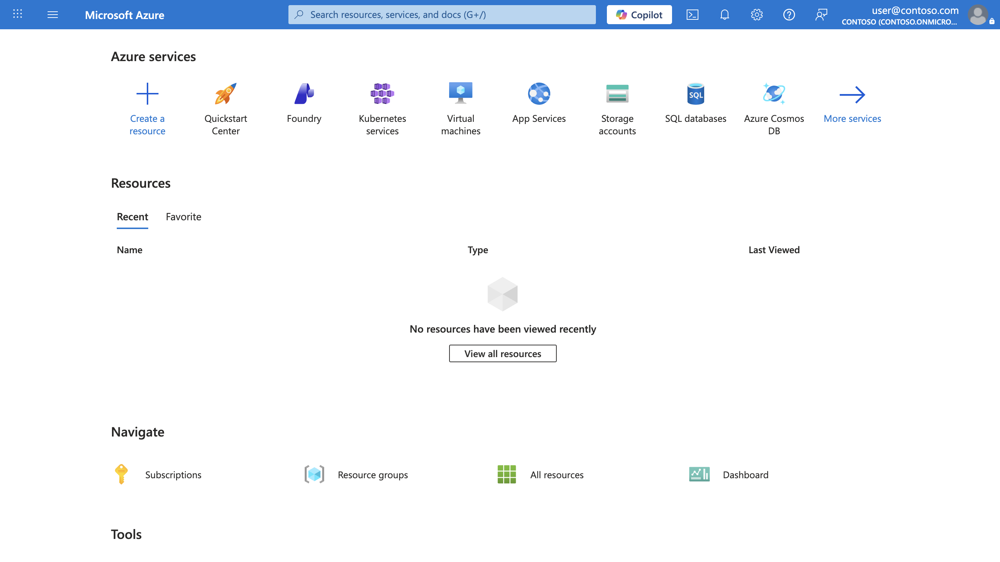

1. Enter the following values on the **Basics** tab of the **Create a storage account** page:
   
    - **Subscription**: Select your Azure subscription.
    - **Resource group**:  Select **Create new** and enter a name of your choice, such as `dp900-lab-rg`.

        > _**What is a resource group?** It's just a folder that holds related Azure resources together. When you're finished, you can delete the folder to remove everything in one click._

    - **Storage account name**: Enter a unique name for your storage account using lower-case letters and numbers only (this name must not already be in use by anyone else).
    - **Region**:  Select any available location near you.
    - **Performance**: *Standard*
    - **Redundancy**: *Locally-redundant storage (LRS)*

    > _**Note**: Depending on the region you choose, you might also see a **Preferred storage type** option set to *Azure Blob Storage or Azure Data Lake Storage Gen 2*. You can leave it at the default value._

    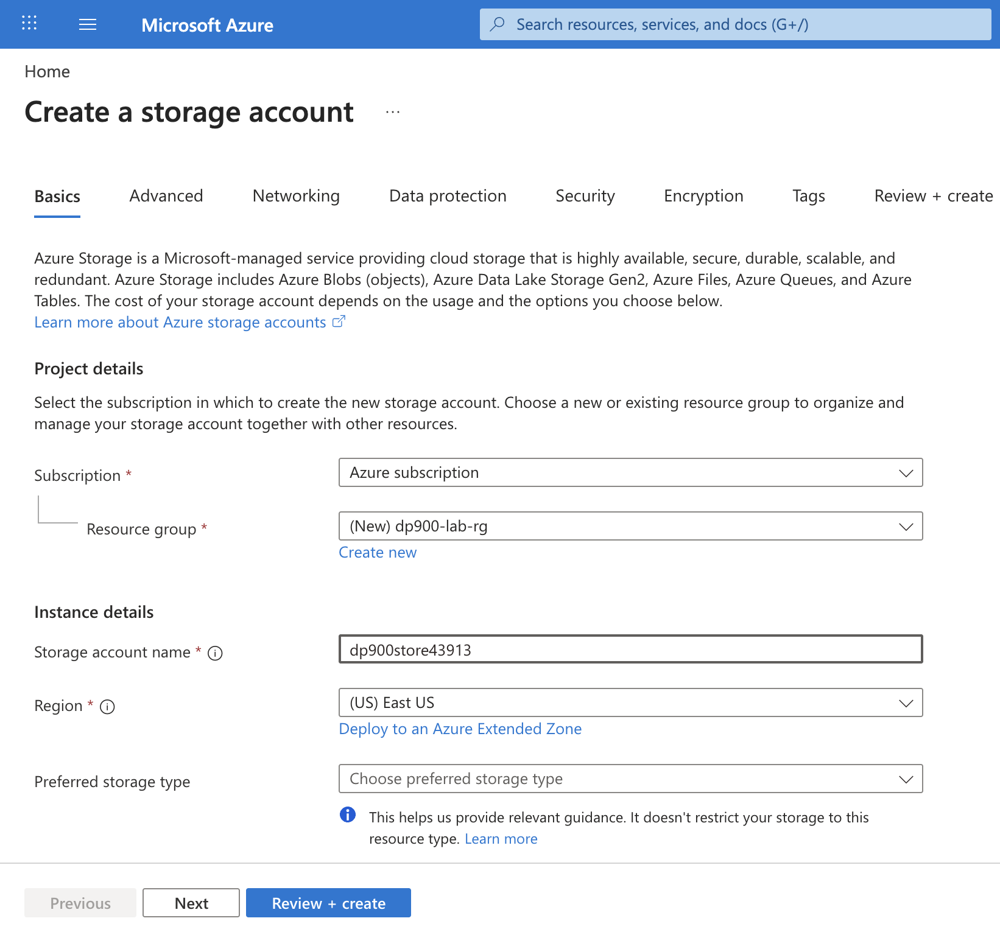

    > _**Tip**: A new resource group makes cleanup easy. Standard + LRS is the lowest-cost baseline, good for learning. LRS keeps three synchronous copies in one region, adequate for non-critical demo data without paying for geo-replication._

1. Select **Next: Advanced >** and view the advanced configuration options. In particular, note that this is where you can enable hierarchical namespace to support Azure Data Lake Storage Gen2. Leave the **Enable hierarchical namespace** option **<u>cleared</u>** (you'll enable it later), and then select **Next: Networking >** to view the networking options for your storage account.

    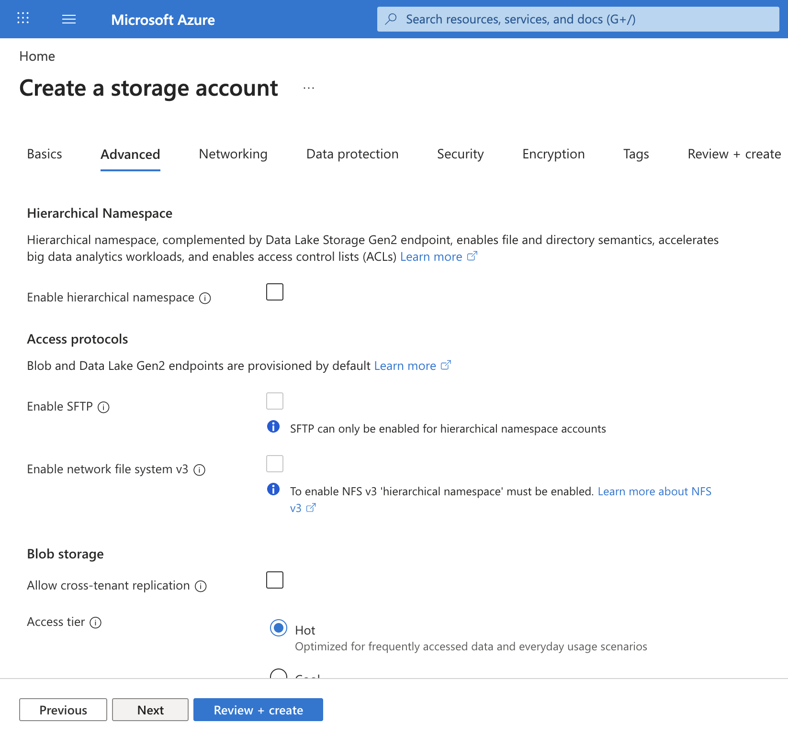

1. Select **Next: Data protection >** and then in the **Recovery** section, <u>de</u>select all of the **Enable soft delete...** options. These options retain deleted files for subsequent recovery, but can cause issues later when you enable hierarchical namespace.

    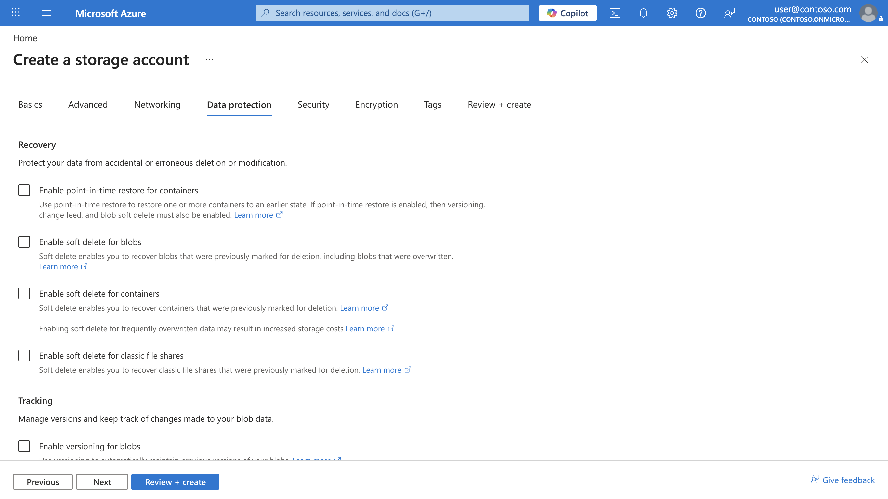

1. Continue through the remaining **Next >** pages without changing any of the default settings, and then on the  **Review** page, wait for your selections to be validated and select **Create** to create your Azure Storage account.

    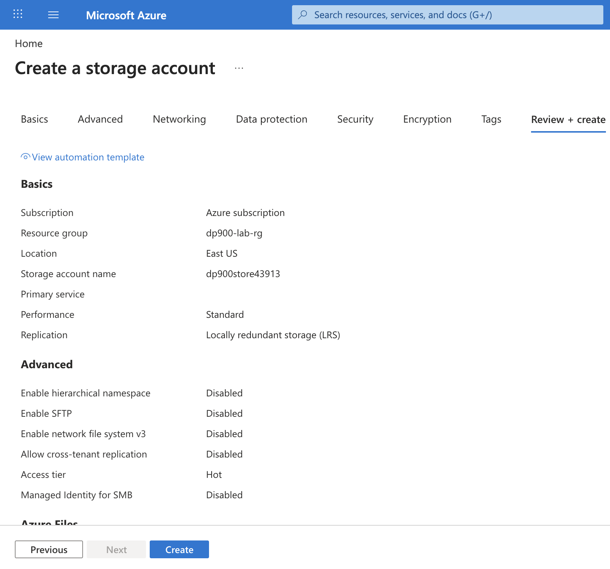

1. Wait for deployment to complete. Then select **Go to resource** to open the storage account that was deployed.

    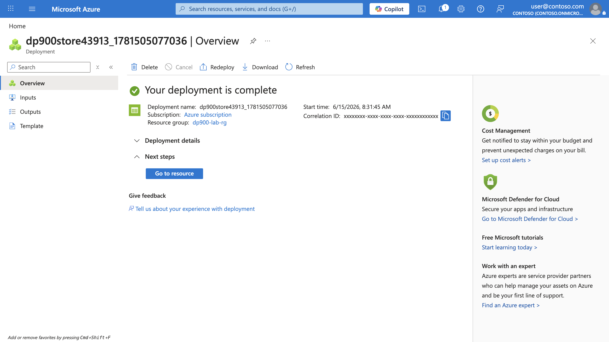

## Explore blob storage

Now that you have an Azure Storage account, you can create a container for blob data.

> _**Tip**: A container groups blobs and is the first scoping level for access control. Starting with plain blob storage (no hierarchical namespace) shows virtual folder behavior you'll compare to Data Lake Gen2 later._

1. Download the [product1.json](https://aka.ms/product1.json?azure-portal=true) JSON file from `https://aka.ms/product1.json` and save it on your computer (you can save it in any folder - you'll upload it to blob storage later).

    *If the JSON file is displayed in your browser, right click the page, and select **Save As**. Name the file  **product1.json** and store it in your downloads folder.* 

1. In the Azure portal page for your storage container, on the left side, in the **Data storage** section, select **Containers**.

1. In the **Containers** page, select **&#65291; Add container**. In the **New container** pane, enter the name `data`.

    Note that the **Anonymous access level** is automatically set to **Private (no anonymous access)** and can't be changed, because anonymous access is disabled by default on the storage account. Select **Create**.

    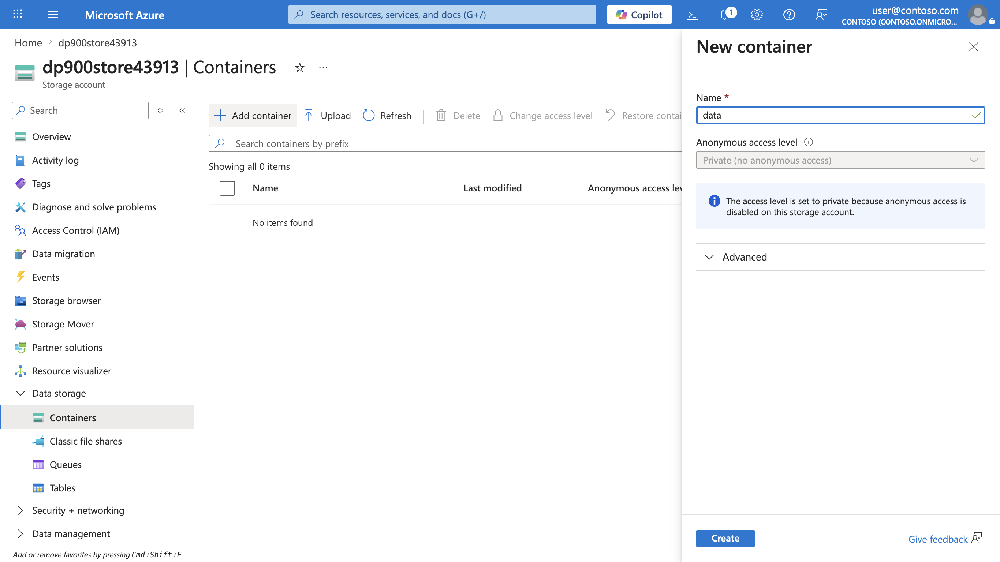

    > _**Tip**: Private keeps your sample data secure. Public access is rarely needed except for static website or open data scenarios. Naming it `data` keeps this example simple and readable._

1. When the **data** container has been created, verify that it's listed in the **Containers** page.

    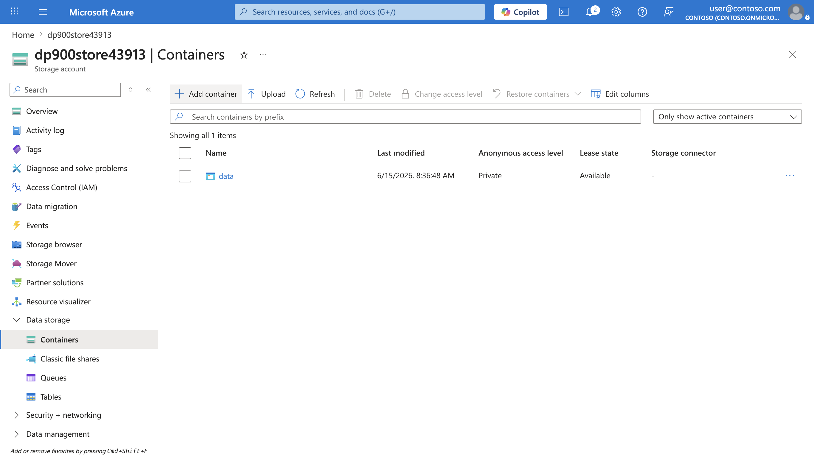

1. In the pane on the left side, in the top section, select **Storage browser**. This page provides a browser-based interface that you can use to work with the data in your storage account.

1. In the storage browser page, select **Blob containers** and verify that your **data** container is listed.

1. Select the **data** container, and note that it's empty.

    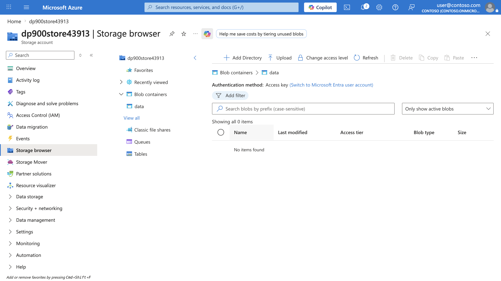

1. Select **&#65291; Add Directory** and read the information about folders before creating a new directory named `products`.

1. In storage browser, verify that the current view shows the contents of the **products** folder you just created - observe that the "breadcrumbs" at the top of the page reflect the path **Blob containers > data > products**.

    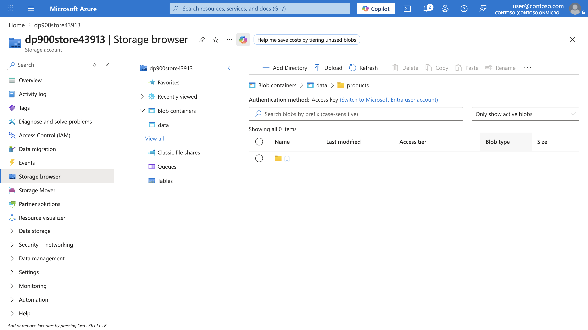

1. In the breadcrumbs, select **data** to switch to the **data** container, and note that it does <u>not</u> contain a folder named **products**.

    Folders in blob storage are virtual, and only exist as part of the path of a blob. Since the **products** folder contained no blobs, it isn't really there!

    > _**Tip**: Flat namespace means directories are just name prefixes (products/file.json). This design enables massive scale because the service indexes blob names instead of maintaining a true tree structure._

1. Use the **&#10514; Upload** button to open the **Upload blob** panel.

1. In the **Upload blob** panel, select the **product1.json** file you saved on your local computer previously. Then in the **Advanced** section, in the **Upload to folder** box, enter `product_data` and select the **Upload** button.

    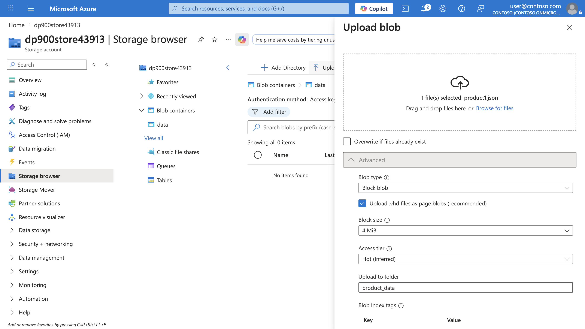

    > _**Tip**: Supplying a folder name while uploading auto-creates the virtual path, illustrating that presence of a blob makes the "folder" appear._

1. Close the **Upload blob** panel if it's still open, and verify that a **product_data** virtual folder has been created in the **data** container.

    

1. Select the **product_data** folder and verify that it contains the **product1.json** blob you uploaded.

1. On the left side, in the **Data storage** section, select **Containers**.

1. Open the **data** container, and verify that the **product_data** folder you created is listed.

1. Select the **&#x2027;&#x2027;&#x2027;** icon at the right-end of the folder, and note that the menu doesn't display any options. Folders in a flat namespace blob container are virtual, and can't be managed.

    > _**Tip**: No real directory object exists, so there are no rename/permission operations — those require hierarchical namespace._

1. Use the **X** icon at the top right in the **data** page to close the page and return to the **Containers** page.

## Explore Azure Data Lake Storage Gen2

Azure Data Lake Store Gen2 support enables you to use hierarchical folders to organize and manage access to blobs. It also enables you to use Azure blob storage to host distributed file systems for common big data analytics platforms.

> _**Tip**: Turning on hierarchical namespace makes folders behave like real directories.
It also lets you do folder actions safely (all at once, without errors) and gives you file-permission controls similar to those in Linux. This is especially helpful when working with big data tools like Spark or Hadoop, or when managing large, organized data lakes._

1. Download the [product2.json](https://aka.ms/product2.json?azure-portal=true) JSON file from `https://aka.ms/product2.json` and save it on your computer in the same folder where you downloaded **product1.json** previously - you'll upload it to blob storage later.

1. In the Azure portal page for your storage account, on the left side, scroll down to the **Settings** section, and select **Data Lake Gen2 upgrade**.

1. In the **Data Lake Gen2 upgrade** page, expand and complete each step to upgrade your storage account to enable hierarchical namespace and support Azure Data Lake Storage Gen. This may take some time.

    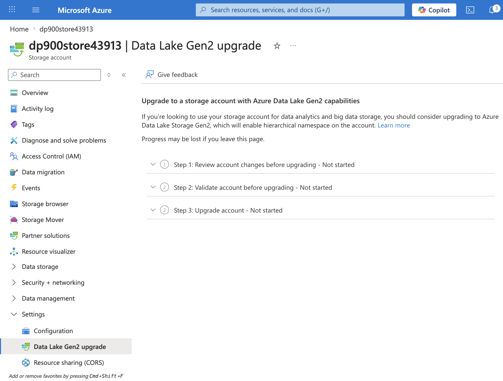

    > _**Tip**: The upgrade is an account-level capability switch — data remains, but directory semantics change to support advanced operations._

1. When the upgrade is complete, in the pane on the left side, in the top section, select **Storage browser** and navigate back to the root of your **data** blob container, which still contains the **product_data** folder.

1. Select the **product_data** folder, and verify it still contains the **product1.json** file you uploaded previously.

1. Use the **&#10514; Upload** button to open the **Upload blob** panel.

1. In the **Upload blob** panel, select the **product2.json** file you saved on your local computer. Then select the **Upload** button.

1. Close the **Upload blob** panel if it's still open, and verify that a **product_data** folder now contains the **product2.json** file.

    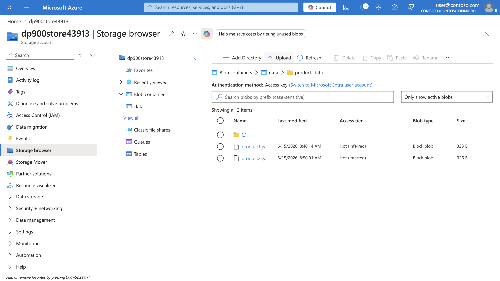

    > _**Tip**: Adding a second file post-upgrade confirms seamless continuity: existing blobs still work, and new ones gain hierarchical benefits such as directory ACLs (Access Control Lists)._

1. On the left side, in the **Data storage** section, select **Containers**.

1. Open the **data** container, and verify that the **product_data** folder you created is listed.

1. Select the **&#x2027;&#x2027;&#x2027;** icon at the right-end of the folder, and note that with hierarchical namespace enabled, you can perform configuration tasks at the folder-level; including renaming folders and setting permissions (**Manage ACL**).

    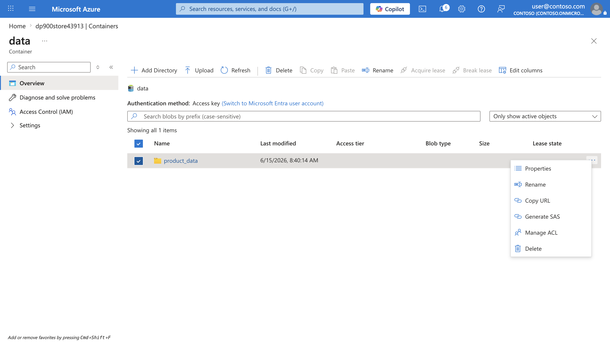

    > _**Tip**: Real folders let you apply least-privilege security at folder granularity, rename safely, and speed recursive listings versus scanning thousands of prefixed blob names._

1. Use the **X** icon at the top right in the **data** page to close the page and return to the **Containers** page.

## Explore Azure Files

Azure Files provides a way to create cloud-based file shares.

> _**Tip**: Azure Files offers SMB/NFS endpoints for lift‑and‑shift scenarios where apps expect a traditional file system. It complements (not replaces) blob storage by supporting file locks and OS-native tooling._

> _**Note**: Because you enabled hierarchical namespace (Azure Data Lake Storage Gen2) earlier, file shares for this account are managed under **Classic file shares**. On a storage account without hierarchical namespace, this menu item is simply named **File shares**, but the steps to create and connect to a share are the same._

1. In the Azure portal page for your storage account, on the left side, in the **Data storage** section, select **Classic file shares**.

1. In the **Classic file shares** page, select **&#65291; Classic file share**. On the **Basics** tab, enter the name `files` and leave the **Access tier** set to **Transaction optimized**.

    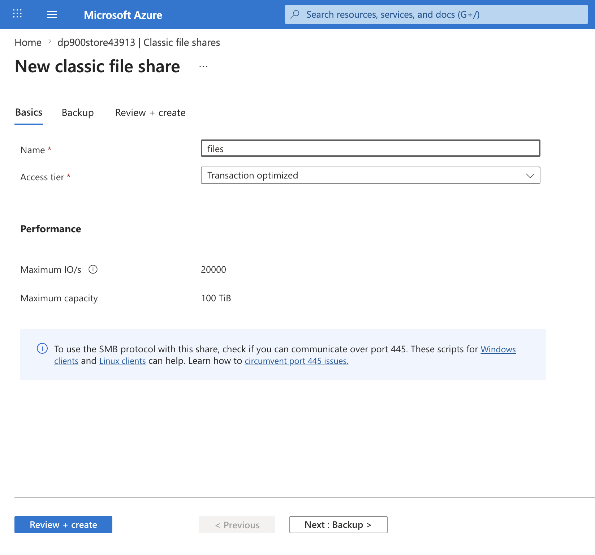

1. Select **Next: Backup >** and clear the **Enable backup** checkbox to disable backup. Then select **Review + create**, and on the **Review + create** tab, select **Create**.

    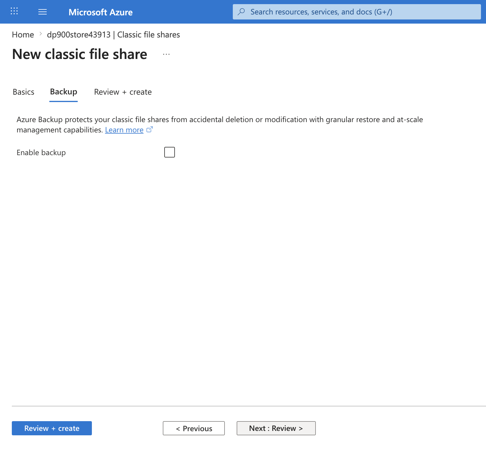

    > _**Tip**:  Disabling backup keeps costs down for a short-lived lab environment — you would enable it for production resilience._

1. When the **files** share has been created, return to the **Classic file shares** page and open your new **files** share.

1. At the top of the page, select **Connect**. Then in the **Connect** pane, note that there are tabs for common operating systems (Windows, Linux, and macOS) that contain scripts you can run to connect to the shared folder from a client computer.

    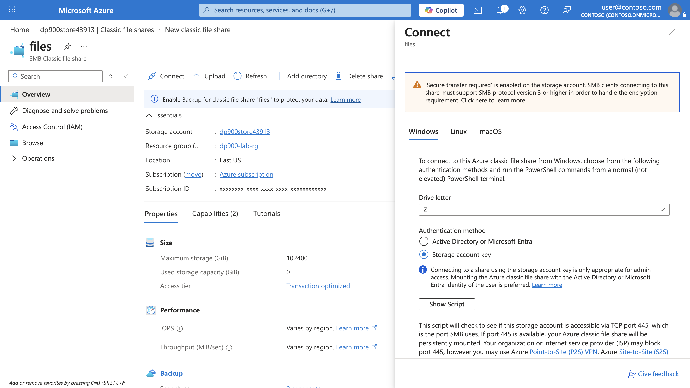

    > _**Tip**: The generated scripts show exactly how to mount the share using platform-native commands, illustrating hybrid access patterns from virtual machines, containers, or on-prem servers._

1. Close the **Connect** pane and then close the **files** page to return to the **Classic file shares** page for your Azure storage account.

## Clean up

When you've finished exploring Azure Storage, you should delete the resources you created so you don't incur any further costs.

1. In the Azure portal, navigate to the **resource group** you created at the start of the lab (for example, `dp900-lab-rg`).

1. Select **Delete resource group**, confirm the deletion by entering the resource group name, and select **Delete**.

    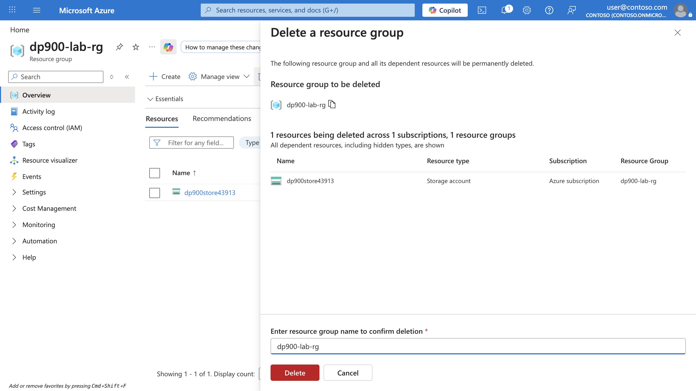

    > _**Tip:** Deleting the resource group removes the storage account and everything inside it in a single step. This is the quickest way to make sure nothing is left running and costing money._

In this lab, you created an Azure Storage account and explored blob storage, Data Lake Storage Gen2, and Azure Files. You've now seen the main ways Azure stores non-relational data!
