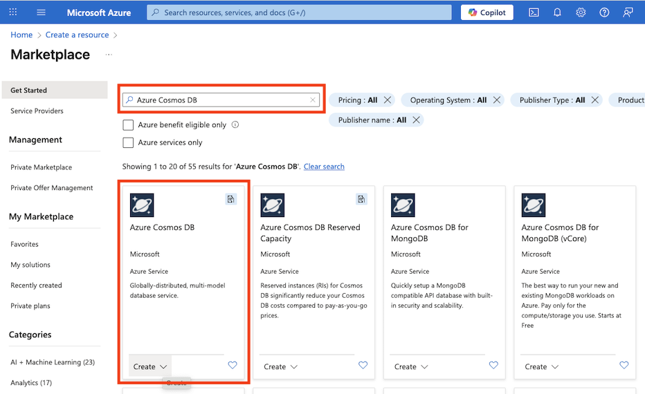
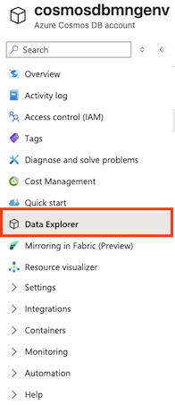
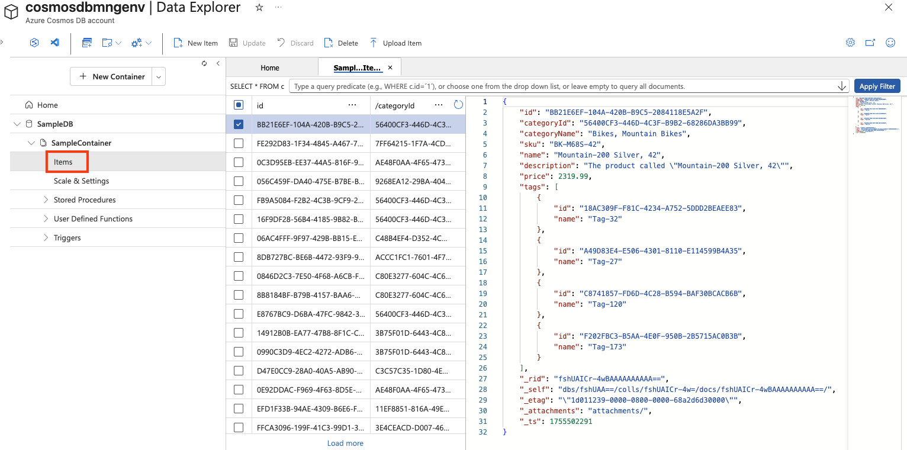
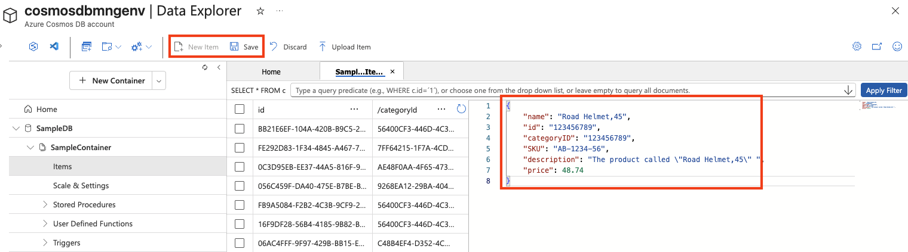
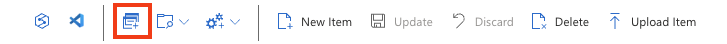
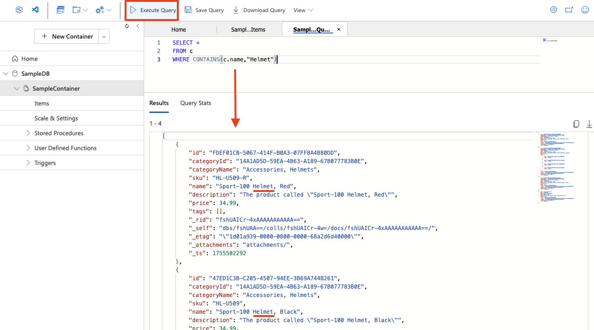

---
lab:
    title: 'Explore Azure Cosmos DB'
    module: 'Explore fundamentals of Azure Cosmos DB'
---
# Explore Azure Cosmos DB

By completing this lab, you'll learn how to provision an Azure Cosmos DB account, create a sample database and container, add and view JSON items, and run SQL-like queries to retrieve data. You'll gain hands-on experience with the Azure portal and understand how Cosmos DB supports flexible, non-relational data storage and querying.

This lab will take approximately **15** minutes to complete.

## Before you start

You'll need an [Azure subscription](https://azure.microsoft.com/free) in which you have administrative-level access.

## Create a Cosmos DB account

To use Cosmos DB, you must provision a Cosmos DB account in your Azure subscription. In this exercise, you'll provision a Cosmos DB account that uses Azure Cosmos DB for NoSQL.

1. In the Azure portal, select **+ Create a resource** at the top left, and search for `Azure Cosmos DB`.  In the results, select **Azure Cosmos DB** and select  **Create**.

    

1. In the **Azure Cosmos DB for NoSQL** tile, select **Create**.

    
   
    > _**Tip**: The account is the top level for your Cosmos DB resources. Choosing Azure Cosmos DB for NoSQL lets you store and query JSON data with a simple, SQL-like query language._

1. Enter the following details, and then select **Review + Create**:
   
    - **Workload Type**: Learning
    - **Subscription**: If you're using a sandbox, select *Concierge Subscription*. Otherwise, select your Azure subscription.
    - **Resource group**:  If you're using a sandbox, select the existing resource group (which will have a name like *learn-xxxx...*). Otherwise, create a new resource group with a name of your choice.
    - **Account Name**: Enter a unique name
    - **Availability Zones**: Disable
    - **Location**: Choose any recommended location
    - **Capacity mode**: Provisioned throughput
    - **Apply Free-Tier Discount**: Select Apply if available
    - **Limit total account throughput**: Unselected
  
    > _**Why these choices?**_
    >
    > _We’re setting the **workload type** to Learning because it comes with beginner-friendly defaults that make setup easier and keep costs low. Your **account name** needs to be unique across the whole service, since it becomes part of your service’s URL. We’re picking a **location** close to you so your tests run faster; which locations you see will depend on your subscription and whether certain availability zones are enabled. For **capacity mode**, we’re going with Provisioned throughput so performance stays predictable during this short lab—though Serverless can be fine if you only need it occasionally. If the **free tier** is available, we’ll use it so you can experiment without racking up charges. Finally, we’re keeping the “**limit total account throughput**” setting turned off so nothing gets slowed down unexpectedly while you work._

1. When the configuration has been validated, select **Create**.

    > _**Tip**: Azure Portal will estimate how long it will take to provision this instance of CosmosDB. The estimated creation time is calculated based on the location you have selected._

1. Wait for deployment to complete. Then go to the deployed resource.

## Create a sample database

*Throughout this procedure, close any tips that are displayed in the portal*.

1. On the page for your new Cosmos DB account, in the pane on the left, select **Data Explorer**.

    

1. In the **Data Explorer** page, select **Launch quick start**.

    > _**Tip**: Quick start creates a working database, container, and sample data so you can practice adding and querying items without designing a schema first._

1. In the **New container** tab, review the pre-populated settings for the sample database, and then select **OK**.

1. Observe the status in the panel at the bottom of the screen until the **SampleDB** database and its **SampleContainer** container has been created (which may take a minute or so).

## View and create items

1. In the Data Explorer page, expand the **SampleDB** database and the **SampleContainer** container, and select **Items** to see a list of items in the container. The items represent product data, each with a unique id and other properties.

    

1. Select any of the items in the list to see a JSON representation of the item data.

1. At the top of the page, select **New Item** to create a new blank item.

1. Modify the JSON for the new item as follows, and then select **Save**.

    ```json
   {
       "name": "Road Helmet,45",
       "id": "123456789",
       "categoryID": "123456789",
       "SKU": "AB-1234-56",
       "description": "The product called \"Road Helmet,45\" ",
       "price": 48.74
   }
    ```

    

1. After saving the new item, notice that additional metadata properties are added automatically.

    > _**Tip**: Cosmos DB stores items as JSON (JavaScript Object Notation), so you can add fields that fit your scenario without a rigid schema. The `id` must be unique within the container. After you save, Cosmos DB adds system properties (like timestamps and internal identifiers) to help manage and optimize your data:_
    > - *_rid — The internal resource ID used by Cosmos DB to identify the item internally.*
    > - *_self — The full resource link for the item.*
    > - *_etag — The entity tag used for optimistic concurrency checks.*
    > - *_ts — The Unix timestamp (in seconds) when the item was last modified.*
    > - *_attachments — A link to the document’s attachments (if any).*

## Query the database

1. In the **Data Explorer** page, select the **New SQL Query** icon.

    

1. In the SQL Query editor, review the default query (`SELECT * FROM c`) and use the **Execute Query** button to run it.

1. Review the results, which includes the full JSON representation of all items.

1. Modify the query as follows:

    ```sql
   SELECT *
   FROM c
   WHERE CONTAINS(c.name,"Helmet")
    ```

    > _**Tip**: The NoSQL API uses familiar, SQL-like queries to search JSON documents. `SELECT * FROM c` lists all items, and `CONTAINS` filters by text inside a property—useful for quick searches without extra setup._

1. Use the **Execute Query** button to run the revised query and review the results, which includes JSON entities for any items with a **name** field containing the text "Helmet".

    

1. Close the SQL Query editor, discarding your changes.

    You've seen how to create and query JSON entities in a Cosmos DB database by using the data explorer interface in the Azure portal. In a real scenario, an application developer would use one of the many programming language specific software development kits (SDKs) to call the NoSQL API and work with data in the database.

> _**Tip**: If you've finished exploring Azure Cosmos DB, you can delete the resource group that you created in this exercise._
