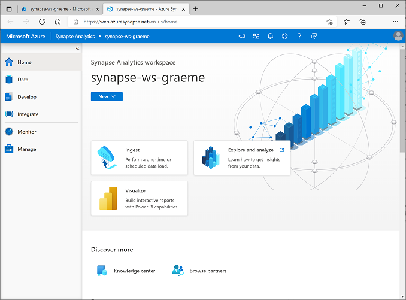
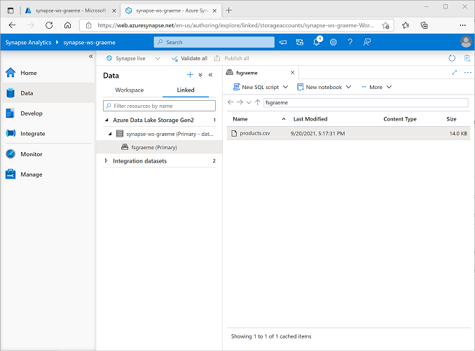

---
lab:
    title: 'Explore data analytics in Azure with Azure Synapse Analytics'
    module: 'Explore fundamentals of large-scale data warehousing'
---

# Explore data analytics in Azure with Azure Synapse Analytics

In this exercise you'll provision an Azure Synapse Analytics workspace in your Azure subscription, and use it to ingest and query data.

This lab will take approximately **30** minutes to complete.

## Before you start

You'll need an [Azure subscription](https://azure.microsoft.com/free) in which you have administrative-level access.

## Provision an Azure Synapse Analytics workspace

To use Azure Synapse Analytics, you must provision an Azure Synapse Analytics Workspace resource in your Azure subscription.

1. Open the Azure portal at [https://portal.azure.com](https://portal.azure.com?azure-portal=true), and sign in using the credentials associated with your Azure subscription.

    > **Tip**:  Ensure you are working in the directory containing your subscription - indicated at the top right under your user ID. If not, select the user icon and switch directory.

2. In the Azure portal, on the **Home** page, use the **&#65291; Create a resource** icon to create a new resource.
3. Search for *Azure Synapse Analytics*, and create a new **Azure Synapse Analytics** resource with the following settings:
    - **Subscription**: *Your Azure subscription*
        - **Resource group**: *Create a new resource group with a suitable name, like "synapse-rg"*
        - **Managed resource group**: *Enter an appropriate name, for example "synapse-managed-rg"*.
    - **Workspace name**: *Enter a unique workspace name, for example "synapse-ws-<your_name>"*.
    - **Region**: *Select any of the following regions*:
        - Australia East
        - Central US
        - East US 2
        - North Europe
        - South Central US
        - Southeast Asia
        - UK South
        - West Europe
        - West US
        - WestUS 2
    - **Select Data Lake Storage Gen 2**: From subscription
        - **Account name**: *Create a new account with a unique name, for example "datalake<your_name>"*.
        - **File system name**: *Create a new file system with a unique name, for example "fs<your_name>"*.

    > **Note**: A Synapse Analytics workspace requires two resource groups in your Azure subscription; one for resources you explicitly create, and another for managed resources used by the service. It also requires a Data Lake storage account in which to store data, scripts, and other artifacts.

4. When you've entered these details, select **Review + create**, and then select **Create** to create the workspace.
5. Wait for the workspace to be created - this may take five minutes or so.
6. When deployment is complete, go to the resource group that was created and notice that it contains your Synapse Analytics workspace and a Data Lake storage account.
7. Select your Synapse workspace, and in its **Overview** page, in **Open Synapse Studio** card, select **Open** to open Synapse Studio in a new browser tab. Synapse Studio is a web-based interface that you can use to work with your Synapse Analytics workspace.
8. On the left side of Synapse Studio, use the **&rsaquo;&rsaquo;** icon to expand the menu - this reveals the different pages within Synapse Studio that you'll use to manage resources and perform data analytics tasks, as shown here:

    

## Ingest data

One of the key tasks you can perform with Azure Synapse Analytics is to define *pipelines* that transfer (and if necessary, transform) data from a wide range of sources into your workspace for analysis.

1. In Synapse Studio, on the **Home** page, select **Ingest** to open the **Copy Data tool** tool.
2. In the Copy Data tool, on the **Properties** step, ensure that **Built-in copy task** and **Run once now** are selected, and click **Next >**.
3. On the **Source** step, in the **Dataset** substep, select the following settings:
    - **Source type**: All
    - **Connection**: *Create a new connection, and in the **New connection** pane that appears, on the **File** tab, select **HTTP**. Then continue and create a connection to a data file using the following settings:*
        - **Name**: AdventureWorks Products
        - **Description**: Product list via HTTP
        - **Connect via integration runtime**: AutoResolveIntegrationRuntime
        - **Base URL**: `https://raw.githubusercontent.com/MicrosoftLearning/DP-900T00A-Azure-Data-Fundamentals/master/Azure-Synapse/products.csv`
        - **Server Certificate Validation**: Enable
        - **Authentication type**: Anonymous
4. After creating the connection, on the **Source/Dataset** substep, ensure the following settings are selected, and then select **Next >**:
    - **Relative URL**: *Leave blank*
    - **Request method**: GET
    - **Additional headers**: *Leave blank*
    - **Binary copy**: <u>Un</u>selected
    - **Request timeout**: *Leave blank*
    - **Max concurrent connections**: *Leave blank*
5. On the **Source** step, in the **Configuration** substep, select **Preview data** to see a preview of the product data your pipeline will ingest, then close the preview.
6. After previewing the data, on the **Source/Configuration** step, ensure the following settings are selected, and then select **Next >**:
    - **File format**: DelimitedText
    - **Column delimiter**: Comma (,)
    - **Row delimiter**: Line feed (\n)
    - **First row as header**: Selected
    - **Compression type**: None
7. On the **Destination** step, in the **Dataset** substep, select the following settings:
    - **Destination type**: Azure Data Lake Storage Gen 2
    - **Connection**: *Select the existing connection to your data lake store (this was created for you when you created the workspace).*
8. After selecting the connection, on the **Destination/Dataset** step, ensure the following settings are selected, and then select **Next >**:
    - **Folder path**: *Browse to your file system folder*
    - **File name**: products.csv
    - **Copy behavior**: None
    - **Max concurrent connections**: *Leave blank*
    - **Block size (MB)**: *Leave blank*
9. On the **Destination** step, in the **Configuration** substep, ensure that the following properties are selected. Then select **Next >**:
    - **File format**: DelimitedText
    - **Column delimiter**: Comma (,)
    - **Row delimiter**: Line feed (\n)
    - **Add header to file**: Selected
    - **Compression type**: None
    - **Max rows per file**: *Leave blank*
    - **File name prefix**: *Leave blank*
10. On the **Settings** step, enter the following settings and then click **Next >**:
    - **Task name**: Copy products
    - **Task description** Copy products data
    - **Fault tolerance**: *Leave blank*
    - **Enable logging**: <u>Un</u>selected
    - **Enable staging**: <u>Un</u>selected
11. On the **Review and finish** step, on the **Review** substep, read the summary and then click **Next >**.
12. On the **Deployment** substep, wait for the pipeline to be deployed and then click **Finish**.
13. In Synapse Studio, select the **Monitor** page, and in the **Pipeline runs** tab, wait for the **Copy products** pipeline to complete with a status of **Succeeded** (you can use the **&#8635; Refresh** button on the Pipeline runs page to refresh the status).
14. On the **Data** page, select the **Linked** tab and expand the **Azure Data Lake Storage Gen 2** hierarchy until you see the file storage for your Synapse workspace. Then select the file storage to verify that a file named **products.csv** has been copied to this location, as shown here:

    

## Use a SQL pool to analyze data

Now that you've ingested some data into your workspace, you can use Synapse Analytics to query and analyze it. One of the most common ways to query data is to use SQL, and in Synapse Analytics you can use a *SQL pool* to run SQL code.

1. In Synapse Studio, right-click the **products.csv** file in the file storage for your Synapse workspace, point to **New SQL script**, and select **Select TOP 100 rows**.
2. In the **SQL Script 1** pane that opens, review the SQL code that has been generated, which should be similar to this:

    ```SQL
    -- This is auto-generated code
    SELECT
        TOP 100 *
    FROM
        OPENROWSET(
            BULK 'https://datalakexx.dfs.core.windows.net/fsxx/products.csv',
            FORMAT = 'CSV',
            PARSER_VERSION='2.0'
        ) AS [result]
    ```

    This code  opens a rowset from the text file you imported and retrieves the first 100 rows of data.

3. In the **Connect to** list, ensure **Built-in** is selected - this represents the built-in SQL Pool that was created with your workspace.
4. On the toolbar, use the **&#9655; Run** button to run the SQL code, and review the results, which should look similar to this:

    | C1 | c2 | c3 | c4 |
    | -- | -- | -- | -- |
    | ProductID | ProductName | Category | ListPrice |
    | 771 | Mountain-100 Silver, 38 | Mountain Bikes | 3399.9900 |
    | 772 | Mountain-100 Silver, 42 | Mountain Bikes | 3399.9900 |
    | ... | ... | ... | ... |

5. Note the results consist of four columns named C1, C2, C3, and C4; and that the first row in the results contains the names of the data fields. To fix this problem, add a HEADER_ROW = TRUE parameters to the OPENROWSET function as shown here (replacing *datalakexx* and *fsxx* with the names of your data lake storage account and file system), and then rerun the query:

    ```SQL
    SELECT
        TOP 100 *
    FROM
        OPENROWSET(
            BULK 'https://datalakexx.dfs.core.windows.net/fsxx/products.csv',
            FORMAT = 'CSV',
            PARSER_VERSION='2.0',
            HEADER_ROW = TRUE
        ) AS [result]
    ```

    Now the results look like this:

    | ProductID | ProductName | Category | ListPrice |
    | -- | -- | -- | -- |
    | 771 | Mountain-100 Silver, 38 | Mountain Bikes | 3399.9900 |
    | 772 | Mountain-100 Silver, 42 | Mountain Bikes | 3399.9900 |
    | ... | ... | ... | ... |

6. Modify the query as follows (replacing *datalakexx* and *fsxx* with the names of your data lake storage account and file system):

    ```SQL
    SELECT
        Category, COUNT(*) AS ProductCount
    FROM
        OPENROWSET(
            BULK 'https://datalakexx.dfs.core.windows.net/fsxx/products.csv',
            FORMAT = 'CSV',
            PARSER_VERSION='2.0',
            HEADER_ROW = TRUE
        ) AS [result]
    GROUP BY Category;
    ```

7. Run the modified query, which should return a resultset that contains the number products in each category, like this:

    | Category | ProductCount |
    | -- | -- |
    | Bib Shorts | 3 |
    | Bike Racks | 1 |
    | ... | ... |

8. In the **Properties** pane for **SQL Script 1**, change the **Name** to **Count Products by Category**. Then in the toolbar, select **Publish** to save the script.

9. Close the **Count Products by Category** script pane.

10. In Synapse Studio, select the **Develop** page, and notice that your published **Count Products by Category** SQL script has been saved there.

11. Select the **Count Products by Category** SQL script to reopen it. Then ensure that the script is connected to the **Built-in** SQL pool and run it to retrieve the product counts.

12. In the **Results** pane, select the **Chart** view, and then select the following settings for the chart:
    - **Chart type**: Column
    - **Category column**: Category
    - **Legend (series) columns**: ProductCount
    - **Legend position**: bottom - center
    - **Legend (series) label**: *Leave blank*
    - **Legend (series) minimum value**: *Leave blank*
    - **Legend (series) maximum**: *Leave blank*
    - **Category label**: *Leave blank*

    The resulting chart should resemble this:

    

## Use a Spark pool to analyze data

While SQL is a common language for querying structured datasets, many data analysts find languages like Python useful to explore and prepare data for analysis. In Azure Synapse Analytics, you can run Python (and other) code in a *Spark pool*; which uses a distributed data processing engine based on Apache Spark.

1. In Synapse Studio, select the **Manage** page.
2. Select the **Apache Spark pools** tab, and then use the **&#65291; New** icon to create a new Spark pool with the following settings:
    - **Apache Spark pool name**: spark
    - **Node size family**: Memory Optimized
    - **Node size**: Small (4 vCores / 32 GB)
    - **Autoscale**: Enabled
    - **Number of nodes** 3----3
3. Review and create the Spark pool, and then wait for it to deploy (which may take a few minutes).
4. When the Spark pool has been deployed, in Synapse Studio, on the **Data** page, browse to the file system for your Synapse workspace. Then right-click **products.csv**, point to **New notebook**, and select **Load to DataFrame**.
5. In the **Notebook 1** pane that opens, in the **Attach to** list, select the **spark** Spark pool to created previously and ensure that the **Language** is set to **PySpark (Python)**.
6. Review the code in the first (and only) cell in the notebook, which should look like this:

    ```Python
    %%pyspark
    df = spark.read.load('abfss://fsxx@datalakexx.dfs.core.windows.net/products.csv', format='csv'
    ## If header exists uncomment line below
    ##, header=True
    )
    display(df.limit(10))
    ```

7.  Select **&#9655; Run** to the left of the code cell to run it, and wait for the results. The first time you run a cell in a notebook, the Spark pool is started - so it may take a minute or so to return any results.

    > **Note**: If an error occurs because the Python Kernel isn't available yet, run the cell again.

8. Eventually, the results should appear below the cell, and they should be similar to this:

    | _c0_ | _c1_ | _c2_ | _c3_ |
    | -- | -- | -- | -- |
    | ProductID | ProductName | Category | ListPrice |
    | 771 | Mountain-100 Silver, 38 | Mountain Bikes | 3399.9900 |
    | 772 | Mountain-100 Silver, 42 | Mountain Bikes | 3399.9900 |
    | ... | ... | ... | ... |

9. Uncomment the *,header=True* line (because the products.csv file has the column headers in the first line), so your code looks like this:

    ```Python
    %%pyspark
    df = spark.read.load('abfss://fsxx@datalakexx.dfs.core.windows.net/products.csv', format='csv'
    ## If header exists uncomment line below
    , header=True
    )
    display(df.limit(10))
    ```

10. Rerun the cell and verify that the results look like this:

    | ProductID | ProductName | Category | ListPrice |
    | -- | -- | -- | -- |
    | 771 | Mountain-100 Silver, 38 | Mountain Bikes | 3399.9900 |
    | 772 | Mountain-100 Silver, 42 | Mountain Bikes | 3399.9900 |
    | ... | ... | ... | ... |

    Notice that running the cell again takes less time, because the Spark pool is already started.

11. Under the results, use the **&#65291; Code** icon to add a new code cell to the notebook.
12. In the new empty code cell, add the following code:

    ```Python
    df_counts = df.groupBy(df.Category).count()
    display(df_counts)
    ```

13. Select **&#9655; Run** to the left to run the new code cell, and review the results, which should look similar to this:

    | Category | count |
    | -- | -- |
    | Headsets | 3 |
    | Wheels | 14 |
    | ... | ... |

14. In the results output for the cell, select the **Chart** view. The resulting chart should resemble this:

    

15. Close the **Notebook 1** pane and discard your changes.

## Delete Azure resources

If you've finished exploring Azure Synapse Analytics, you should delete the resources you've created to avoid unnecessary Azure costs.

1. Close the Synapse Studio browser tab and return to the Azure portal.
2. On the Azure portal, on the **Home** page, select **Resource groups**.
3. Select the resource group for your Synapse Analytics workspace (not the managed resource group), and verify that it contains the Synapse workspace, storage account, and Spark pool for your workspace.
4. At the top of the **Overview** page for your resource group, select **Delete resource group**.
5. Enter the resource group name to confirm you want to delete it, and select **Delete**.

    After a few minutes, your Azure Synapse workspace and the managed workspace associated with it will be deleted.
