---
lab:
    title: 'Explore data analytics in Microsoft Fabric'
    module: 'Explore fundamentals of large-scale data analytics'
---

# Explore data analytics in Microsoft Fabric

In this exercise you'll explore data ingestion and analytics in a Microsoft Fabric Lakehouse.

By completing this lab, you will:

- **Understand Microsoft Fabric Lakehouse concepts**: Learn how to create workspaces and lakehouses, which are central to organizing and managing data assets in Fabric.
- **Ingest data using pipelines**: Use a guided pipeline to bring external data into the lakehouse, making it query-ready without manual coding.
- **Explore and query data with SQL**: Analyze ingested data using familiar SQL queries, gaining insights directly within Fabric.
- **Manage resources**: Learn best practices for cleaning up resources to avoid unnecessary charges.

## Background on the NYC Taxi Dataset:

The "NYC Taxi - Green" dataset contains detailed records of taxi trips in New York City, including pickup and drop-off times, locations, trip distances, fares, and passenger counts. It is widely used in data analytics and machine learning for exploring urban mobility, demand forecasting, and anomaly detection. In this lab, you’ll use this real-world dataset to practice data ingestion and analysis in Microsoft Fabric.

This lab will take approximately **25** minutes to complete.

> **Note**: You'll need a Microsoft Fabric license to complete this exercise. See [Getting started with Fabric](https://learn.microsoft.com/fabric/get-started/fabric-trial) for details of how to enable a free Fabric trial license. You will need a Microsoft *school* or *work* account to do this. If you don't have one, you can [sign up for a trial of Microsoft Office 365 E3 or higher](https://www.microsoft.com/microsoft-365/business/compare-more-office-365-for-business-plans).

*The first time you use any Microsoft Fabric features, prompts with tips may appear. Dismiss these.*

## Create a workspace

Before working with data in Fabric, create a workspace with the Fabric trial enabled.

> _**Tip**: A workspace is your container for all assets (lakehouses, pipelines, notebooks, reports). Enabling Fabric capacity lets these items run._

1. Navigate to the [Microsoft Fabric home page](https://app.fabric.microsoft.com/home?experience=fabric) at `https://app.fabric.microsoft.com/home?experience=fabric` in a browser, and sign in with your Fabric credentials.

1. In the menu bar on the left, select **Workspaces** (the icon looks similar to &#128455;).

    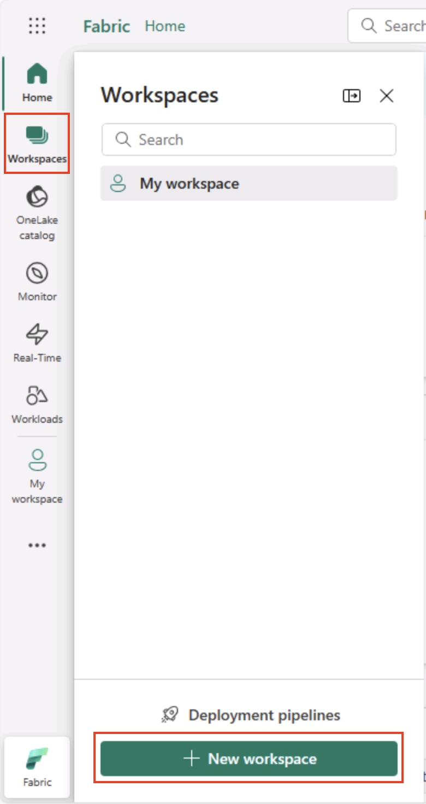

1. Create a new workspace with a name of your choice, selecting a licensing mode in the **Advanced** section that includes Fabric capacity (*Trial*, *Premium*, or *Fabric*).

    > _**Tip** Selecting a capacity that includes Fabric gives the workspace the engines needed for data engineering tasks. Using a dedicated workspace keeps your lab resources isolated and easy to clean up._

1. When your new workspace opens, it should be empty.

    

## Create a lakehouse

Now that you have a workspace, it's time to create a lakehouse for your data files.

> _**Tip**: A lakehouse brings files and tables together on OneLake. You can store raw files and also create managed Delta tables you can query with SQL._

1. On the menu bar on the left, select **Create**. In the *New* page, under the *Data Engineering* section, select **Lakehouse**. Give it a unique name of your choice.

    >**Note**: If the **Create** option is not pinned to the sidebar, you need to select the ellipsis (**...**) option first.

    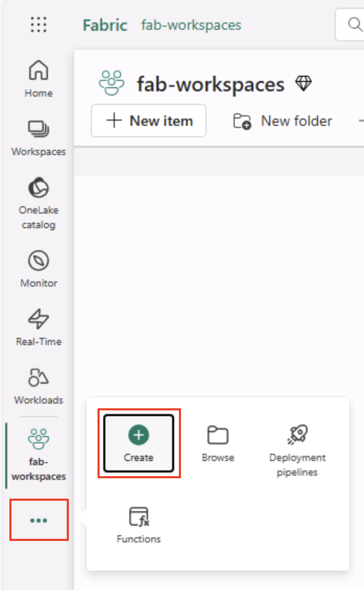

    After a minute or so, a new lakehouse will be created:

    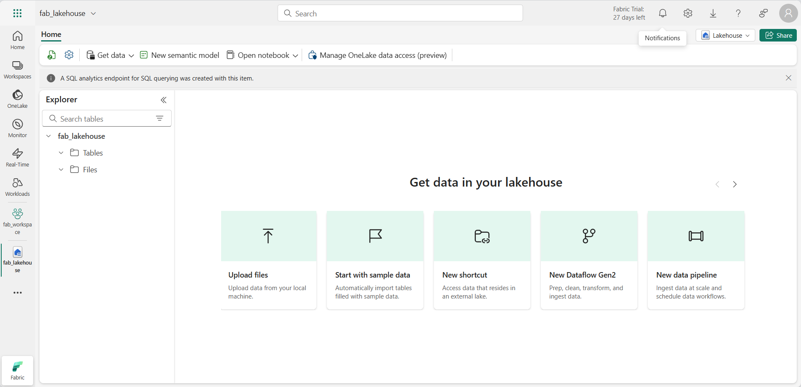

1. View the new lakehouse, and note that the **Lakehouse explorer** pane on the left enables you to browse tables and files in the lakehouse:
   
    - The **Tables** folder contains tables that you can query using SQL semantics. Tables in a Microsoft Fabric lakehouse are based on the open source *Delta Lake* file format, commonly used in Apache Spark.
    - The **Files** folder contains data files in the OneLake storage for the lakehouse that aren't associated with managed delta tables. You can also create *shortcuts* in this folder to reference data that is stored externally.

    Currently, there are no tables or files in the lakehouse.

    > _**Tip**: Use Files for raw or staged data, and Tables for curated, query-ready datasets. Tables are backed by Delta Lake so they support reliable updates and efficient queries._

## Ingest data

A simple way to ingest data is to use a **Copy Data** activity in a pipeline to extract the data from a source and copy it to a file in the lakehouse.

> _**Tip**: Pipelines provide a guided, repeatable way to bring data into the lakehouse. They’re easier than coding from scratch and can be scheduled later if needed._

1. On the **Home** page for your lakehouse, in the **Get data** menu, select **New data pipeline**, and create a new data pipeline named **Ingest Data**.

    

1. In the **Copy Data** wizard, on the **Choose a data source** page, select **Sample data** and then select the **NYC Taxi - Green** sample dataset.

    

    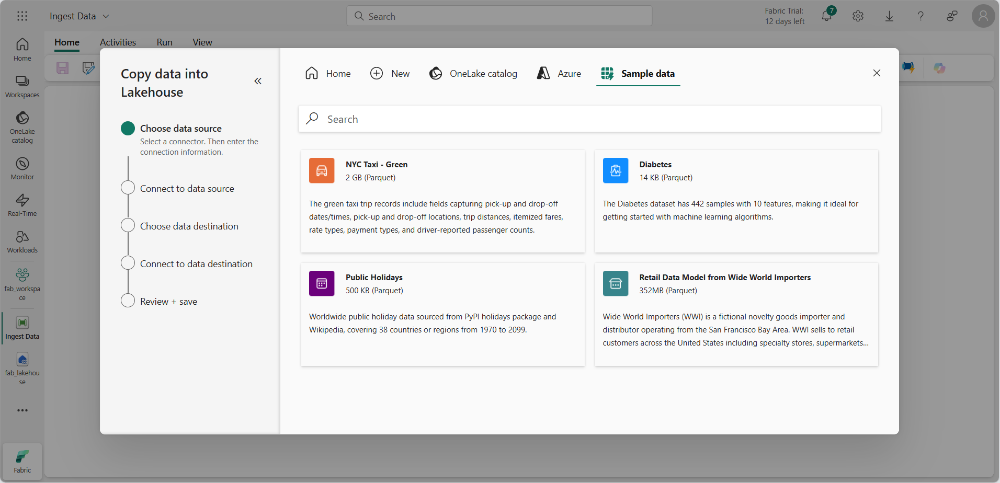

1. On the **Connect to data source** page, view the tables in the data source. There should be one table that contains details of taxi trips in New York City. Then select **Next** to progress to the **Connect to data destination** page.

1. On the **Connect to data destination** page, set the following data destination options, and then select **Next**:
    - **Root folder**: Tables
    - **Load settings**: Load to new table
    - **Destination table name**: taxi_rides *(You may need to wait for the column mappings preview to be displayed before you can change this)*
    - **Column mappings**: *Leave the default mappings as-is*
    - **Enable partition**: *Unselected*

    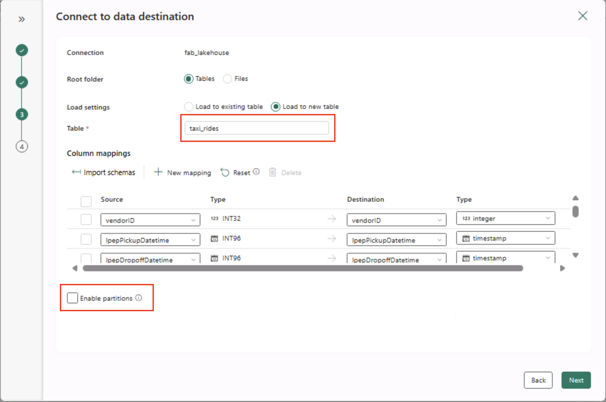

    > _**Why these choices?**_
    > 
    > _We’re starting with Tables as the **root** so the data goes straight into a managed Delta table, which you can query right away. We’re loading it into a **new table** so this lab stays self-contained and nothing existing gets overwritten. We’ll stick with the **default column mappings** since the sample data already matches the expected structure—no custom mapping needed. **Partitioning** is turned off to keep things simple for this small dataset; while partitioning is useful for large-scale data, it’s not necessary here._

1. On the **Review + save** page, ensure that the **Start data transfer immediately** option is selected, and then select **Save + Run**.

    > _**Tip**: Starting immediately lets you watch the pipeline in action and confirm data arrives without extra steps._

    A new pipeline containing a **Copy Data** activity is created, as shown here:

    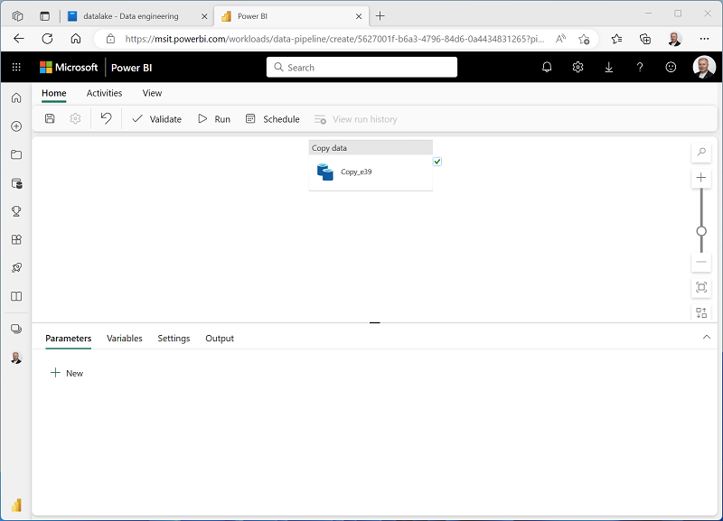

    When the pipeline starts to run, you can monitor its status in the **Output** pane under the pipeline designer. Use the **&#8635;** (*Refresh*) icon to refresh the status, and wait until it has succeeded (which may take 10 minutes or more). This particular dataset contains more than 75 million rows, storing about 2.5 Gb of data. 

1. In the hub menu bar on the left, select your lakehouse.

    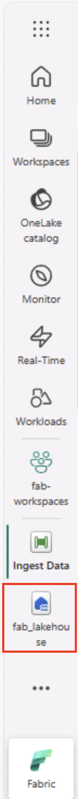

1. On the **Home** page, in the **Lakehouse explorer** pane, in the **...** menu for the **Tables** node, select **Refresh** and then expand **Tables** to verify that the **taxi_rides** table has been created.

    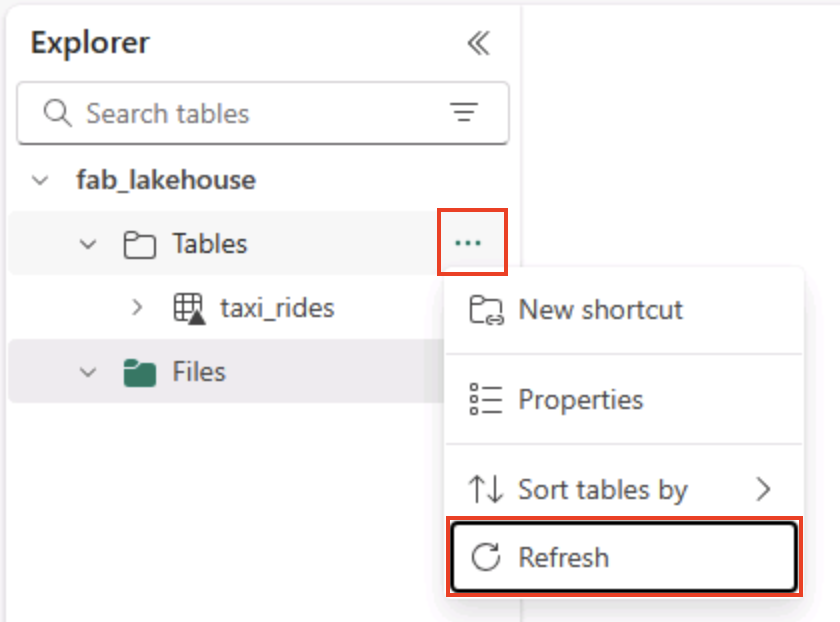

    > **Note**: If the new table is listed as *unidentified*, use its **Refresh** menu option to refresh the view.

    > _**Tip**: The explorer view is cached. Refreshing forces it to fetch the latest table metadata so your new table appears correctly._

1. Select the **taxi_rides** table to view its contents.

    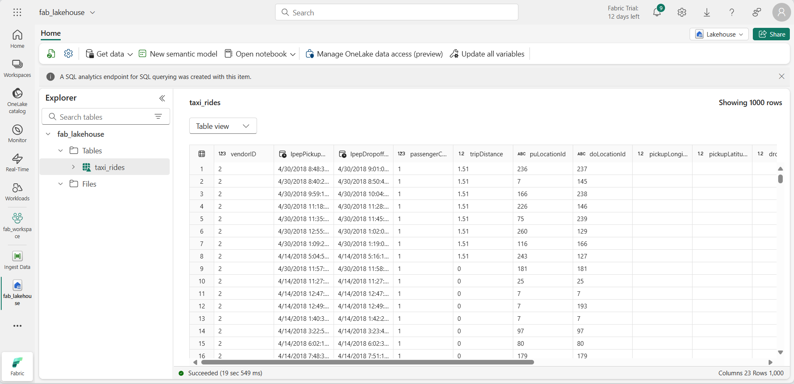

## Query data in a lakehouse

Now that you have ingested data into a table in the lakehouse, you can use SQL to query it.

> _**Tip**: Lakehouse tables are SQL-friendly. You can analyze data right away without moving it to another system._

1. At the top right of the Lakehouse page, switch from **Lakehouse** view to the **SQL analytics endpoint** for your lakehouse.

    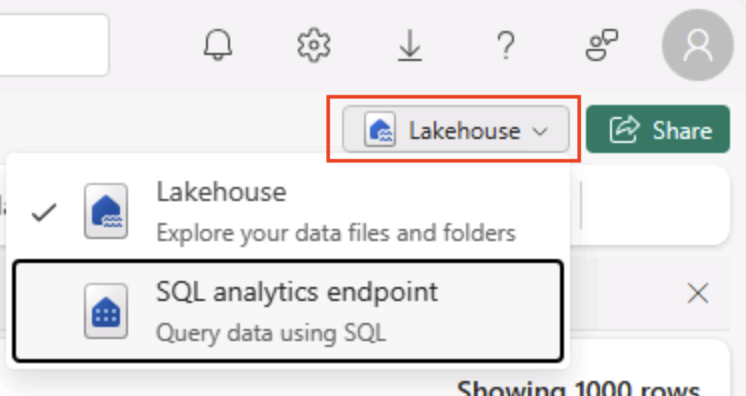

    > _**Tip**: The SQL analytics endpoint is optimized for running SQL queries over your lakehouse tables and integrates with familiar query tools._

1. In the toolbar, select **New SQL query**. Then enter the following SQL code into the query editor:

    ```sql
    SELECT  DATENAME(dw,lpepPickupDatetime) AS Day,
            AVG(tripDistance) As AvgDistance
    FROM taxi_rides 
    GROUP BY DATENAME(dw,lpepPickupDatetime)
    ```

1. Select the **&#9655; Run** button to run the query and review the results, which should include the average trip distance for each day of the week.

    > _**Tip**: This query groups trips by day name and calculates the average distance, showing a simple example of aggregation you can build on._

    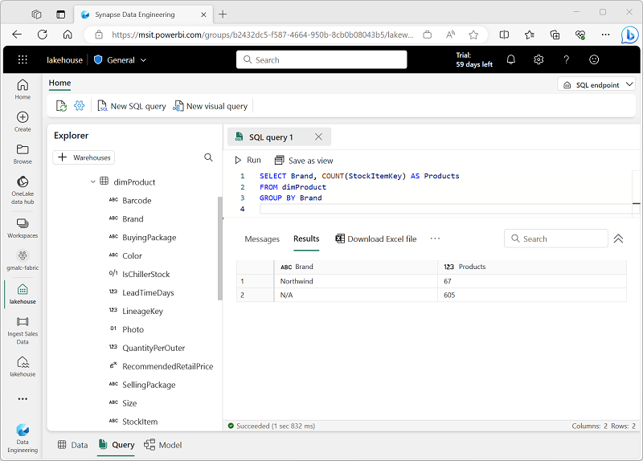

## Clean up resources

If you've finished exploring Microsoft Fabric, you can delete the workspace you created for this exercise.

> _**Tip**: Deleting the workspace removes all items created in the lab and helps prevent ongoing charges._

1. In the bar on the left, select the icon for your workspace to view all of the items it contains.

1. In the toolbar, select **Workspace settings**.

1. In the **General** section, select **Remove this workspace**.
