---
lab:
  title: Explore data analytics in Microsoft Fabric
  module: Explore fundamentals of large-scale data analytics
  description: In this lab, you'll create a Microsoft Fabric lakehouse, bring in real-world NYC taxi data using a pipeline, and query it with SQL. The lab is written for absolute beginners, so every step is explained in plain language.
  duration: 30 minutes
  level: 100
  islab: true
  primarytopics:
    - Microsoft Fabric
---

# Explore data analytics in Microsoft Fabric

In this lab, you'll explore how to bring in and analyze data using **Microsoft Fabric**, an all-in-one analytics platform that handles everything from storing data to building reports in one place.

You'll work with a **lakehouse**, which is a single place that can store both raw data files *and* organized tables you can query with SQL. You'll then use a **copy job** (an automated, guided way to copy data from one place to another) to bring in a real-world set of New York City taxi trips, and finish by running SQL queries to answer questions about the data.

By completing this lab, you will:

- **Understand Microsoft Fabric lakehouse concepts**: Learn how to create workspaces and lakehouses, which are central to organizing and managing data in Fabric.
- **Bring in data using a copy job**: Use a guided copy job to load external data into the lakehouse, making it ready to query without writing any code.
- **Explore and query data with SQL**: Analyze the loaded data using familiar SQL queries, gaining insights directly within Fabric.
- **Manage resources**: Learn good habits for cleaning up resources to avoid unnecessary charges.

Don't worry if these terms are new, every step is explained as you go.

## Background on the NYC Taxi dataset

The "NYC Taxi - Green" dataset contains detailed records of taxi trips in New York City, including pickup and drop-off times, locations, trip distances, fares, and passenger counts. It's widely used in data analytics for exploring how people move around a city, forecasting demand, and spotting unusual patterns. In this lab, you'll use this real-world dataset to practice bringing in and analyzing data in Microsoft Fabric.

This lab will take approximately **30** minutes to complete.

> **Note**: You'll need a Microsoft Fabric license to complete this exercise. See [Getting started with Fabric](https://learn.microsoft.com/fabric/get-started/fabric-trial) for details of how to enable a free Fabric trial license. You will need a Microsoft *school* or *work* account to do this. If you don't have one, you can [sign up for a trial of Microsoft Office 365 E3 or higher](https://www.microsoft.com/microsoft-365/business/compare-more-office-365-for-business-plans).

*The first time you use any Microsoft Fabric features, prompts with tips may appear. Dismiss these.*

## Create a workspace

Before working with data in Fabric, create a workspace with the Fabric trial enabled.

> _**What is a workspace?** Think of it as a project folder that holds everything you create in Fabric (lakehouses, pipelines, reports, and more). Enabling Fabric capacity gives the workspace the computing power needed to run those items._

1. Navigate to the [Microsoft Fabric home page](https://app.fabric.microsoft.com/home?experience=fabric) at `https://app.fabric.microsoft.com/home?experience=fabric` in a browser, and sign in with your Fabric credentials.

1. At the bottom of the menu bar on the left is an experience switcher. If it shows **Power BI**, select it and choose **Fabric** so that all of the data engineering features used in this lab are available.

    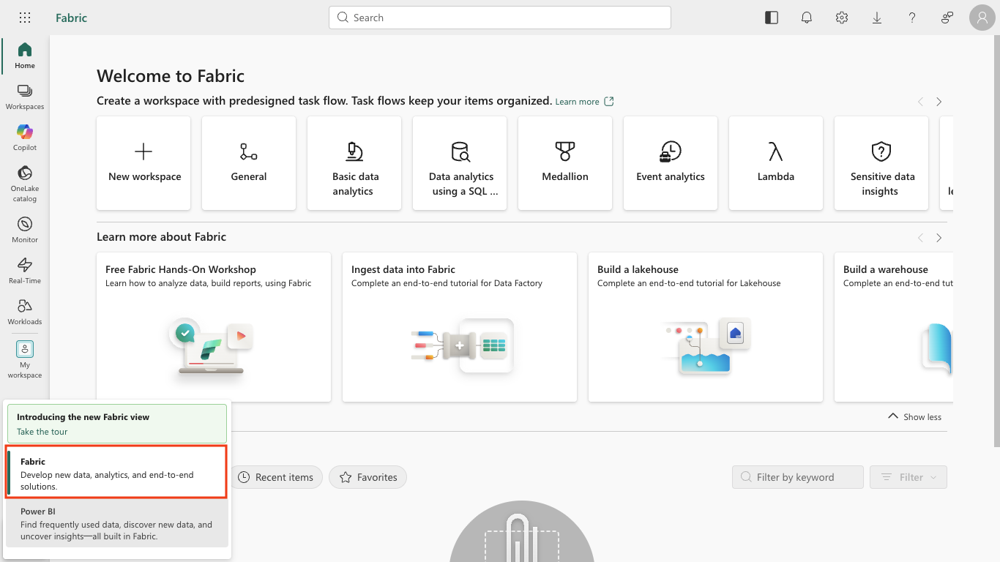

1. In the menu bar on the left, select **Workspaces** (the icon looks similar to &#128455;).

    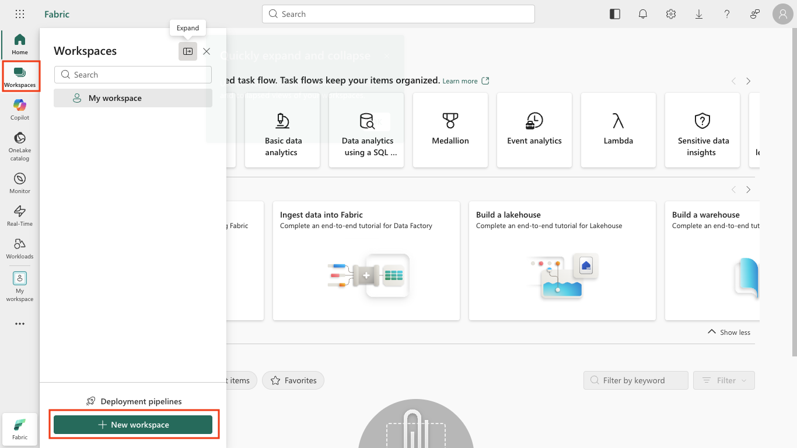

1. Select **+ New workspace**, give your workspace a name (such as `dp900-fabric-lakehouse`), and in the **Advanced** section select a licensing mode that includes Fabric capacity (*Trial*, *Premium*, or *Fabric*). Then select **Apply**.

    > _**Tip** Selecting a capacity that includes Fabric gives the workspace the engines needed for data engineering tasks. Using a dedicated workspace keeps your lab resources isolated and easy to clean up._

    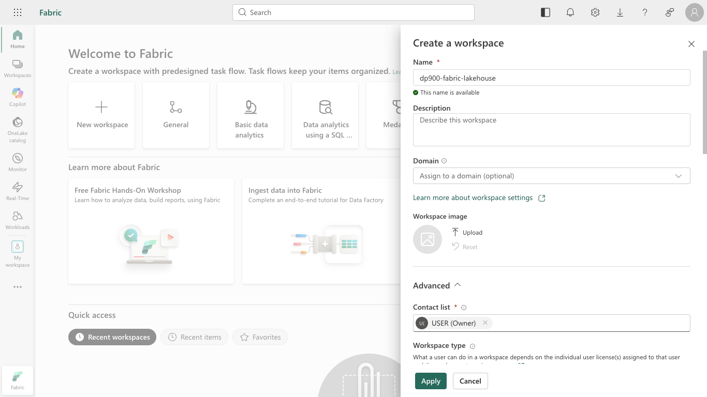

1. When your new workspace opens, it should be empty.

    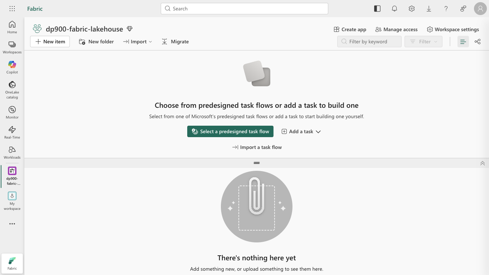

## Create a lakehouse

Now that you have a workspace, it's time to create a lakehouse for your data files.

> _**What is a lakehouse?** It's a single storage area that holds both raw data files *and* organized tables. The tables can be queried with SQL, just like in a regular database, while the files area can hold data in any format. This combination is why it's called a "lake" (flexible file storage) plus a "house" (structured tables)._

1. In your workspace toolbar, select **+ New item**. In the **New item** pane, search for `Lakehouse` and select the **Lakehouse** tile.

    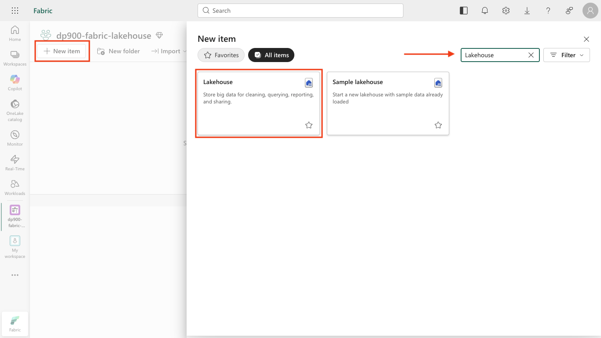

1. In the **New Lakehouse** dialog, enter a name such as `taxi_lakehouse`, leave **Lakehouse schemas** selected, and select **Create**.

    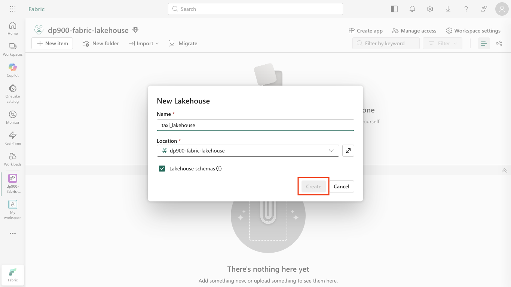

    After a minute or so, a new lakehouse will be created.

1. View the new lakehouse, and note that the **Explorer** pane on the left enables you to browse tables and files in the lakehouse:
   
    - The **Tables** folder contains tables that you can query using SQL semantics, organized into schemas (such as the default **dbo** schema). Tables in a Microsoft Fabric lakehouse are based on the open source *Delta Lake* file format, commonly used in Apache Spark.
    - The **Files** folder contains data files in the OneLake storage for the lakehouse that aren't associated with managed delta tables. You can also create *shortcuts* in this folder to reference data that is stored externally.

    Currently, there are no tables or files in the lakehouse.

    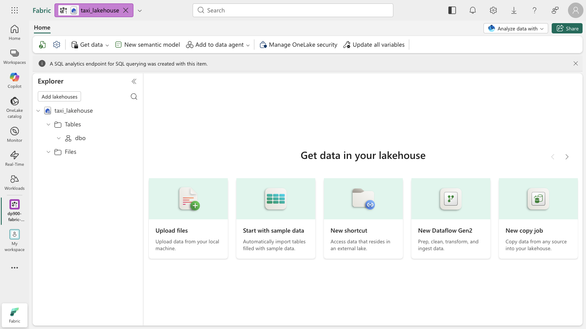

    > _**Tip**: Use Files for raw or staged data, and Tables for curated, query-ready datasets. Tables are backed by Delta Lake so they support reliable updates and efficient queries._

## Ingest data

A simple way to bring data into the lakehouse is to use a **Copy job**. This copies the data from a source (in this case, a sample dataset) into a table in your lakehouse.

> _**What is a copy job?** It's a guided, repeatable way to move data from a source into your lakehouse without writing any code. A copy job can run once or on a schedule, which makes it much easier than copying data by hand._

1. On the **Home** page for your lakehouse, in the **Get data** menu, select **New copy job**.

    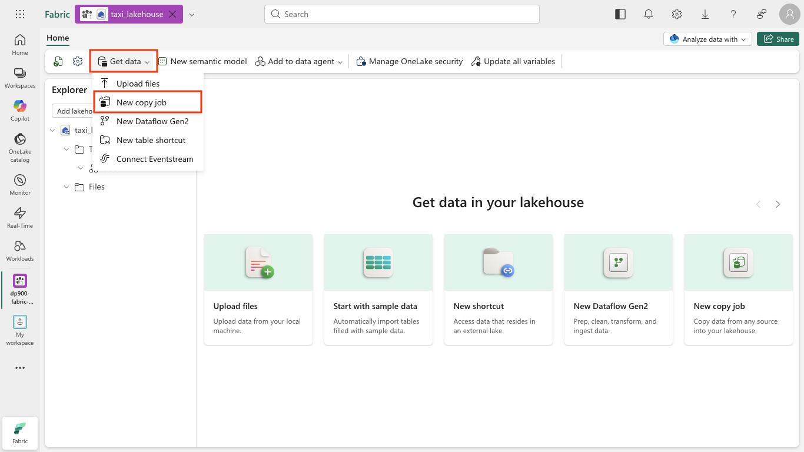

1. In the **New Copy job** dialog, name the job `Ingest Data` and select **Create**.

    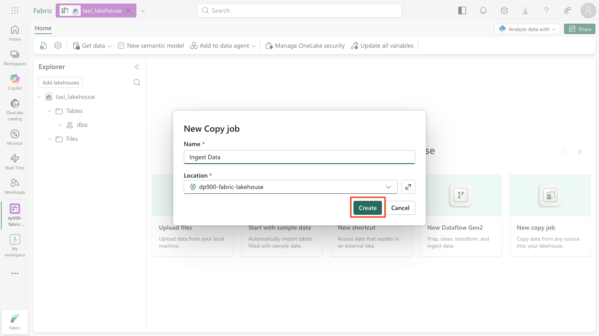

1. On the **Choose data source** page, select the **Sample data** tab at the top.

    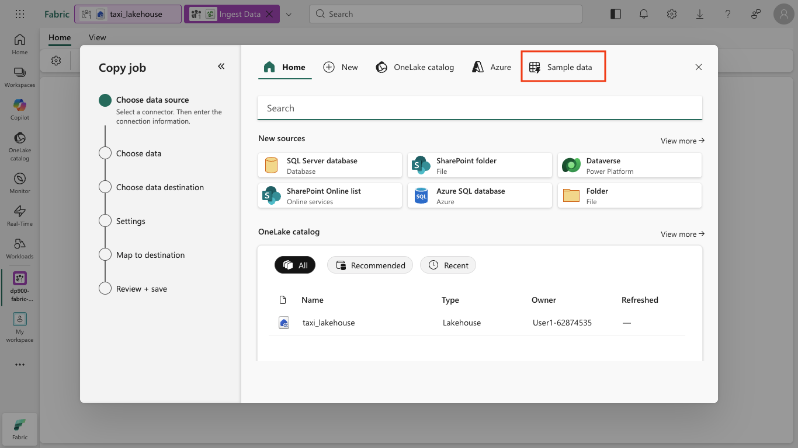

1. Select the **NYC Taxi - Green** sample dataset.

    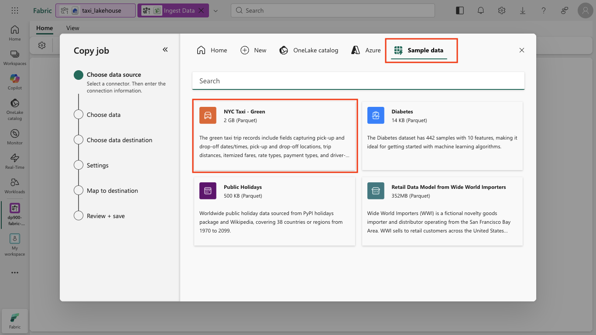

1. On the **Choose data** page, review the preview of the taxi trip data, and then select **Next**.

    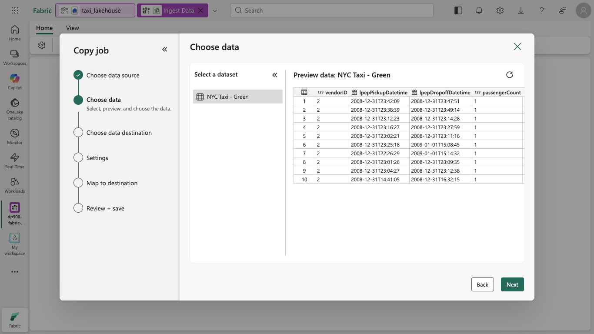

1. On the **Settings** page, ensure **Full copy** is selected as the read method and **Tables** is selected as the destination root folder, and then select **Next**.

    > _**Why these choices?** **Full copy** loads all of the data in a single run, and choosing **Tables** as the root folder loads the data straight into a managed Delta table that you can query right away._

    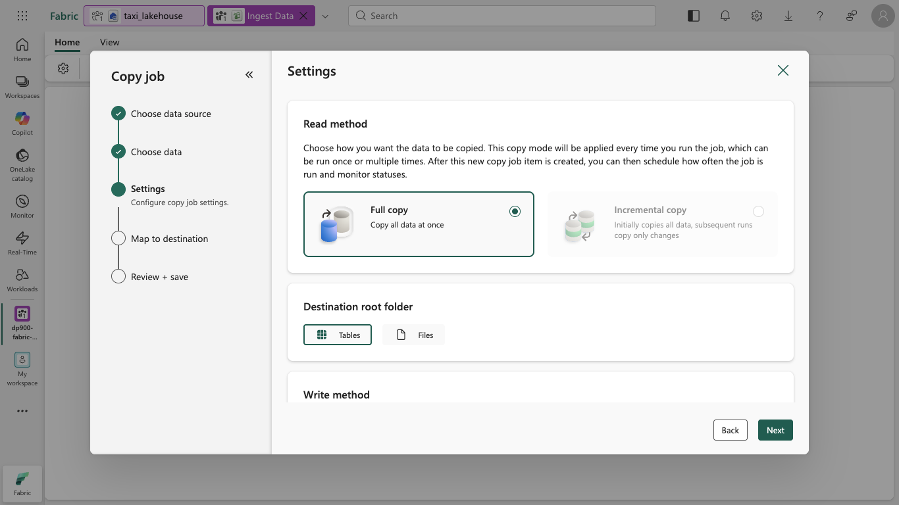

1. On the **Map to destination** page, set the destination schema to `dbo` and the destination table name to `taxi_rides`, and then select **Next**.

    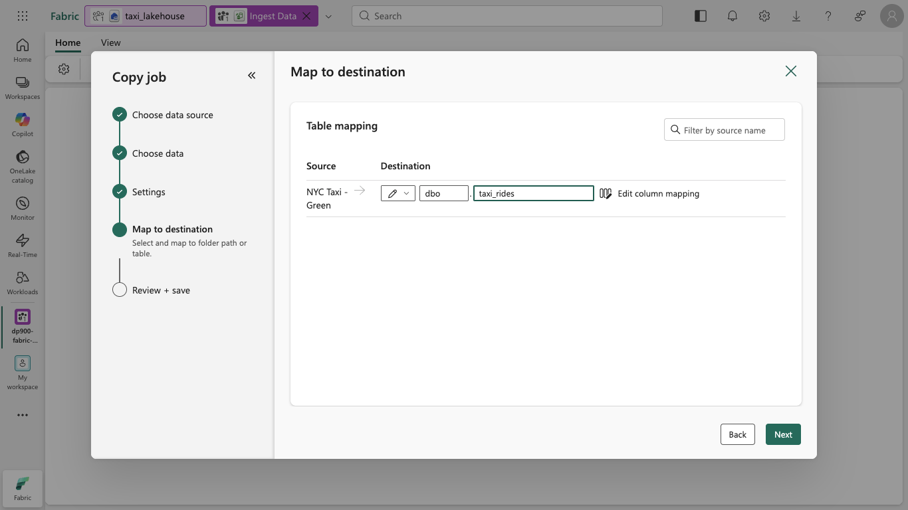

1. On the **Review + save** page, make sure **Start data transfer immediately** is selected and the **Run once** option is selected, and then select **Save + Run**.

    > _**Tip**: Starting immediately lets you watch the copy job run and confirm the data arrives without extra steps._

    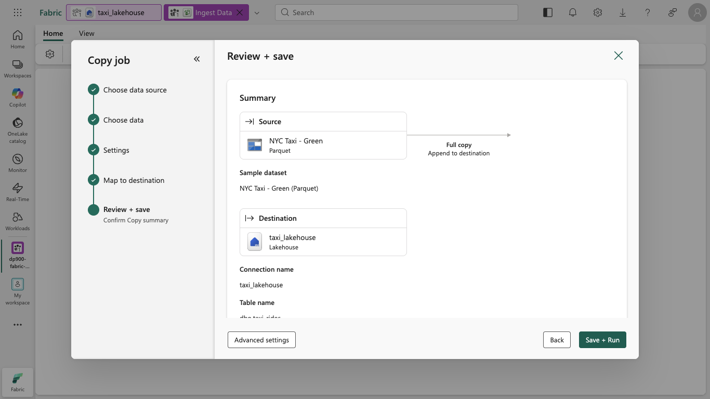

1. The copy job runs. In the **Results** pane, wait until the **Status** shows **Succeeded** and **Tables completed** shows **1/1**.

    > **Note**: Because the sample data is copied as Parquet files, the *Rows read* and *Rows written* counters may show **0** even though the table is created and populated successfully.

    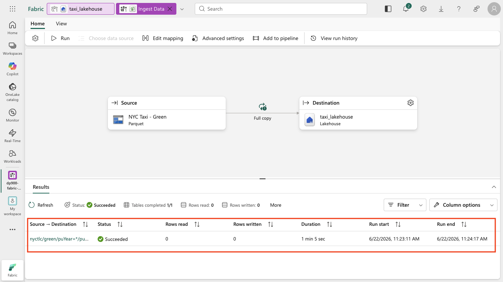

1. In the menu bar at the top, select your lakehouse (you can also find it from your workspace). In the **Explorer** pane, expand **Tables** > **dbo** and select the **taxi_rides** table to view its contents.

    > _**Tip**: If the table doesn't appear right away, use the **...** menu on the **Tables** node and select **Refresh**._

    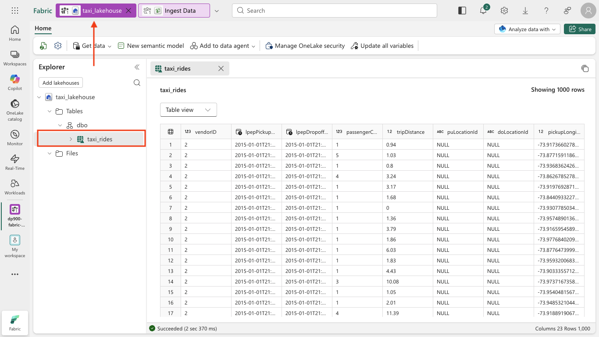

## Query data in a lakehouse

Now that you have ingested data into a table in the lakehouse, you can use SQL to query it.

> _**Tip**: Lakehouse tables are SQL-friendly. You can analyze data right away without moving it to another system._

1. At the top right of the lakehouse page, select **Analyze data with**, and then select **SQL analytics endpoint**.

    > _**Tip**: The SQL analytics endpoint is optimized for running SQL queries over your lakehouse tables and integrates with familiar query tools._

    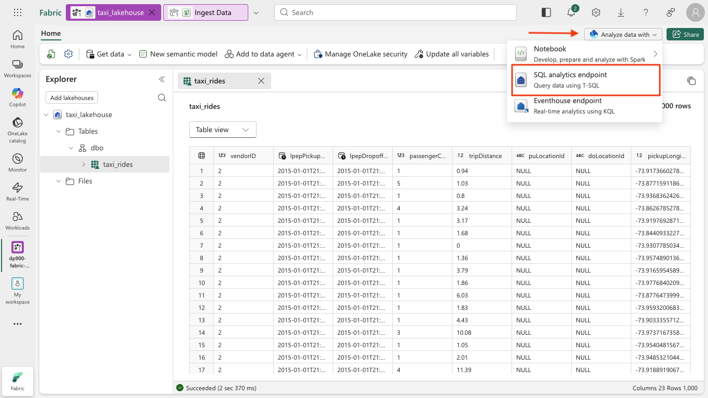

1. In the toolbar, select **New SQL query**. Then enter the following SQL code into the query editor:

    ```sql
    SELECT  DATENAME(dw,lpepPickupDatetime) AS Day,
            AVG(tripDistance) As AvgDistance
    FROM taxi_rides 
    GROUP BY DATENAME(dw,lpepPickupDatetime)
    ```

1. Select the **&#9655; Run** button to run the query and review the results, which should include the average trip distance for each day of the week.

    > _**Tip**: This query groups trips by day name and calculates the average distance, showing a simple example of aggregation you can build on._

    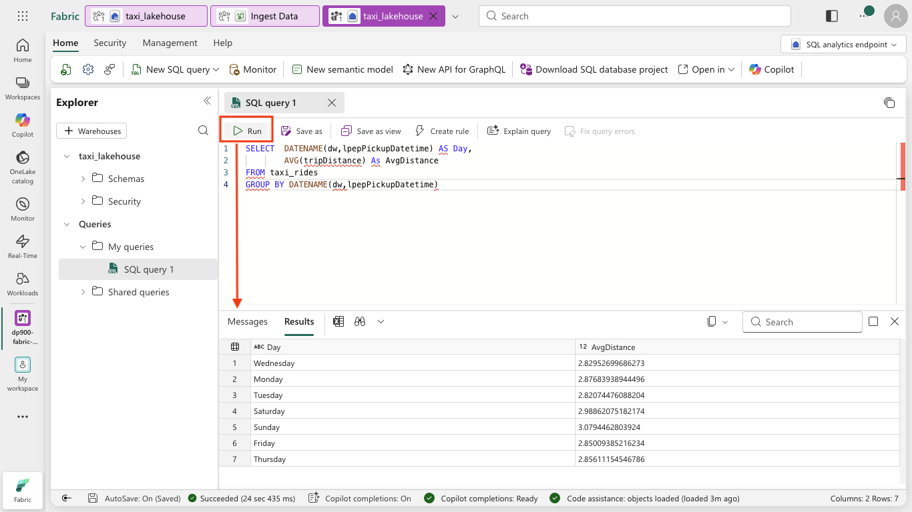

## Clean up resources

If you've finished exploring Microsoft Fabric, you can delete the workspace you created for this exercise.

> _**Tip**: Deleting the workspace removes all items created in the lab and helps prevent ongoing charges._

1. In the bar on the left, select the icon for your workspace to view all of the items it contains.

1. In the toolbar, select **Workspace settings**.

1. In the **General** section, select **Remove this workspace**.
