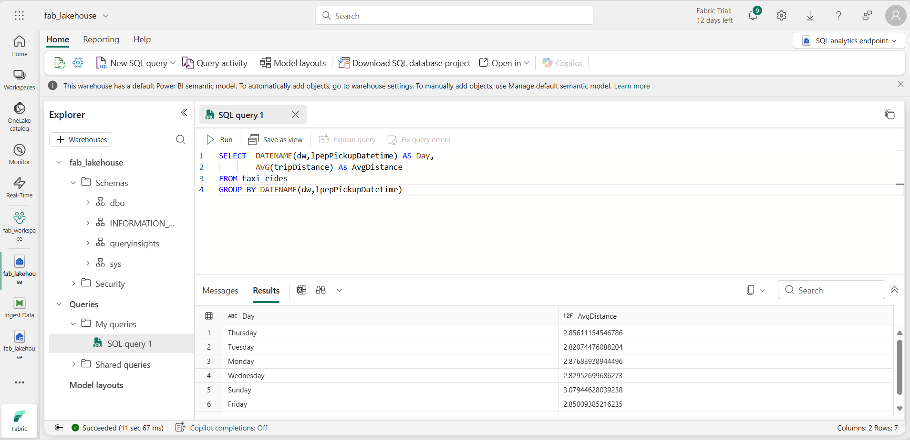

---
lab:
    title: 'Explore data analytics in Microsoft Fabric'
    module: 'Explore fundamentals of large-scale data analytics'
---

# Explore data analytics in Microsoft Fabric

In this exercise you'll explore data ingestion and analytics in a Microsoft Fabric Lakehouse.

This lab will take approximately **25** minutes to complete.

> **Note**: You'll need a Microsoft Fabric license to complete this exercise. See [Getting started with Fabric](https://learn.microsoft.com/fabric/get-started/fabric-trial) for details of how to enable a free Fabric trial license. You will need a Microsoft *school* or *work* account to do this. If you don't have one, you can [sign up for a trial of Microsoft Office 365 E3 or higher](https://www.microsoft.com/microsoft-365/business/compare-more-office-365-for-business-plans).

*The first time you use any Microsoft Fabric features, prompts with tips may appear. Dismiss these.*

## Create a workspace

Before working with data in Fabric, create a workspace with the Fabric trial enabled.

1. Sign into [Microsoft Fabric](https://app.fabric.microsoft.com) at `https://app.fabric.microsoft.com`.
1. In the menu bar, at the bottom left, switch to the **Data Engineering** experience.

    

1. In the menu bar on the left, select **Workspaces** (the icon looks similar to &#128455;).
1. Create a new workspace with a name of your choice, selecting a licensing mode in the **Advanced** section that includes Fabric capacity (*Trial*, *Premium*, or *Fabric*).
1. When your new workspace opens, it should be empty.

    

## Create a lakehouse

Now that you have a workspace, it's time to create a data lakehouse for your data files.

1. In the home page for the workspace, create a new **Lakehouse** with a name of your choice.

    After a minute or so, a new lakehouse will be created:

    

1. View the new lakehouse, and note that the **Lakehouse explorer** pane on the left enables you to browse tables and files in the lakehouse:
    - The **Tables** folder contains tables that you can query using SQL. Tables in a Microsoft Fabric lakehouse are based on the open source *Delta Lake* file format, commonly used in Apache Spark.
    - The **Files** folder contains data files in the OneLake storage for the lakehouse that aren't associated with managed delta tables. You can also create *shortcuts* in this folder to reference data that is stored externally.

    Currently, there are no tables or files in the lakehouse.

## Ingest data

A simple way to ingest data is to use a **Copy Data** activity in a pipeline to extract the data from a source and copy it to a file in the lakehouse.

1. On the **Home** page for your lakehouse, in the **Get data** menu, select **New data pipeline**, and create a new data pipeline named **Ingest Data**.
1. In the **Copy Data** wizard, on the **Choose a data source** page, select **Sample data** and then select the **NYC Taxi - Green** sample dataset.

    

1. On the **Connect to data source** page, view the tables in the data source. There should be one table that contains details of taxi trips in New York City. Then select **Next** to progress to the **Choose data destination** page.
1. On the **Choose data destination** page, select your existing lakehouse. Then select **Next**.
1. Set the following data destination options, and then select **Next**:
    - **Root folder**: Tables
    - **Load settings**: Load to new table
    - **Destination table name**: taxi_rides *(You may need to wait for the column mappings preview to be displayed before you can change this)*
    - **Column mappings**: *Leave the default mappings as-is*
    - **Enable partition**: *Unselected*
1. On the **Review + save** page, ensure that the **Start data transfer immediately** option is selected, and then select **Save + Run**.

    A new pipeline containing a **Copy Data** activity is created, as shown here:

    

    When the pipeline starts to run, you can monitor its status in the **Output** pane under the pipeline designer. Use the **&#8635;** (*Refresh*) icon to refresh the status, and wait until it has succeeeded (which may take 10 minutes or more).

1. In the hub menu bar on the left, select your lakehouse.
1. On the **Home** page, in the **Lakehouse explorer** pane, in the **...** menu for the **Tables** node, select **Refresh** and then expand **Tables** to verify that the **taxi_rides** table has been created.

    > **Note**: If the new table is listed as *unidentified*, use its **Refresh** menu option to refresh the view.

1. Select the **taxi_rides** table to view its contents.

    

## Query data in a lakehouse

Now that you have ingested data into a table in the lakehouse, you can use SQL to query it.

1. At the top right of the Lakehouse page, switch from **Lakehouse** view to the **SQL analytics endpoint** for your lakehouse.

1. In the toolbar, select **New SQL query**. Then enter the following SQL code into the query editor:

    ```sql
    SELECT  DATENAME(dw,lpepPickupDatetime) AS Day,
            AVG(tripDistance) As AvgDistance
    FROM taxi_rides
    GROUP BY DATENAME(dw,lpepPickupDatetime)
    ```

1. Select the **&#9655; Run** button to run the query and review the results, which should include the average trip distance for each day of the week.

    

## Visualize data in a lakehouse

Microsoft Fabric lakehouses organize all tables in a semantic data model, which you can use to create visualizations and reports.

1. At the bottom left of the page, under the **Explorer** pane, select the **Model** tab to see the data model for the tables in the lakehouse (this includes system tables as well as the **taxi_rides** table).
1. In the toolbar, select **New report** to create a new report based on the **taxi_rides**.
1. In the report designer:
    1. In the **Data** pane, expand the **taxi_rides** table and select the **lpepPickupDatetime** and **passengerCount** fields.
    1. In the **Visualizations** pane, select the **Line chart** visualization. Then ensure that the **X-axis** contains the **lpepPickupDatetime** field and the **Y** axis contains **Sum of passengerCount**.

        

    > **Tip**: You can use the **>>** icons to hide the report designer panes in order to see the report more clearly.

1. On the **File** menu, select **Save** to save the report as **Taxi Rides Report** in your Fabric workspace.

    You can find the report in the page for your workspace in the Microsoft Fabric portal.

## Clean up resources

If you've finished exploring Microsoft Fabric, you can delete the workspace you created for this exercise.

1. In the bar on the left, select the icon for your workspace to view all of the items it contains.
2. In the **...** menu on the toolbar, select **Workspace settings**.
3. In the **Other** section, select **Remove this workspace**.
