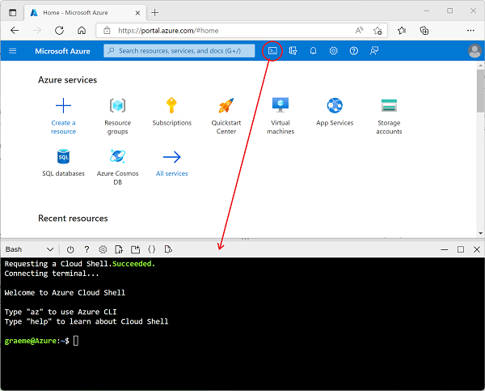

---
lab:
    title: 'Explore Azure Stream Analytics'
    module: 'Explore data analytics in Azure'
---

## Explore Azure Stream Analytics

In this exercise you'll provision an Azure Stream Analytics job in your Azure subscription, and use it to process a stream of realtime data.

> **Note**: The exercise is part of a module on Microsoft Learn, and includes an option to use a *sandbox* Azure subscription. However, if you are completing this exercise as part of an instructor-led class, you should use the Azure subscription provided as part of the class instead of the sandbox.

Before starting the exercise on Microsoft Learn, you'll need to prepare a cloud shell environment for your Azure subscription.

1. Sign into your Azure subscription in the [Azure portal](https://portal.azure.com) at `https://portal.azure.com`, using your Azure subscription credentials.
2. Use the **[\>_]** button to the right of the search bar at the top of the page to create a new Cloud Shell in the Azure portal, selecting a ***Bash*** environment and creating storage if prompted. The cloud shell provides a command line interface in a pane at the bottom of the Azure portal, as shown here:

    

3. Note that you can resize the cloud shell by dragging the separator bar at the top of the pane, or by using the **&#8212;**, **&#9723;**, and **X** icons at the top right of the pane to minimize, maximize, and close the pane. For more information about using the Azure Cloud Shell, see the [Azure Cloud Shell documentation](https://docs.microsoft.com/azure/cloud-shell/overview).

4. Now you're ready to complete the exercise on Microsoft Learn - just be use to use the cloud shell in your Azure portal instead of the (blank) one in the Learn module (which is provided for self-paced learners using a sandbox subscription).

    Use the link below to open the exercise on Microsoft Learn.

    **[Go to Microsoft Learn](https://docs.microsoft.com/learn/modules/explore-fundamentals-stream-processing/5-exercise-stream-analytics#create-azure-resources)**

> **Further learning**: If you have time later, you consider returning to this Microsoft Learn module and trying the other exercises it contains, which include exploring Spark Streaming and Azure Synapse Data Explorer.
