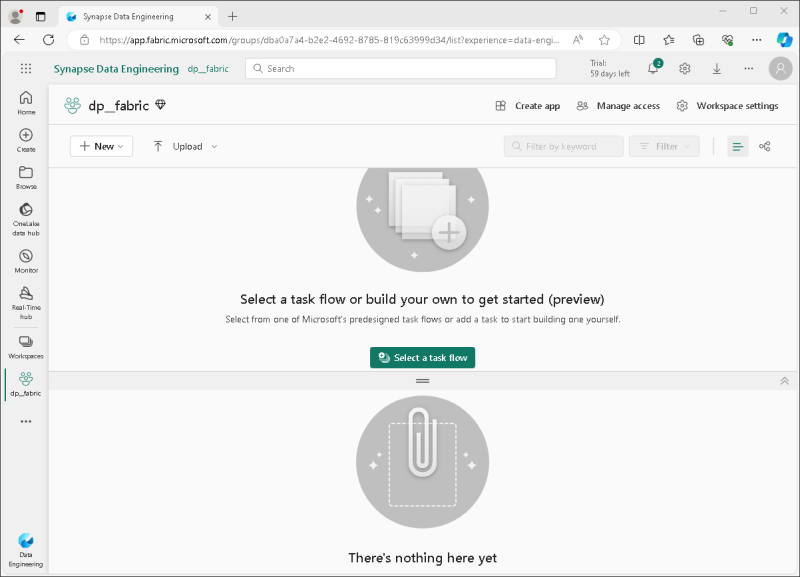
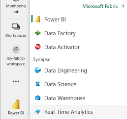
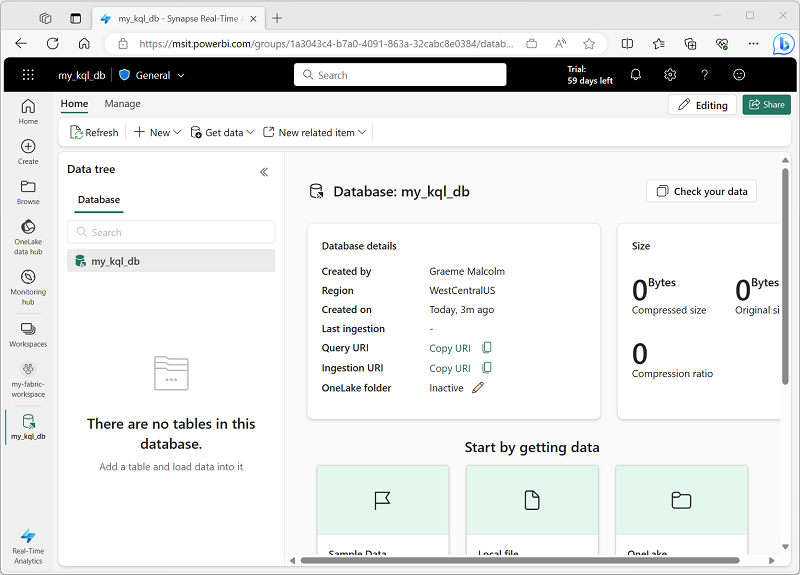
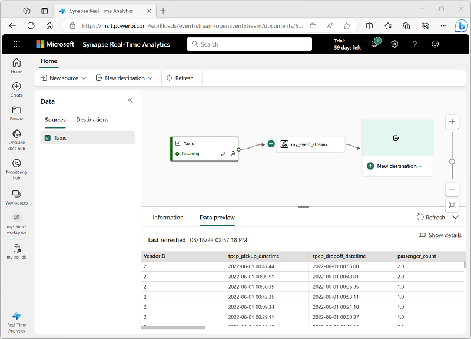
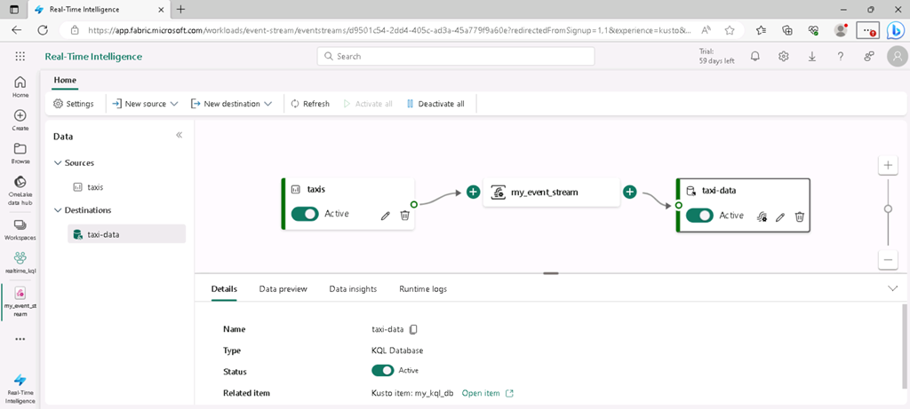
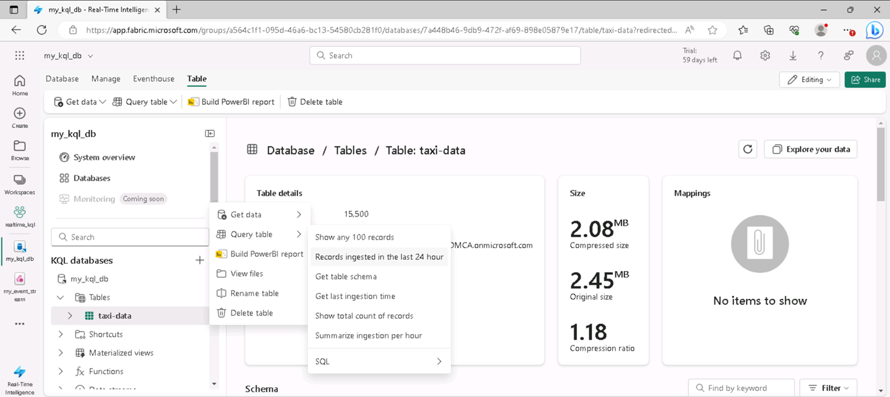

---
lab:
    title: 'Explore real-time analytics in Microsoft Fabric'
    module: 'Explore fundamentals of large-scale data analytics'
---

# Explore real-time analytics in Microsoft Fabric

In this exercise you'll explore real-time analytics in Microsoft Fabric.

This lab will take approximately **25** minutes to complete.

> **Note**: You'll need a Microsoft Fabric license to complete this exercise. See [Getting started with Fabric](https://learn.microsoft.com/fabric/get-started/fabric-trial) for details of how to enable a free Fabric trial license. You will need a Microsoft *school* or *work* account to do this. If you don't have one, you can [sign up for a trial of Microsoft Office 365 E3 or higher](https://www.microsoft.com/microsoft-365/business/compare-more-office-365-for-business-plans).

## Create a workspace

Before working with data in Fabric, create a workspace with the Fabric trial enabled.

1. Sign into [Microsoft Fabric](https://app.fabric.microsoft.com) at `https://app.fabric.microsoft.com`.
2. In the menu bar on the left, select **Workspaces** (the icon looks similar to &#128455;).
3. Create a new workspace with a name of your choice, selecting a licensing mode in the **Advanced** section that includes Fabric capacity (*Trial*, *Premium*, or *Fabric*).
4. When your new workspace opens, it should be empty.

    

## Create a KQL database

Now that you have a workspace, you can create a KQL database to store real-time data.

1. At the bottom left of the portal, switch to the **Real Time Analytics** experience.

    

    The real time analytics home page includes tiles to create commonly used assets for real-time data analyis

2. In the real time analytics home page, create a new **KQL Database** with a name of your choice.

    After a minute or so, a new KQL database will be created:

    

    Currently, there are no tables in the database.

## Create an eventstream

Eventstreams provide a scalable and flexible way to ingest real-time data from a streaming source.

1. In the menu bar on the left, select the **Home** page for the real-time analytics experience.
1. On the home page, select the tile to create a new **Eventstream** with a name of your choice.

    After a short time, the visual designer for your eventstream is displayed.

    

    The visual designer canvas shows a source that connects to your eventstream, which in turn is connected to a destination.

1. On the designer canvas, in the **New source** list for your source, select **Sample data**. Then in the **Sample data** pane, specify the name **taxis** and select the **Yellow Taxi** sample data (which represents data collected from taxi journeys). Then select **Add**.
1. Beneath the designer canvas, select the **Data preview** tab to preview the data being streamed from the source:

    

1. On the designer canvas, in the **New destination** list for your destination, select **KQL database**. Then in the **KQL database** pane, specify the destination name **taxi-data** and select your workspace and KQL database. Then select **Create and configure**.
1. In the **Ingest data** wizard, on the **Destination** page, select **New table** and enter the table name **taxi-data**. Then select **Next: Source**.
1. On the **Source** page, review the default data connection name, and then select **Next: Schema**.
1. On the **Schema** page, change the **Data format** from TXT to **JSON**, and view the preview to verify that this format results in multiple columns of data. Then select **Next: Summary**.
1. On the **Summary** page, wait for continuous ingestion to be established, and then select **Close**.
1. Verify that your completed eventstream looks like this:

    

## Query real-time data in a KQL database

Your eventstream continuously populates a table in your KQL database, enabling you to query the real-time data.

1. In the menu hub on the left, select your KQL database (or select your workspace and find your KQL database there).
1. In the **...** menu for the **taxi-data** table (which has been created by your eventstream), select **Query table > Records ingested in the last 24 hours**.

    

1. View the results of the query, which should be a KQL query like this:

    ```kql
    ['taxi-data']
    | where ingestion_time() between (now(-1d) .. now())
    ```

    The results show all taxi records ingested from the streaming source in the last 24 hours.

1. Replace all of the KQL query code in the top half of the query editor with the following code:

    ```kql
    // This query returns the number of taxi pickups per hour
    ['taxi-data']
    | summarize PickupCount = count() by bin(tpep_pickup_datetime, 1h)
    ```

1. Use the **&#9655; Run** button to run the query and review the results, which show the number of taxi pickups for each hour.

## Clean up resources

If you've finished exploring real-time analytics in Microsoft Fabric, you can delete the workspace you created for this exercise.

1. In the bar on the left, select the icon for your workspace to view all of the items it contains.
2. In the **...** menu on the toolbar, select **Workspace settings**.
3. In the **Other** section, select **Remove this workspace**.
