---
lab:
  title: Explore real-time analytics in Microsoft Fabric
  module: Explore real-time analytics in Microsoft Fabric
  description: In this lab, you'll use Microsoft Fabric's Real-Time Intelligence to capture, store, and query a live stream of taxi data. The lab is written for absolute beginners, so every step is explained in plain language.
  duration: 30 minutes
  level: 100
  islab: true
  primarytopics:
    - Microsoft Fabric
---

# Explore real-time analytics in Microsoft Fabric

Most data analysis works on data that was collected earlier. **Real-time analytics** is different: it works on data *as it arrives*, moment by moment. Think of a live feed of taxi trips, where new trips keep streaming in continuously.

In this lab, you'll use the **Real-Time Intelligence** features in **Microsoft Fabric** to capture a live stream of taxi data, store it, and then query it to answer questions, watching the answers change as fresh data keeps flowing in. Don't worry if these terms are new, every step is explained as you go.

This lab takes approximately **30** minutes to complete.

> **Note**: You need a [Microsoft Fabric tenant](https://learn.microsoft.com/fabric/get-started/fabric-trial) to complete this exercise.

## Create a workspace

Before working with data in Fabric, you need to create a workspace with the Fabric capacity enabled.

> _**What is a workspace?** Think of it as a project folder that holds everything you create in Fabric (eventstreams, eventhouses, dashboards, and more). Enabling Fabric capacity gives the workspace the computing power needed to run those items._

1. Navigate to the [Microsoft Fabric home page](https://app.fabric.microsoft.com/home?experience=fabric) at `https://app.fabric.microsoft.com/home?experience=fabric` in a browser, and sign in with your Fabric credentials.

1. At the bottom of the menu bar on the left is an experience switcher. If it shows **Power BI**, select it and choose **Fabric** so that all of the real-time intelligence features used in this lab are available.

    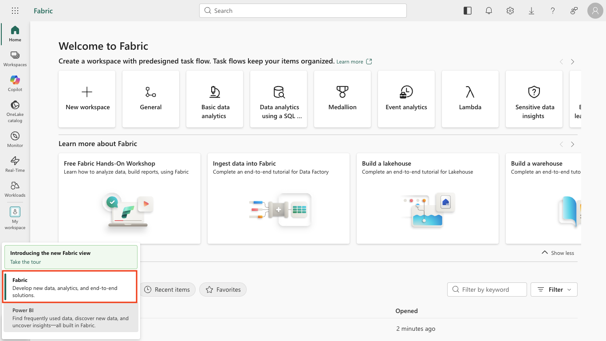

1. In the menu bar on the left, select **Workspaces** (the icon looks similar to &#128455;).

    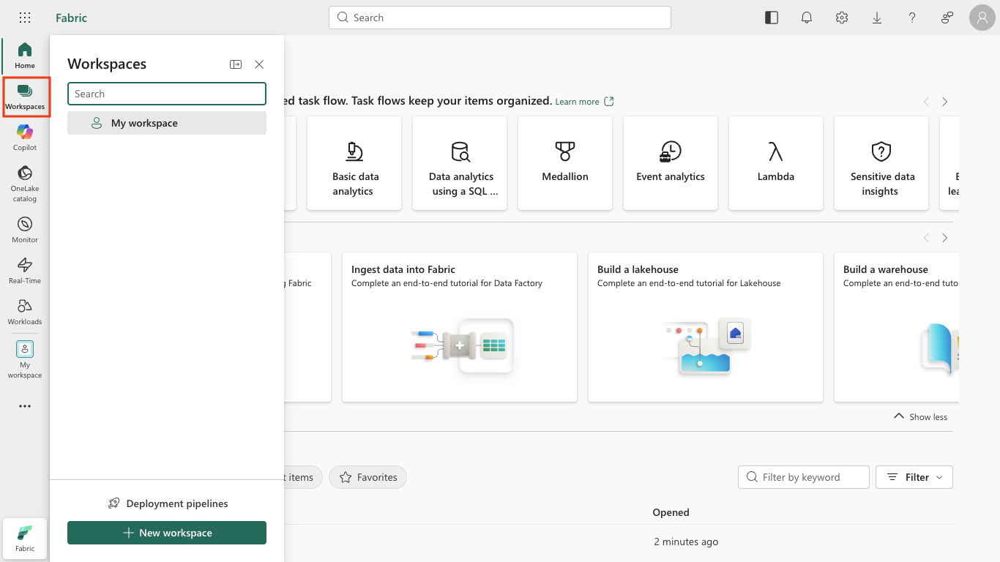

1. Select **+ New workspace**, give your workspace a name (such as `dp900-realtime`), and in the **Advanced** section select a licensing mode that includes Fabric capacity (*Trial*, *Premium*, or *Fabric*). Then select **Apply**.

    > _**Tip**: Using a capacity that includes Fabric ensures the workspace has the engines needed for real-time ingestion and analytics. A separate workspace keeps lab resources isolated and easy to clean up._

    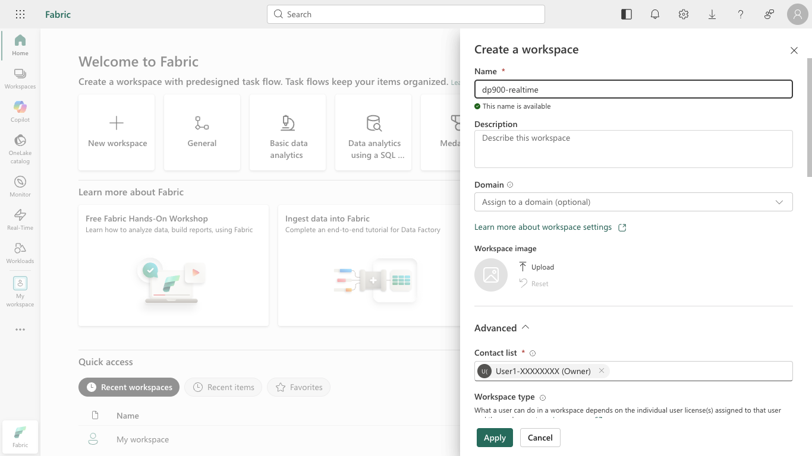

1. When your new workspace opens, it should be empty.

    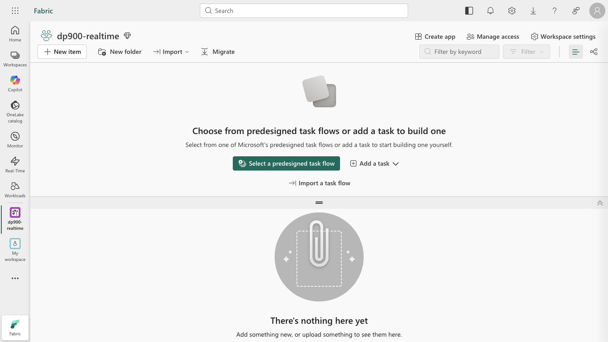

## Create an eventstream

Now you're ready to find and capture real-time data from a streaming source. To do this, you'll start in the Fabric Real-Time Hub.

> _**What is an eventstream?** A stream is a continuous flow of data arriving in real time. An **eventstream** is the Fabric feature that connects to a streaming source and carries that flow to a destination where you can store and analyze it. The **Real-Time Hub** is the central place to find and connect to available streaming sources._

> **Tip**: The first time you use the Real-Time Hub, some *getting started* tips may be displayed. You can close these.

1. In the menu bar on the left, select the **Real-Time** hub.

    The real-time hub provides an easy way to find and manage sources of streaming data.

    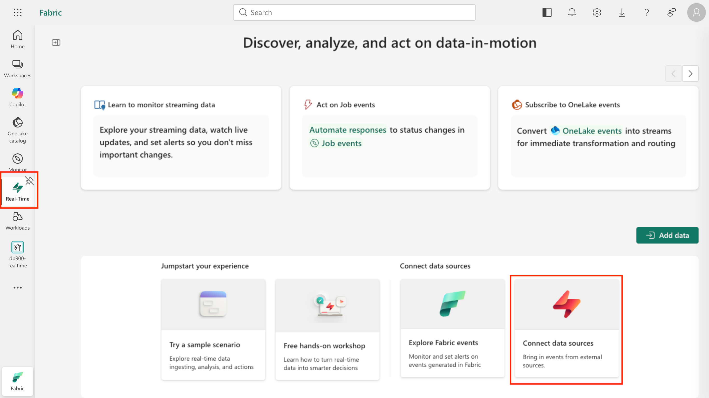

1. In the real-time hub, in the **Connect to** section, select **Data sources**.

    A catalog of available streaming data sources is displayed.

    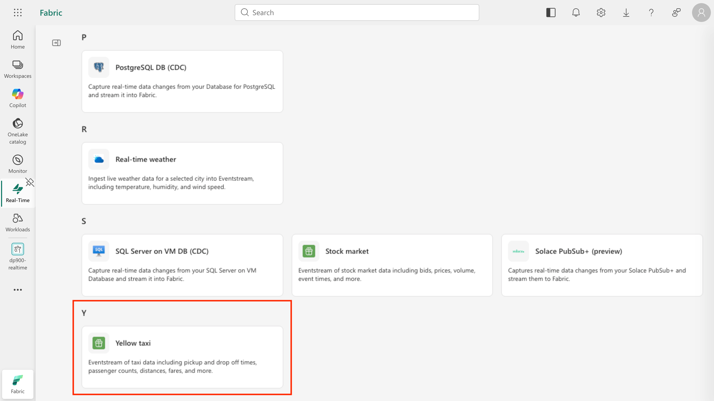

1. Find the **Yellow taxi** sample data source and select **Connect**. The **Connect data source** wizard opens on the **Configure connection settings** page.

    > _**Tip**: The Yellow taxi sample is a safe, public stream—no credentials required—and it’s consistent for all learners._

    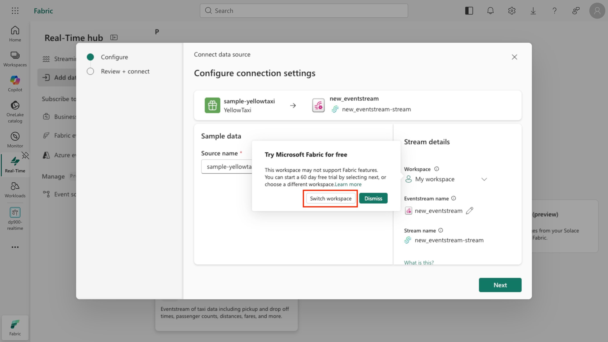

1. In the **Stream details** pane on the right, select the **Workspace** drop-down and choose the workspace you created earlier (for example, `dp900-realtime`) instead of *My workspace*. If a *Try Microsoft Fabric for free* prompt appears, you can dismiss it.

    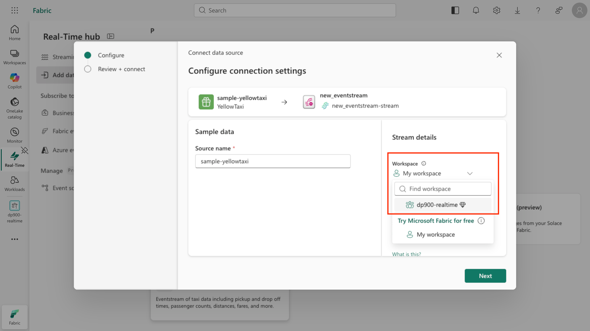

1. Set the **Source name** to `taxi`, and edit the default **Eventstream name** to `taxi-data`. The **Stream name** is automatically set to *taxi-data-stream*.

    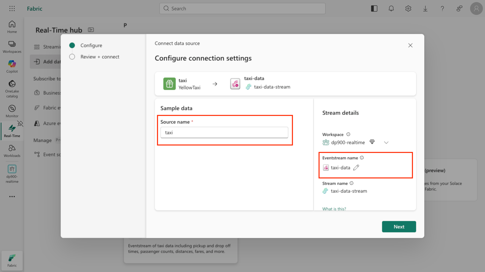

1. Select **Next**. On the **Review + connect** page, review the source and stream details, then select **Connect**.

    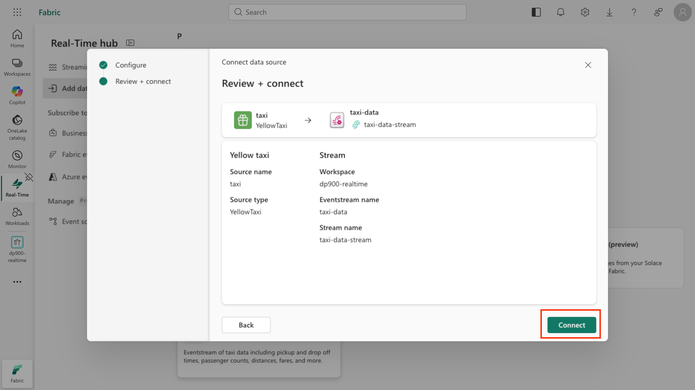

1. Wait for the **Create Eventstream** and **Create Eventstream source** tasks to show a status of **Successful**, then select **Open Eventstream**.

    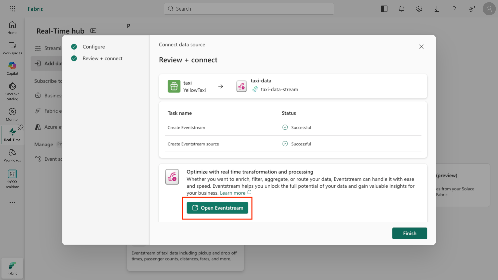

    The eventstream opens on the design canvas, showing the **taxi** source and the **taxi-data-stream**.

## Create an eventhouse and store the stream

The eventstream captures the real-time taxi data, but it doesn't currently store it anywhere. To keep the data so you can query it, add an **eventhouse** as a *destination* of the eventstream.

> _**What is an eventhouse?** It's durable storage built for real-time data. It contains a **KQL database**, where your streaming data is saved into tables. **KQL** (Kusto Query Language) is a read-only, SQL-like language designed to quickly explore, filter, and analyze large amounts of data, including data that keeps arriving._

1. With the **taxi-data** eventstream open on the design canvas in **Edit mode**, on the toolbar select **Add destination**, and then select **Eventhouse**.

    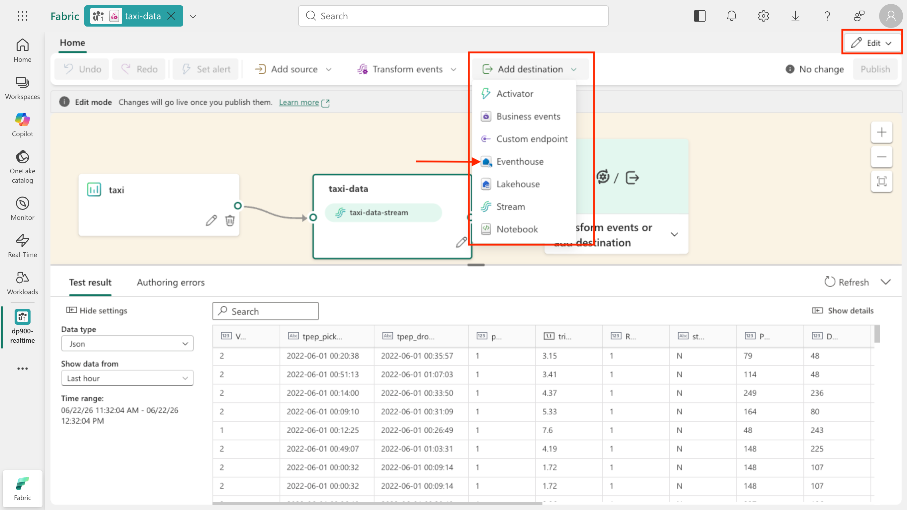

1. In the **Eventhouse** pane that opens on the right, configure the destination:

    - For **Data ingestion mode**, select **Event processing before ingestion**.
    - Leave the default **Destination name** (`Eventhouse`).
    - For **Workspace**, select the workspace you created earlier (for example, `dp900-realtime`).
    - For **Eventhouse**, select **Create new**, name the eventhouse `taxi-eventhouse`, and select **Done**. The **KQL Database** is automatically set to the same name.

    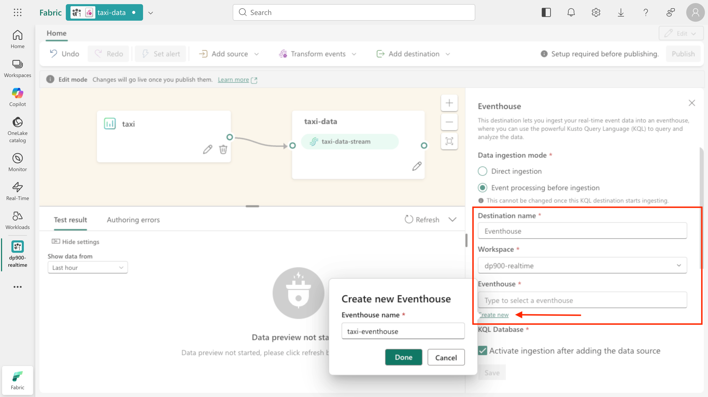

1. For **KQL Destination table**, select **Create new**, name the table `yellow-taxi`, and select **Done**. Make sure **Activate ingestion after adding the data source** is selected, and then select **Save**.

    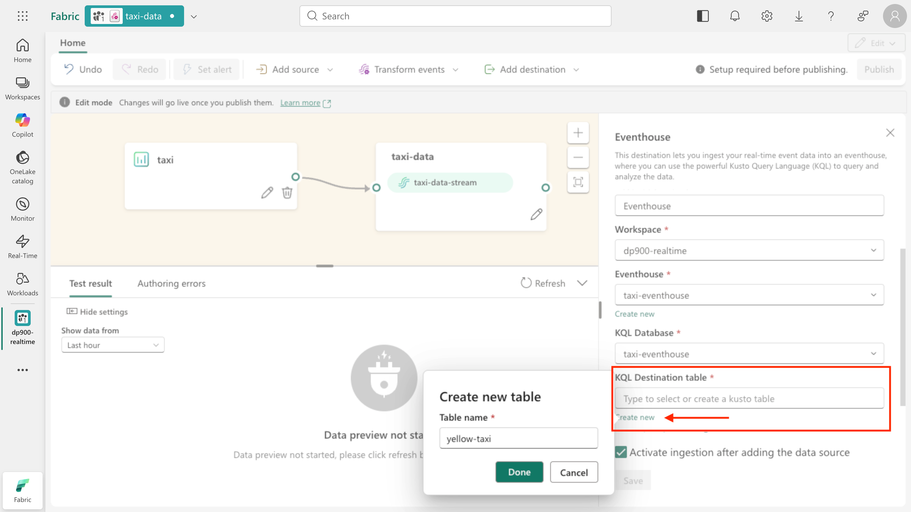

1. On the canvas, an **Eventhouse** destination node is added. Make sure it's connected to the **taxi-data-stream** node. If the stream and the eventhouse aren't joined, drag a connection from the circle on the right edge of the stream node to the **Eventhouse** node.

    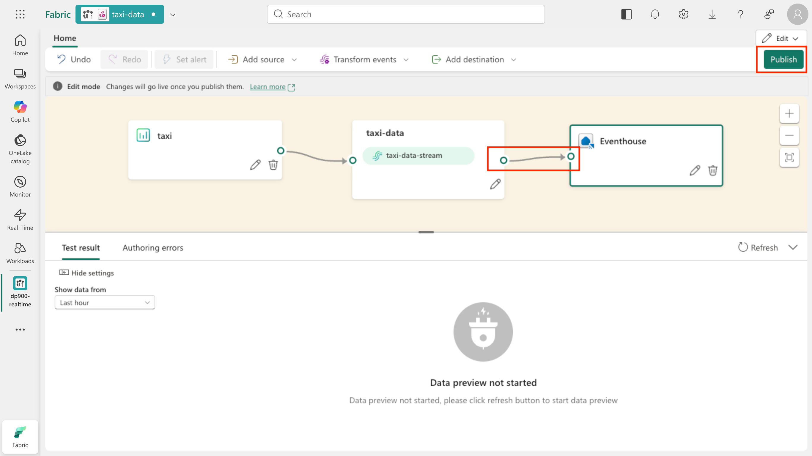

1. On the toolbar, select **Publish** to make your changes live.

    > _**Tip**: Changes you make on the canvas stay in **Edit mode** until you publish them. Publishing switches the eventstream to **Live** mode and starts moving events to the eventhouse._

1. After the eventstream switches to **Live** mode, the **taxi** source, the **taxi-data-stream**, and the **Eventhouse** destination each show a status of **Active**. Select the **Eventhouse** node, and in the pane below the canvas select the **Data preview** tab. Wait a few minutes for ingestion to start, selecting **Refresh** until rows of taxi data appear.

    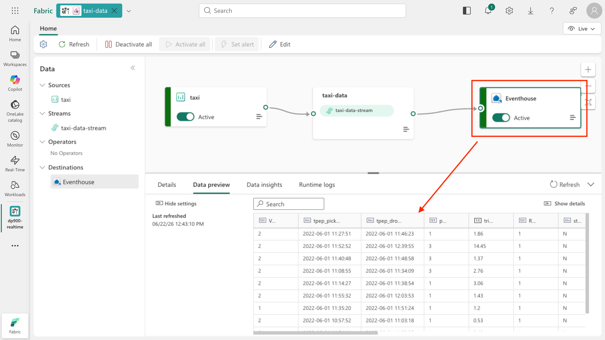

    > _**Tip**: After publishing, it can take a few minutes before the first events are written to the table. If the preview is empty, wait and select **Refresh** again._

    Now let's explore how you can query and analyze the captured data.

## Query the captured data

The eventstream loads the real-time taxi data into the **yellow-taxi** table in your KQL database. You can query that table to explore the captured data.

> _**Tip**: KQL is designed for fast exploration of time-stamped, high-volume data. Querying lets you validate ingestion and start analysis immediately._

1. In the menu bar on the left, select **Workspaces**, open your workspace (for example, `dp900-realtime`), and then select the **taxi-eventhouse** KQL database.

    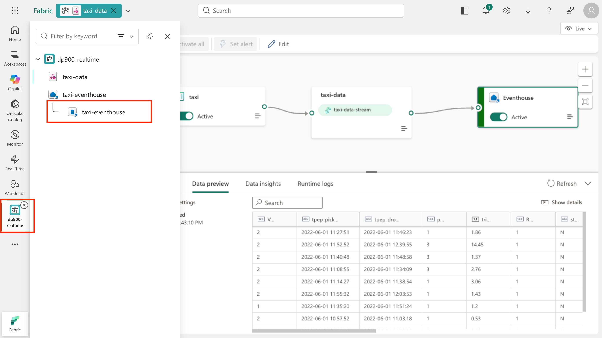

1. On the database page, note that the **taxi-eventhouse** database contains a **taxi-eventhouse_queryset** and the **yellow-taxi** table you created earlier.

    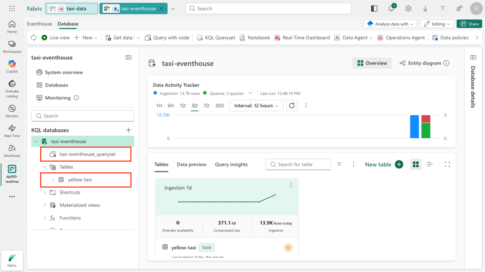

1. In the pane on the left, select the **taxi-eventhouse_queryset**. It opens with some sample KQL queries that you can use as a starting point.

    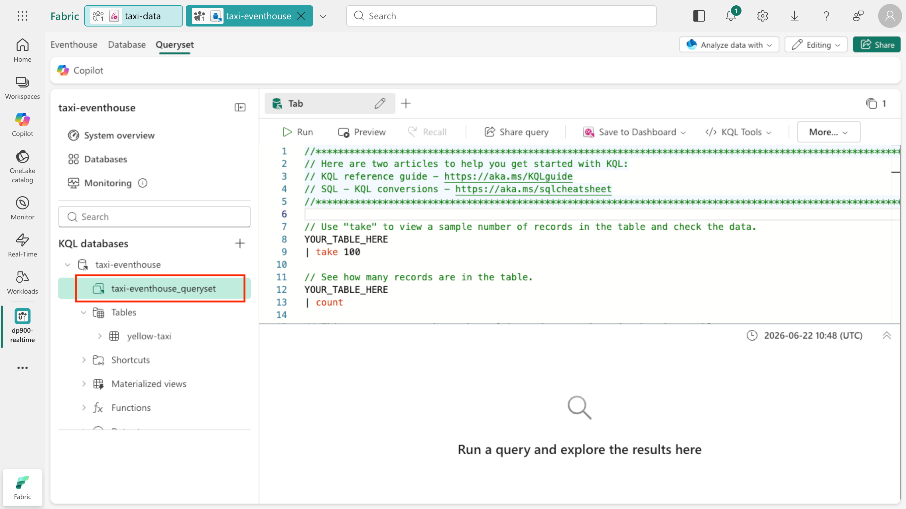

1. Select all of the text in the query pane and delete it. Then enter the following query and select **Run** to see 100 rows of data from the table:

    ```kql
    ['yellow-taxi']
    | take 100
    ```

    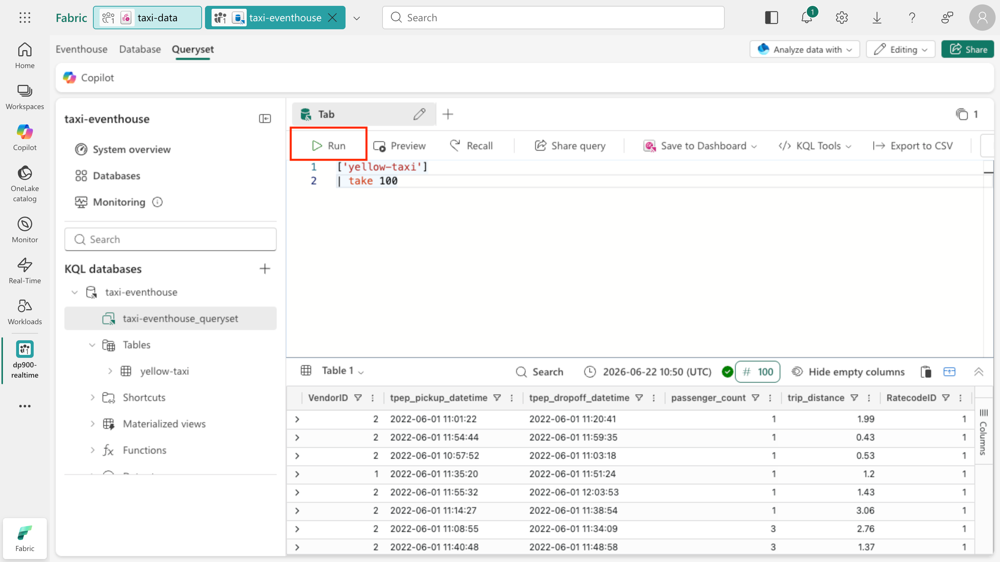

    > _**Note**: The table name is wrapped in `['...']` because `yellow-taxi` contains a hyphen. KQL uses this syntax for names that include special characters._

    > _**Tip**: `take 100` is a quick health check—confirm rows are arriving and inspect a small sample without scanning everything._

1. Replace the query with the following code to show the number of taxi pickups for each hour, and then select **Run**:

    ```kql
    ['yellow-taxi']
    | summarize PickupCount = count() by bin(todatetime(tpep_pickup_datetime), 1h)
    ```

    The results appear in a table with a row for each hour and the count of pickups.

    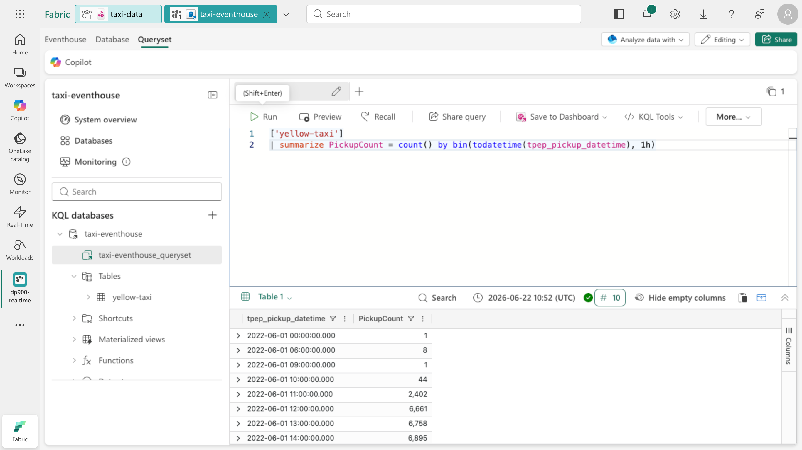

    > _**Tip**: `bin(..., 1h)` groups events into hourly buckets, making it easy to spot trends over time._

1. To visualize the hourly trend, below the query results select the **Table 1** drop-down and add a visual. In the **Visual Formatting** pane on the right, set the **Visual type** to **Column chart**. The hourly pickup counts are displayed as a column chart.

    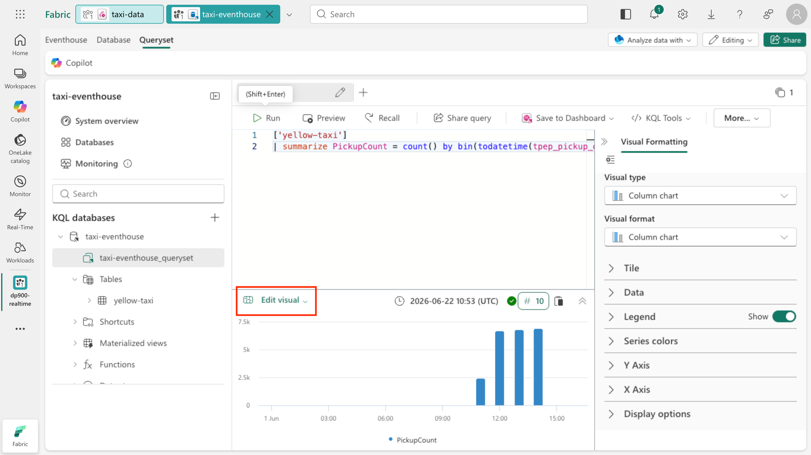

1. Wait a few seconds and select **Run** again, noting that the pickup counts change as new data is added to the table from the real-time stream.

    > _**Tip**: The stream keeps adding data, so results change over time. Re-running shows how aggregations update as fresh events arrive._

## Clean up resources

In this exercise, you created an eventhouse, captured real-time data using an eventstream, and queried the captured data in a KQL database table.

If you've finished exploring Real-Time Intelligence in Fabric, you can delete the workspace you created for this exercise.

> _**Tip**: Deleting the workspace removes all items created in the lab and helps prevent ongoing charges._

1. In the bar on the left, select the icon for your workspace.

1. In the toolbar, select **Workspace settings**.

1. In the **General** section, select **Remove this workspace**.

    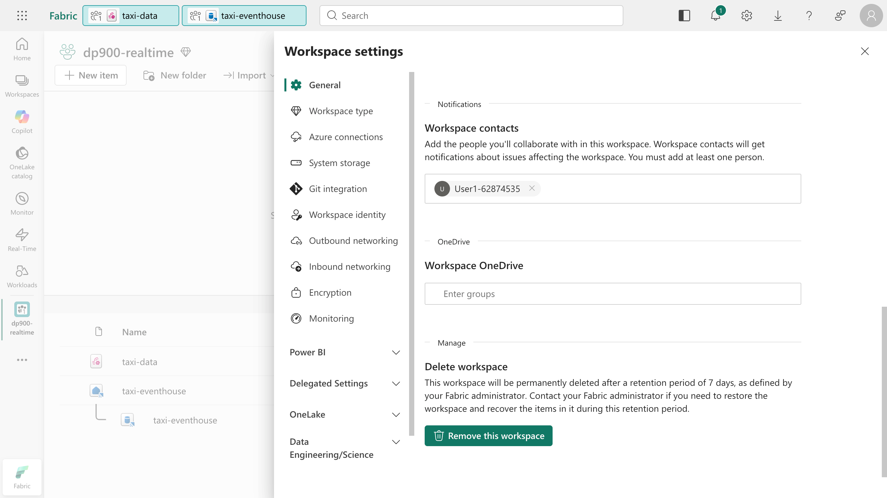