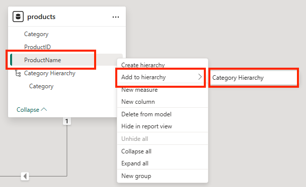

---
lab:
    title: 'Explore fundamentals of data visualization with Power BI'
    module: 'Explore fundamentals of data visualization'
---

# Explore fundamentals of data visualization with Power BI

By completing this lab, you'll learn how to import and model data from multiple sources in Power BI Desktop, create relationships and hierarchies for deeper analysis, and format and categorize data to enhance visualization. You'll build interactive reports using tables, charts, and maps, and explore data insights through drill-down and cross-highlighting features. These skills will enable you to transform raw data into compelling visual stories and actionable business intelligence.

This lab will take approximately **20** minutes to complete.

## Install Power BI Desktop

If Microsoft Power BI Desktop is not already installed on your Windows computer, you can download and install it for free.

> _**Tip**: Power BI Desktop is the authoring tool where you build models and reports locally before sharing them. It's free to install for learning and prototyping._

1. Download the Power BI Desktop installer from [https://aka.ms/power-bi-desktop](https://aka.ms/power-bi-desktop?azure-portal=true).

1. When the file has downloaded, open it, and use the setup wizard to install Power BI Desktop on your computer. This installation may take a few minutes.

## Import data

1. Open Power BI Desktop. The application interface should look similar to this:

    

    Now you're ready to import the data for your report.

1. On the Power BI Desktop welcome screen, select **Get data from other sources**, and then in the list of data sources, select **Web** and then select **Connect**.

    

1. In the **From web** dialog box, enter the following URL and then select **OK**:

    ```
    https://github.com/MicrosoftLearning/DP-900T00A-Azure-Data-Fundamentals/raw/master/power-bi/customers.csv
    ```

    > _**Tip**: Using the Web connector with sample CSV files means everyone works from the same clean data — no local files or credentials needed._

1. In the Access Web content dialog, select **Connect**.

1. Verify that the URL opens a dataset containing customer data, as shown below. Then select **Load** to load the data into the data model for your report.

    

    > _**Tip**: Loading the data directly is fastest for this lab. You can always apply transformations later in Power Query if needed._

1. In the main Power BI Desktop window, in the Data menu, select **Get data**, then select **Web**:

    

1. In the **From web** dialog box, enter the following URL and then select **OK**:

    ```
    https://github.com/MicrosoftLearning/DP-900T00A-Azure-Data-Fundamentals/raw/master/power-bi/products.csv
    ```

1. In the dialog, select **Load** to load the product data in this file into the data model.

1. Repeat the previous three steps to import a third dataset containing order data from the following URL:

    ```
    https://github.com/MicrosoftLearning/DP-900T00A-Azure-Data-Fundamentals/raw/master/power-bi/orders.csv
    ```

    > _**Tip**: Bringing in Customers, Products, and Orders creates a small, realistic model. Multiple related tables let you analyze across entities (for example, revenue by product category and city)._

## Explore a data model

The three tables of data you've imported have been loaded into a data model, which you'll now explore and refine.

1. In Power BI Desktop, on the left-side edge, select the **Model** tab, and then arrange the tables in the model so you can see them. You can hide the panes on the right side by using the **>>** icons:

    

1. In the **orders** table, select the **Revenue** field and then in the **Properties** pane, set its **Format** property to **Currency**:

    

    This step will ensure that revenue values are displayed as currency in report visualizations.

    > _**Tip**: Formatting measures improves readability in visuals and aligns numbers with how business users expect to see them._

1. In the products table, right-click the **Category** field (or open its **&vellip;** menu) and select **Create hierarchy**. This step creates a hierarchy named **Category Hierarchy**. You may need to expand or scroll in the **products** table to see this - you can also see it in the **Fields** pane:

    

1. In the products table, right-click the **ProductName** field (or open its **&vellip;** menu) and select **Add to hierarchy** > **Category Hierarchy**. This adds the **ProductName** field to the hierarchy you created previously.

    

1. In the **Fields** pane, right-click **Category Hierarchy** (or open its **...** menu) and select **Rename**. Then rename the hierarchy to **Categorized Product**.

    

    > _**Tip**: A category→product hierarchy enables drill-down in visuals, so viewers can explore from summary to detail._

1. On the left-side edge, select the **Table view** tab, and then in the **Data** pane, select the **customers** table.

1. Select the **City** column header, and then set its **Data Category** property to **City**:

    

    This step will ensure that the values in this column are interpreted as city names, which can be useful if you intend to include map visualizations.

    > _**Tip**: Data categories help Power BI geo-code locations correctly so map visuals place points in the right places._

## Create a report

Now you're almost ready to create a report. First you need to check some settings to ensure all visualizations are enabled.

1. On the **File** menu, select **Options and Settings**. Then select **Options**, and in the **Security** section, ensure that **Use Map and Filled Map visuals** is enabled and select **OK**.

    

    This setting ensures that you can include map visualizations in reports.

    > _**Tip**: Map visuals are turned off in some environments. Enabling them ensures the Map visual appears in your visualization pane._

1. On the left-side edge, select the **Report view** tab and view the report design interface.

    

1. In the ribbon, above the report design surface, select **Text Box** and add a text box containing the text **Sales Report** to the report. Format the text to make it bold with a font size of 32.

    

    > _**Tip**: A clear title helps users understand the report’s purpose at a glance._

1. Select any empty area on the report to de-select the text box. Then in the **Data** pane, expand **Products** and select the **Categorized Products** field. This step adds a table to the report.

    

    > _**Tip**: Using the hierarchy field now lets you switch to visuals that support drill-down seamlessly._

1. With the table still selected, in the **Data** pane, expand **Orders** and select **Revenue**. A Revenue column is added to the table. You may need to expand the size of the table to see it.

    The revenue is formatted as currency, as you specified in the model. However, you didn't specify the number of decimal places, so the values include fractional amounts. It won't matter for the visualizations you're going to create, but you could go back to the **Model** or **Data** tab and change the decimal places if you wish.

    

1. With the table still selected, in the **Visualizations** pane, select the **Stacked column chart** visualization. The table is changed to a column chart showing revenue by category.

    

    > _**Tip**: A column chart makes it easy to compare categories side by side._

1. Above the selected column chart, select the **&#8595;** icon to turn on drill-down. Then in the chart, select any column to drill down and see the revenue for the individual products in this category. This capability is possible because you defined a hierarchy of categories and products.

    

    > _**Tip**: Drill-down reveals detail on demand without cluttering the view — perfect for layered insights._

1. Use the **&#x2191;** icon to drill back up to the category level. Then select the **(**&#8595;**)** icon to turn off the drill-down feature.

1. Select a blank area of the report, and then in the **Data** pane, select the **Quantity** field in the **orders** table and the **Category** field in the **products** table. This step results in another column chart showing sales quantity by product category.

1. With the new column chart selected, in the **Visualizations** pane, select **Pie chart** and then resize the chart and position it next to the revenue by category column chart.

    

    > _**Tip**: Showing quantity by category as a pie highlights proportional contribution, complementing the revenue column chart._

1. Select a blank area of the report, and then in the **Data** pane, select the **City** field in the **customers** table and then select the **Revenue** field in the **orders** table. This results in a map showing sales revenue by city. Rearrange and resize the visualizations as needed:

    

    > _**Tip**: Mapping revenue by city adds a geographic lens—patterns that aren’t obvious in tables or charts can pop on a map._

1. In the map, note that you can drag, double-click, use a mouse-wheel, or pinch and drag on a touch screen to interact. Then select a specific city, and note that the other visualizations in the report are modified to highlight the data for the selected city.

    

    > _**Tip**: Cross-highlighting lets users interact with one visual and see related changes across the page—turning a static report into an interactive experience._

1. On the **File** menu, select **Save**. Then save the file with an appropriate .pbix file name. You can open the file and explore data modeling and visualization further at your leisure.

    > _**Tip**: Saving a .pbix keeps your model, queries, and report together so you can reopen and iterate later._

If you've a [Power BI service](https://www.powerbi.com/?azure-portal=true) subscription, you can sign into your account and publish the report to a Power BI workspace. 

> **Tip**: Publishing to the Power BI service lets you share the report, schedule refresh, and collaborate with others in your workspace.
